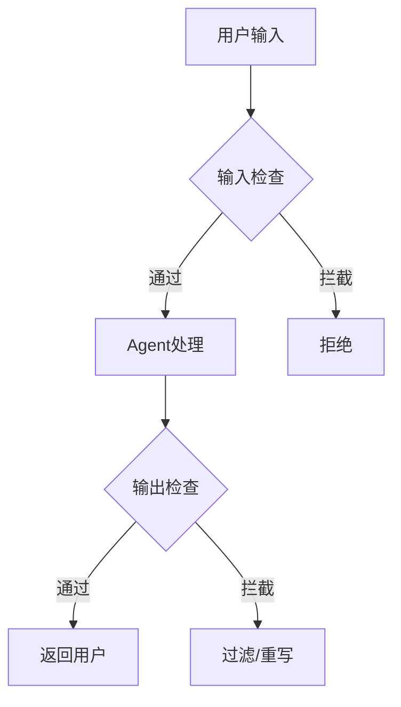
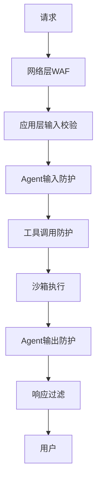

# 防护栏与沙箱

## 为什么需要防护栏

Agent 具有自主性，可能：
- 调用不合适的工具
- 泄露敏感信息
- 执行有害操作
- 产生不当内容



## 防护栏类型

### 1. 输入防护

```python
class InputGuardrail:
    def check(self, input_text: str) -> tuple[bool, str]:
        # 检查注入攻击
        if contains_injection_pattern(input_text):
            return False, "检测到潜在的提示注入"
        
        # 检查敏感信息
        if contains_pii(input_text):
            return False, "输入包含敏感个人信息"
        
        return True, "通过"
```

### 2. 输出防护

```python
class OutputGuardrail:
    def check(self, output_text: str) -> tuple[bool, str]:
        # 检查有害内容
        if contains_harmful_content(output_text):
            return False, "输出包含有害内容"
        
        # 检查事实性错误（可选）
        if contains_clear_factual_error(output_text):
            return False, "输出包含明显事实错误"
        
        return True, "通过"
```

### 3. 工具调用防护

```python
class ToolGuardrail:
    ALLOWED_TOOLS = {"search", "calculator", "weather"}
    BLOCKED_PARAMETERS = {"password", "token", "secret"}
    
    def check_tool_call(self, tool_name: str, params: dict) -> bool:
        if tool_name not in self.ALLOWED_TOOLS:
            return False
        
        for key in params:
            if key in self.BLOCKED_PARAMETERS:
                return False
        
        return True
```

## 沙箱设计

隔离 Agent 的执行环境：

```python
class Sandbox:
    def __init__(self):
        self.allowed_operations = set()
        self.resource_limits = {
            "max_cpu_time": 30,
            "max_memory_mb": 512,
            "max_file_size_mb": 10,
        }
    
    def execute(self, code: str) -> dict:
        """在沙箱中执行代码"""
        with isolated_environment() as env:
            env.set_limits(self.resource_limits)
            env.block_network()
            env.restrict_file_access()
            
            result = env.run(code, timeout=30)
            return result
```

## 多层防护架构



## 最佳实践

1. **默认拒绝**：不在白名单的操作默认不允许
2. **最小权限**：Agent 只拥有完成任务所需的最小权限
3. **多层防护**：任何单层都可能被绕过，多层互补
4. **审计日志**：记录所有安全相关事件
5. **定期演练**：模拟攻击测试防护有效性

## 延伸阅读

- [[01-安全防护栏]] — 更全面的安全设计
- [[04-错误恢复]] — 防护触发后的恢复策略
