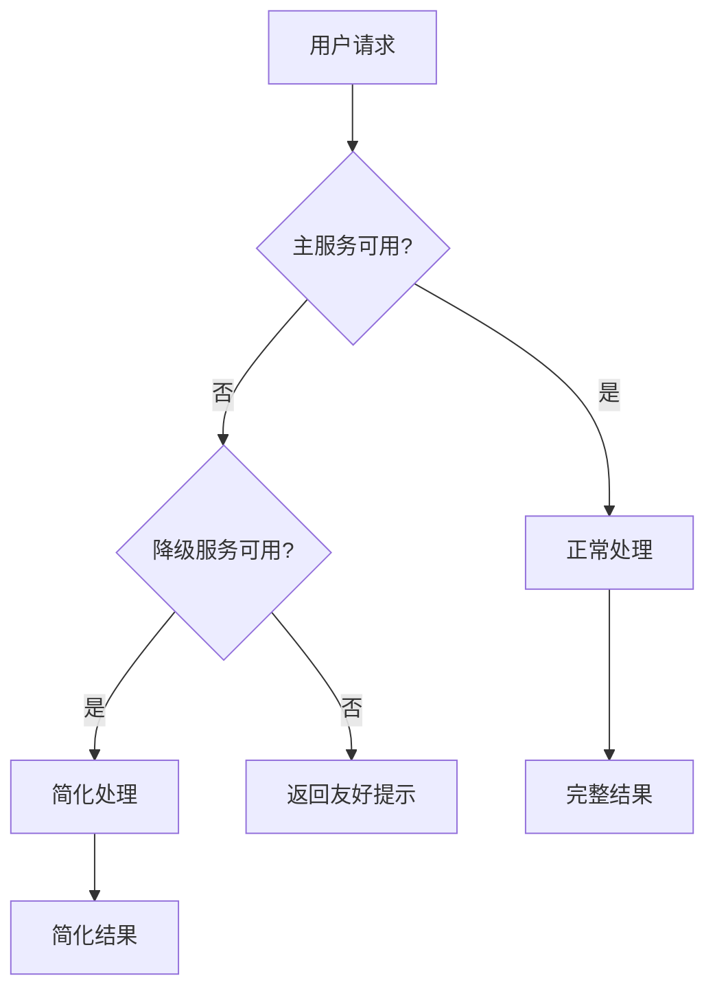

# 错误恢复

## 错误类型

| 类型 | 示例 | 处理策略 |
|------|------|---------|
| **LLM 错误** | API 超时、Rate Limit | 重试、降级模型 |
| **工具错误** | 工具返回异常、超时 | 重试、备用工具、跳过 |
| **推理错误** | 错误选择工具、参数错误 | 反思、重试、人工介入 |
| **系统错误** | 内存不足、依赖故障 | 优雅降级、快速失败 |

## 恢复策略

### 1. 重试（Retry）

```python
import backoff

@backoff.on_exception(
    backoff.expo,
    (APITimeoutError, RateLimitError),
    max_tries=5,
)
def call_llm_with_retry(prompt: str) -> str:
    return llm.invoke(prompt)
```

### 2. 降级（Degradation）

```python
def generate_with_fallback(prompt: str) -> str:
    try:
        # 先用强模型
        return gpt4.invoke(prompt)
    except Exception:
        try:
            # 降级到标准模型
            return gpt35.invoke(prompt)
        except Exception:
            # 最终降级到缓存模板
            return cached_template_response(prompt)
```

### 3. 断路器（Circuit Breaker）

```python
class CircuitBreaker:
    def __init__(self, threshold=5, timeout=60):
        self.failure_count = 0
        self.threshold = threshold
        self.timeout = timeout
        self.state = "closed"  # closed, open, half-open
    
    def call(self, func, *args, **kwargs):
        if self.state == "open":
            raise Exception("服务不可用，请稍后重试")
        
        try:
            result = func(*args, **kwargs)
            self.failure_count = 0
            return result
        except Exception as e:
            self.failure_count += 1
            if self.failure_count >= self.threshold:
                self.state = "open"
            raise e
```

### 4. 自我修正

```python
def self_correct_agent(query: str, max_attempts: int = 3) -> str:
    for attempt in range(max_attempts):
        try:
            result = agent.invoke(query)
            if validate_result(result):
                return result
        except Exception as e:
            if attempt < max_attempts - 1:
                query = f"之前遇到错误：{e}\n请重试：{query}"
            else:
                raise
    
    return "无法完成请求"
```

## 优雅降级示例



## 最佳实践

1. **快速失败**：尽早检测错误，避免资源浪费
2. **用户知情**：用户应知道当前是降级模式
3. **自动恢复**：故障消除后自动恢复主路径
4. **日志完整**：记录所有错误和恢复尝试
5. **测试故障**：定期进行混沌测试

## 延伸阅读

- [[03-防护栏与沙箱]] — 预防性安全设计
- [[05-性能评估]] — 系统可靠性评估
