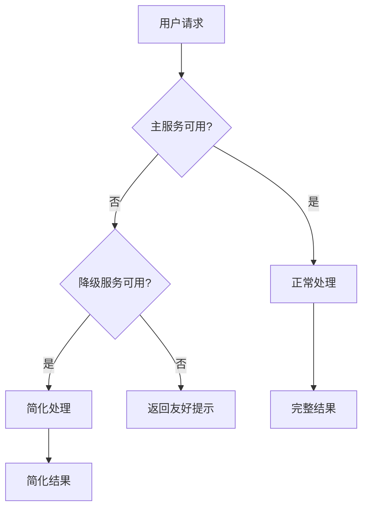

# 错误恢复

## 错误类型

| 类型 | 示例 | 处理策略 |
|------|------|---------|
| **LLM 错误** | API 超时、Rate Limit | 重试、降级模型 |
| **工具错误** | 工具返回异常、超时 | 重试、备用工具、跳过 |
| **推理错误** | 错误选择工具、参数错误 | 反思、重试、人工介入 |
| **系统错误** | 内存不足、依赖故障 | 优雅降级、快速失败 |

## 恢复策略

### 1. 重试（Retry）

```python
import backoff

@backoff.on_exception(
    backoff.expo,
    (APITimeoutError, RateLimitError),
    max_tries=5,
)
def call_llm_with_retry(prompt: str) -> str:
    return llm.invoke(prompt)
```

### 2. 降级（Degradation）

```python
def generate_with_fallback(prompt: str) -> str:
    try:
        # 先用强模型
        return gpt4.invoke(prompt)
    except Exception:
        try:
            # 降级到标准模型
            return gpt35.invoke(prompt)
        except Exception:
            # 最终降级到缓存模板
            return cached_template_response(prompt)
```

### 3. 断路器（Circuit Breaker）

```python
class CircuitBreaker:
    def __init__(self, threshold=5, timeout=60):
        self.failure_count = 0
        self.threshold = threshold
        self.timeout = timeout
        self.state = "closed"  # closed, open, half-open
    
    def call(self, func, *args, **kwargs):
        if self.state == "open":
            raise Exception("服务不可用，请稍后重试")
        
        try:
            result = func(*args, **kwargs)
            self.failure_count = 0
            return result
        except Exception as e:
            self.failure_count += 1
            if self.failure_count >= self.threshold:
                self.state = "open"
            raise e
```

### 4. 自我修正

```python
def self_correct_agent(query: str, max_attempts: int = 3) -> str:
    for attempt in range(max_attempts):
        try:
            result = agent.invoke(query)
            if validate_result(result):
                return result
        except Exception as e:
            if attempt < max_attempts - 1:
                query = f"之前遇到错误：{e}\n请重试：{query}"
            else:
                raise
    
    return "无法完成请求"
```

## 优雅降级示例



## 反模式与修复

| 反模式 | 问题描述 | 影响 | 修复方案 |
|--------|----------|------|----------|
| 无限重试 | 重试逻辑没有最大次数限制或指数退避，遇到持续性故障时陷入无限循环 | 线程/协程被永久占用，连接池耗尽，级联故障扩散到上游服务 | 使用 `backoff` 库设置 `max_tries` 和指数退避策略，结合断路器在连续失败后快速熔断 |
| 静默降级 | 降级后返回低质量结果但不告知用户当前处于降级模式 | 用户误以为收到的是完整质量的回复，基于不完整信息做出错误决策 | 降级时在响应中明确标注（如"当前使用简化模式"），并说明哪些功能受限以及何时可能恢复 |
| 重试风暴 | 多个客户端同时遇到错误并以相同间隔重试，形成请求洪峰 | 服务端负载瞬间飙升，原本可恢复的故障演变为系统性崩溃 | 在重试策略中加入随机抖动（jitter），避免客户端同步重试；配合断路器在服务端主动拒绝请求 |
| 错误信息泄露 | 将内部异常堆栈、API Key、数据库连接串等原始错误信息直接返回给用户 | 暴露系统内部实现细节，为攻击者提供攻击向量，同时用户体验极差 | 在错误处理层捕获所有异常，返回用户友好的错误消息，原始错误信息仅写入服务端日志 |
| 无回滚机制 | Agent 执行多步操作（如连续写入多个系统）时，中间步骤失败后无法撤销已完成的操作 | 数据处于不一致状态，部分写入成功部分失败，修复需要人工介入逐条清理 | 实现补偿事务模式，每步操作记录对应的回滚操作，失败时逆序执行回滚，确保原子性 |

"无限重试"和"重试风暴"是错误恢复中最容易引发级联故障的两个反模式。无限重试看似"坚持不懈"，实际上在依赖服务持续不可用时，它会耗尽客户端资源并阻塞其他正常请求。正确做法是结合断路器（Circuit Breaker）模式——当失败次数达到阈值时直接熔断，避免无意义的重试。重试风暴则更隐蔽：单个客户端的重试策略看起来合理，但当成百上千个客户端同时重试时，指数退避中的随机抖动（jitter）就成为必需品，而非可选项。参考[[03-防护栏与沙箱]]中的多层防护思想，错误恢复也需要多级策略：重试 → 降级 → 断路 → 快速失败，逐级递进。

## 最佳实践

1. **快速失败**：尽早检测错误，避免资源浪费
2. **用户知情**：用户应知道当前是降级模式
3. **自动恢复**：故障消除后自动恢复主路径
4. **日志完整**：记录所有错误和恢复尝试
5. **测试故障**：定期进行混沌测试

## 延伸阅读

- [[03-防护栏与沙箱]] — 预防性安全设计
- [[05-性能评估]] — 系统可靠性评估
