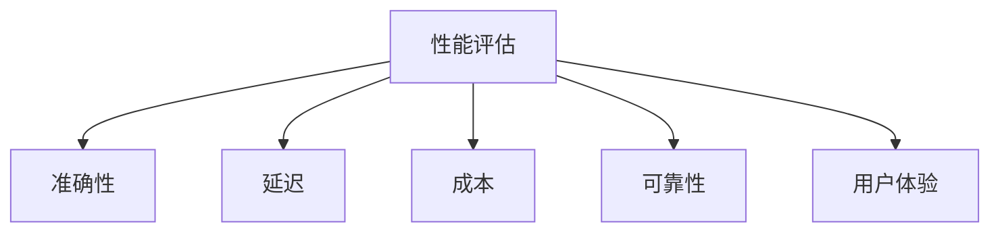

# 性能评估

## 评估维度



### 1. 准确性

| 指标 | 说明 | 测量方法 |
|------|------|---------|
| **任务完成率** | 成功完成任务的比例 | 人工标注 / 自动检查 |
| **工具选择准确率** | 正确选择工具的比例 | 对比标注数据 |
| **参数填充准确率** | 工具参数正确的比例 | 自动校验 |
| **事实准确性** | 回答中事实正确的比例 | 对比权威来源 |

### 2. 延迟

| 指标 | 说明 | 目标 |
|------|------|------|
| **首 token 延迟** | 首次响应时间 | < 1s |
| **总响应时间** | 完整任务时间 | 视复杂度 |
| **工具调用延迟** | 单次工具调用时间 | < 3s |
| **端到端延迟** | 用户输入到最终输出 | 视场景 |

### 3. 成本

| 指标 | 说明 |
|------|------|
| **Token 消耗** | 输入 + 输出 token 总数 |
| **API 调用次数** | LLM 和工具调用次数 |
| **单次任务成本** | 完成一个任务的平均费用 |
| **月度运营成本** | 规模化后的总成本 |

### 4. 可靠性

| 指标 | 说明 |
|------|------|
| **成功率** | 无错误完成任务的比例 |
| **错误恢复率** | 遇到错误后成功恢复的比例 |
| **超时率** | 超过最大时间的比例 |
| **一致性** | 相同输入得到相似输出的稳定性 |

## 评估框架

```python
class AgentEvaluator:
    def __init__(self):
        self.metrics = {
            "accuracy": [],
            "latency": [],
            "cost": [],
            "success": [],
        }
    
    def evaluate_task(self, task: dict, expected: dict) -> dict:
        start_time = time.time()
        
        try:
            result = self.agent.run(task)
            success = True
            
            # 准确性评估
            accuracy = self._compare_result(result, expected)
            
        except Exception as e:
            success = False
            accuracy = 0
            result = None
        
        latency = time.time() - start_time
        cost = self._calculate_cost()
        
        return {
            "success": success,
            "accuracy": accuracy,
            "latency": latency,
            "cost": cost,
        }
    
    def benchmark(self, test_set: list) -> dict:
        """批量评估"""
        results = [self.evaluate_task(t, e) for t, e in test_set]
        
        return {
            "avg_accuracy": mean(r["accuracy"] for r in results),
            "avg_latency": mean(r["latency"] for r in results),
            "avg_cost": mean(r["cost"] for r in results),
            "success_rate": mean(r["success"] for r in results),
        }
```

## 反模式与修复

| 反模式 | 问题描述 | 影响 | 修复方案 |
|--------|----------|------|----------|
| 虚荣指标 | 只追踪和汇报好看的数据（如"99% 请求成功"），隐藏长尾延迟和边缘案例失败率 | 系统在 P99/P999 延迟上远超预期，少数用户体验极差却无法被发现和修复 | 建立完整的指标体系，同时追踪均值、P50/P95/P99 延迟、错误分布和用户满意度，不遗漏长尾 |
| 无基准对比 | 评估新方案时没有基线数据，无法量化改进幅度 | 无法判断优化是否真正有效，可能引入回退而不自知，A/B 测试失去统计意义 | 上线前先建立性能基准（benchmark），所有后续评估都与基准对比，变更必须通过显著性检验 |
| 成本盲区 | 只关注功能和延迟指标，忽视 Token 消耗和 API 调用成本 | 上线后成本远超预算，批量任务的 Token 消耗失控，月度账单出现意外飙升 | 将单次任务成本纳入核心评估指标，设定成本预算上限，监控 Token 消耗趋势并设置告警 |
| 离线评估替代线上 | 完全依赖离线测试集评估，不在线上收集真实用户数据 | 离线数据分布与真实场景存在偏差，Agent 在实验室表现优秀但线上效果差距明显 | 离线评估与线上监控并行，通过 A/B 测试验证离线结论，持续收集线上指标修正评估偏差 |
| 指标孤岛 | 各维度指标（准确性、延迟、成本、可靠性）独立评估，不分析相互之间的关联和权衡 | 优化单一指标时无意中恶化其他指标（如提升准确性导致延迟翻倍），缺乏全局最优视角 | 建立多维度关联分析框架，在评估报告中同时展示各指标变化，设定综合评分函数平衡各维度权衡 |

"虚荣指标"是性能评估中最具欺骗性的反模式。当团队只汇报平均值和成功率时，系统看似运行良好，但 P99 延迟可能高达数秒甚至超时，而这恰恰是用户体验最差的那 1%。正确的做法是建立分位数监控，确保长尾性能不被平均值掩盖。"成本盲区"则是另一个在 Agent 系统中尤为突出的问题——与传统服务不同，Agent 的每次推理和工具调用都直接产生 Token 费用，且成本与任务复杂度非线性相关。一个看似简单的多轮对话可能消耗大量 Token，如果不在评估阶段就建立成本基线和预算告警，上线后的费用增长往往超出预期。参考[[01-简单性原则]]，在设计阶段就应考虑简单方案的成本优势。

## 权衡分析

性能评估的核心权衡是**评估深度 vs 评估成本、指标全面性 vs 可操作性**。

### 评估维度的冲突

| 维度 | 优化方向 | 与其他维度的冲突 |
|------|----------|-----------------|
| 准确性 | 更强模型、更多推理 | 延迟增加、成本增加 |
| 延迟 | 轻量模型、缓存、并行 | 准确性可能下降 |
| 成本 | 轻量模型、减少调用 | 准确性可能下降 |
| 可靠性 | 重试、降级、多模型投票 | 延迟增加、成本增加 |

核心矛盾：**准确性、延迟、成本三者不可兼得**——提升任一维度几乎必然牺牲其他维度。评估的目标不是同时优化所有指标，而是找到满足业务需求的**帕累托最优**点。

### 离线评估 vs 在线评估

| 维度 | 离线评估 | 在线评估 |
|------|----------|----------|
| 成本 | 低（一次性构建测试集） | 高（持续收集数据） |
| 真实性 | 中（测试集可能有偏差） | 高（真实用户行为） |
| 可重复性 | 高（固定测试集） | 低（用户行为变化） |
| 评估速度 | 快（批量运行） | 慢（需要流量积累） |
| 适用阶段 | 开发和迭代 | 上线后监控 |

- **离线评估**适合快速迭代——修改 prompt 后立即跑测试集看效果
- **在线评估**适合验证真实效果——离线指标提升不等于线上指标提升
- **最佳实践**：离线评估用于日常迭代，在线 A/B 测试用于重大变更

### 指标数量的取舍

- **指标太少**（如只看成功率）：可能遗漏关键问题（如 P99 延迟爆炸、成本失控）
- **指标太多**：团队注意力分散，无法聚焦关键改进
- **推荐核心指标集**：任务完成率、P95 延迟、单次任务成本、错误率——四个指标覆盖质量、速度、成本、可靠性

### 评估频率 vs 评估成本

- **每次变更都评估**：最安全，但评估成本高，拖慢迭代速度
- **定期评估（如每周）**：平衡迭代速度和质量保障
- **仅重大变更评估**：迭代最快，但可能引入回退而不自知
- **经验法则**：prompt 修改跑离线测试集（分钟级），架构变更跑完整 benchmark（小时级），上线前跑 A/B 测试（天级）

### 何时投入系统化评估

- Agent **已进入生产环境**——需要持续监控和告警
- **多团队协作**——需要统一的评估标准和基线
- **成本敏感**——需要精确追踪 Token 消耗和 API 调用成本
- **有 SLA 要求**——需要量化可用性和性能指标

### 何时可简化评估

- **原型阶段**——手动测试 + 主观评估足够
- **单一用户场景**——不需要分位数和分布分析
- **任务简单且成本低**——评估成本可能超过任务本身

## 最佳实践

1. **建立基准**：上线前先建立性能基准
2. **持续监控**：生产环境实时收集指标
3. **A/B 测试**：新方案与旧方案对比评估
4. **用户反馈**：结合用户满意度综合评估
5. **成本预算**：设定成本上限，避免失控

## 延伸阅读

- [[Agent-能力模型]] — Agent 能力分层评估
- [[01-简单性原则]] — 简单性与性能的平衡
