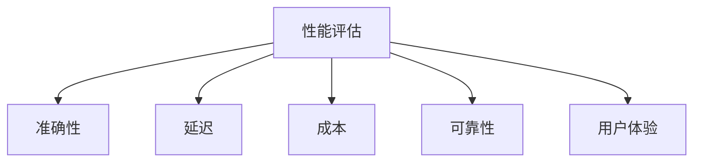

# 性能评估

## 评估维度



### 1. 准确性

| 指标 | 说明 | 测量方法 |
|------|------|---------|
| **任务完成率** | 成功完成任务的比例 | 人工标注 / 自动检查 |
| **工具选择准确率** | 正确选择工具的比例 | 对比标注数据 |
| **参数填充准确率** | 工具参数正确的比例 | 自动校验 |
| **事实准确性** | 回答中事实正确的比例 | 对比权威来源 |

### 2. 延迟

| 指标 | 说明 | 目标 |
|------|------|------|
| **首 token 延迟** | 首次响应时间 | < 1s |
| **总响应时间** | 完整任务时间 | 视复杂度 |
| **工具调用延迟** | 单次工具调用时间 | < 3s |
| **端到端延迟** | 用户输入到最终输出 | 视场景 |

### 3. 成本

| 指标 | 说明 |
|------|------|
| **Token 消耗** | 输入 + 输出 token 总数 |
| **API 调用次数** | LLM 和工具调用次数 |
| **单次任务成本** | 完成一个任务的平均费用 |
| **月度运营成本** | 规模化后的总成本 |

### 4. 可靠性

| 指标 | 说明 |
|------|------|
| **成功率** | 无错误完成任务的比例 |
| **错误恢复率** | 遇到错误后成功恢复的比例 |
| **超时率** | 超过最大时间的比例 |
| **一致性** | 相同输入得到相似输出的稳定性 |

## 评估框架

```python
class AgentEvaluator:
    def __init__(self):
        self.metrics = {
            "accuracy": [],
            "latency": [],
            "cost": [],
            "success": [],
        }
    
    def evaluate_task(self, task: dict, expected: dict) -> dict:
        start_time = time.time()
        
        try:
            result = self.agent.run(task)
            success = True
            
            # 准确性评估
            accuracy = self._compare_result(result, expected)
            
        except Exception as e:
            success = False
            accuracy = 0
            result = None
        
        latency = time.time() - start_time
        cost = self._calculate_cost()
        
        return {
            "success": success,
            "accuracy": accuracy,
            "latency": latency,
            "cost": cost,
        }
    
    def benchmark(self, test_set: list) -> dict:
        """批量评估"""
        results = [self.evaluate_task(t, e) for t, e in test_set]
        
        return {
            "avg_accuracy": mean(r["accuracy"] for r in results),
            "avg_latency": mean(r["latency"] for r in results),
            "avg_cost": mean(r["cost"] for r in results),
            "success_rate": mean(r["success"] for r in results),
        }
```

## 最佳实践

1. **建立基准**：上线前先建立性能基准
2. **持续监控**：生产环境实时收集指标
3. **A/B 测试**：新方案与旧方案对比评估
4. **用户反馈**：结合用户满意度综合评估
5. **成本预算**：设定成本上限，避免失控

## 延伸阅读

- [[Agent-能力模型]] — Agent 能力分层评估
- [[01-简单性原则]] — 简单性与性能的平衡
