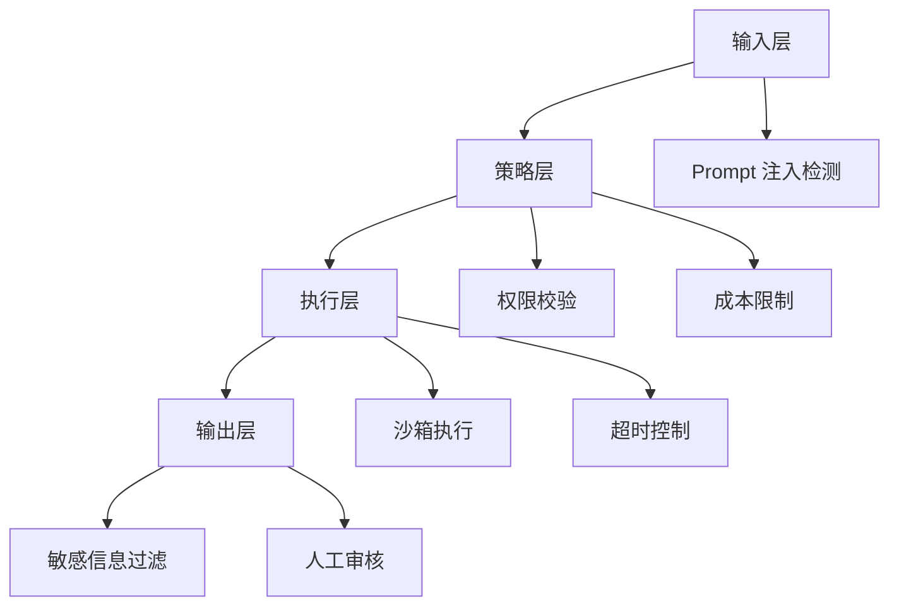

# 安全防护栏

Agent 系统具备自主执行能力，因此安全防护栏是生产部署的必备条件。

## 防护层级



## 关键机制

1. **输入过滤**：检测 Prompt 注入和越狱尝试
2. **权限最小化**：工具只能访问必要资源
3. **成本上限**：单会话 token 和调用次数限制
4. **人工介入**：高风险操作需人类确认
5. **审计日志**：所有决策和动作可追溯

## 代码示例

```typescript
class SafetyGuardrail {
  async check(action: AgentAction): Promise<boolean> {
    // 权限检查
    if (!this.hasPermission(action.tool)) return false;
    
    // 成本检查
    if (this.costTracker.exceedsLimit()) return false;
    
    // 敏感操作人工确认
    if (action.riskLevel === 'high') {
      return await this.requestHumanApproval(action);
    }
    
    return true;
  }
}
```
