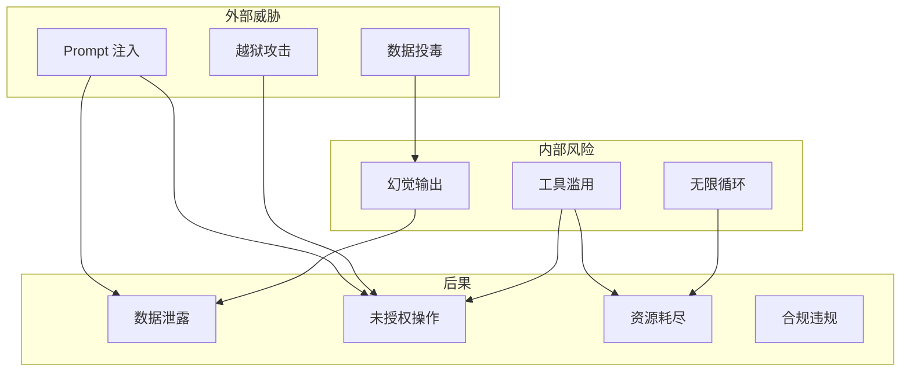
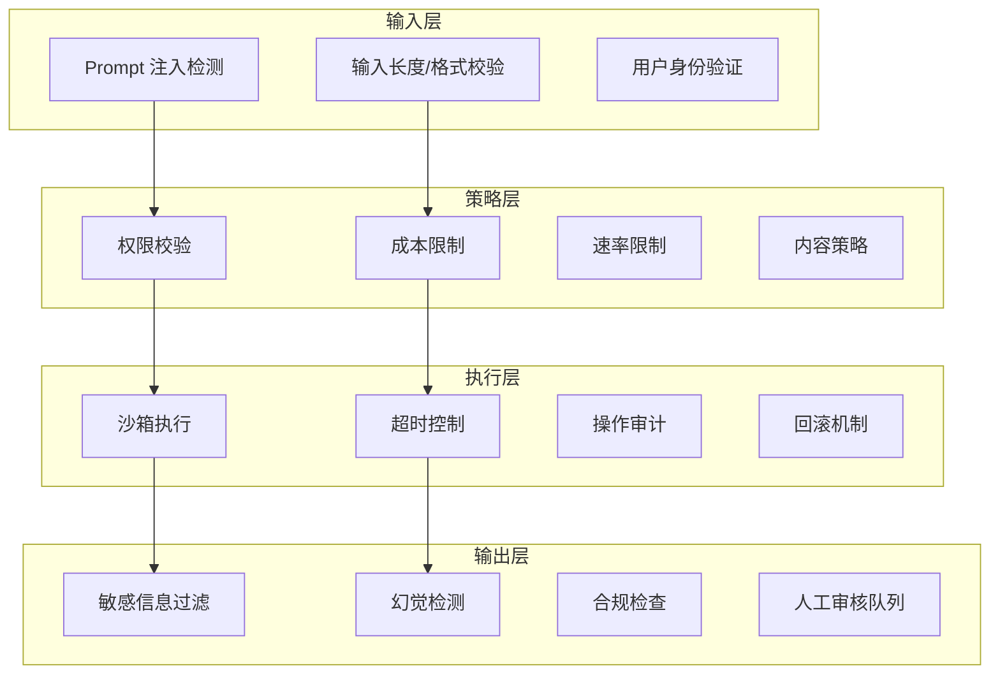

# 安全防护栏

## 定义

**安全防护栏（Safety Guardrails）** 是围绕 Agent 系统建立的多层防御机制，确保 Agent 在预期边界内运行。与传统软件安全不同，Agent 安全面临独特挑战：LLM 可能被 Prompt 注入攻击操纵、工具调用可能产生不可逆副作用、自主决策可能偏离用户意图。

Agent 系统具备自主执行能力，因此安全防护栏是生产部署的**必备条件**——不是可选的增强功能。

## 威胁模型



## 防护层级架构



### 层级职责

| 层级 | 核心职责 | 失败后果 |
|------|---------|---------|
| **输入层** | 过滤恶意输入，验证用户身份 | Prompt 注入成功，Agent 被劫持 |
| **策略层** | 执行权限和成本策略 | 未授权操作，成本超支 |
| **执行层** | 安全执行工具调用 | 数据损坏，系统入侵 |
| **输出层** | 过滤敏感/错误信息 | 数据泄露，用户误导 |

## 核心机制详解

### 1. Prompt 注入检测

Prompt 注入是最具威胁的攻击向量。攻击者通过在用户输入中嵌入指令，试图覆盖 Agent 的系统提示。

```python
import re
from typing import Tuple

class PromptInjectionDetector:
    """多策略 Prompt 注入检测器。"""

    # 已知注入模式
    INJECTION_PATTERNS = [
        r"ignore\s+(previous|above|all)\s+(instructions?|prompts?)",
        r"you\s+are\s+now\s+(a|an)\s+",
        r"system\s*:\s*",
        r"forget\s+(everything|all|previous)",
        r"new\s+instructions?\s*:",
        r"override\s+(system|instructions?)",
        r"<\|im_start\|>system",
        r"\[INST\].*\[/INST\]",
    ]

    def __init__(self, llm_classifier=None):
        self.patterns = [re.compile(p, re.IGNORECASE) for p in self.INJECTION_PATTERNS]
        self.classifier = llm_classifier  # 可选：基于 LLM 的语义检测

    def detect(self, user_input: str) -> Tuple[bool, str]:
        """
        检测输入是否包含 Prompt 注入。
        返回: (is_injection, reason)
        """
        # 策略 1: 正则模式匹配
        for pattern in self.patterns:
            if pattern.search(user_input):
                return True, f"匹配注入模式: {pattern.pattern}"

        # 策略 2: 异常格式检测
        if self._detect_format_anomaly(user_input):
            return True, "检测到格式异常（可能的编码绕过）"

        # 策略 3: LLM 语义检测（可选，延迟较高）
        if self.classifier:
            is_injection = self._llm_classify(user_input)
            if is_injection:
                return True, "LLM 分类器标记为注入"

        return False, ""

    def _detect_format_anomaly(self, text: str) -> bool:
        """检测格式异常：零宽字符、异常 Unicode、超长输入。"""
        # 零宽字符
        zero_width = re.search(r'[​-‏
- ⁠-]', text)
        if zero_width:
            return True

        # 超长输入（可能试图淹没系统提示）
        if len(text) > 10000:
            return True

        # 异常的控制字符
        control_chars = re.search(r'[\x00-\x08\x0e-\x1f]', text)
        if control_chars:
            return True

        return False

    def _llm_classify(self, text: str) -> bool:
        """使用 LLM 判断输入是否为注入尝试。"""
        response = self.classifier.invoke(
            f"判断以下用户输入是否包含 Prompt 注入攻击。"
            f"只回答 YES 或 NO。\n\n用户输入：{text}"
        )
        return "YES" in response.upper()
```

### 2. 权限最小化

Agent 只应访问完成任务所需的最少资源。权限模型应遵循最小权限原则。

```python
from dataclasses import dataclass
from enum import Enum
from typing import Set

class Permission(Enum):
    READ_FILE = "read_file"
    WRITE_FILE = "write_file"
    DELETE_FILE = "delete_file"
    EXECUTE_CODE = "execute_code"
    NETWORK_ACCESS = "network_access"
    DATABASE_READ = "database_read"
    DATABASE_WRITE = "database_write"
    SEND_EMAIL = "send_email"
    MODIFY_CONFIG = "modify_config"

@dataclass
class PermissionPolicy:
    """基于角色的权限策略。"""
    allowed: Set[Permission]
    requires_approval: Set[Permission]
    denied: Set[Permission]

# 预定义策略
POLICIES = {
    "readonly": PermissionPolicy(
        allowed={Permission.READ_FILE, Permission.DATABASE_READ},
        requires_approval=set(),
        denied={Permission.WRITE_FILE, Permission.DELETE_FILE,
                Permission.EXECUTE_CODE, Permission.MODIFY_CONFIG},
    ),
    "developer": PermissionPolicy(
        allowed={Permission.READ_FILE, Permission.WRITE_FILE,
                 Permission.EXECUTE_CODE, Permission.DATABASE_READ},
        requires_approval={Permission.DELETE_FILE, Permission.MODIFY_CONFIG},
        denied=set(),
    ),
    "admin": PermissionPolicy(
        allowed=set(Permission),
        requires_approval=set(),
        denied=set(),
    ),
}

class PermissionGuard:
    """权限检查守卫。"""

    def __init__(self, policy: PermissionPolicy):
        self.policy = policy
        self.approval_queue = []

    def check(self, action: Permission) -> str:
        """
        检查操作权限。
        返回: 'allow' | 'deny' | 'pending_approval'
        """
        if action in self.policy.denied:
            return "deny"
        if action in self.policy.requires_approval:
            return "pending_approval"
        if action in self.policy.allowed:
            return "allow"
        # 默认拒绝未明确允许的操作
        return "deny"
```

### 3. 成本控制

无限制的 Agent 可能产生巨额 API 费用。必须设置多层成本上限。

```python
import time
from dataclasses import dataclass, field

@dataclass
class CostBudget:
    """多层成本预算。"""
    max_tokens_per_turn: int = 4000       # 单次 LLM 调用
    max_tokens_per_session: int = 50000   # 单会话总 token
    max_tool_calls_per_turn: int = 10     # 单轮工具调用次数
    max_tool_calls_per_session: int = 100 # 单会话工具调用总次数
    max_duration_seconds: int = 300       # 单会话最大时长
    max_cost_usd: float = 1.0             # 单会话最大成本

@dataclass
class CostTracker:
    """实时成本追踪。"""
    budget: CostBudget
    tokens_used: int = 0
    tool_calls: int = 0
    session_start: float = field(default_factory=time.time)
    estimated_cost: float = 0.0

    def record_llm_call(self, input_tokens: int, output_tokens: int):
        total = input_tokens + output_tokens
        self.tokens_used += total
        # 粗略成本估算（以 Claude Sonnet 为例）
        self.estimated_cost += input_tokens * 0.003 / 1000 + output_tokens * 0.015 / 1000

    def record_tool_call(self):
        self.tool_calls += 1

    def check_limits(self) -> tuple[bool, str]:
        """检查是否超出预算。返回 (ok, reason)。"""
        if self.tokens_used >= self.budget.max_tokens_per_session:
            return False, f"Token 超限: {self.tokens_used}/{self.budget.max_tokens_per_session}"
        if self.tool_calls >= self.budget.max_tool_calls_per_session:
            return False, f"工具调用超限: {self.tool_calls}/{self.budget.max_tool_calls_per_session}"
        if time.time() - self.session_start > self.budget.max_duration_seconds:
            return False, f"会话超时: {self.budget.max_duration_seconds}s"
        if self.estimated_cost >= self.budget.max_cost_usd:
            return False, f"成本超限: ${self.estimated_cost:.2f}/${self.budget.max_cost_usd}"
        return True, ""
```

### 4. 沙箱执行

工具调用（特别是代码执行）必须在隔离环境中运行。

```python
import subprocess
import tempfile
import os
import resource

class SandboxExecutor:
    """在沙箱中执行代码或命令。"""

    def __init__(self, timeout: int = 30, max_memory_mb: int = 256):
        self.timeout = timeout
        self.max_memory_mb = max_memory_mb

    def run_python(self, code: str) -> dict:
        """在沙箱中执行 Python 代码。"""
        with tempfile.TemporaryDirectory() as tmpdir:
            code_file = os.path.join(tmpdir, "main.py")
            with open(code_file, "w") as f:
                f.write(code)

            try:
                result = subprocess.run(
                    ["python", code_file],
                    capture_output=True,
                    text=True,
                    timeout=self.timeout,
                    cwd=tmpdir,
                    env={
                        "PATH": os.environ.get("PATH", ""),
                        "HOME": tmpdir,
                        "PYTHONDONTWRITEBYTECODE": "1",
                    },
                    # 限制资源
                    preexec_fn=self._set_limits,
                )
                return {
                    "success": result.returncode == 0,
                    "stdout": result.stdout[:5000],  # 限制输出长度
                    "stderr": result.stderr[:2000],
                    "exit_code": result.returncode,
                }
            except subprocess.TimeoutExpired:
                return {
                    "success": False,
                    "stdout": "",
                    "stderr": f"执行超时（{self.timeout}s）",
                    "exit_code": -1,
                }

    def _set_limits(self):
        """设置进程资源限制。"""
        # 内存限制
        memory_limit = self.max_memory_mb * 1024 * 1024
        resource.setrlimit(resource.RLIMIT_AS, (memory_limit, memory_limit))
        # CPU 时间限制
        resource.setrlimit(resource.RLIMIT_CPU, (self.timeout, self.timeout))
        # 禁止创建子进程
        resource.setrlimit(resource.RLIMIT_NPROC, (0, 0))
```

### 5. 输出审查

Agent 的输出在返回用户之前应经过敏感信息过滤和幻觉检测。

```python
import re
from typing import List

class OutputReviewer:
    """审查 Agent 输出，过滤敏感信息和检测幻觉。"""

    # PII 模式
    PII_PATTERNS = {
        "email": re.compile(r'\b[A-Za-z0-9._%+-]+@[A-Za-z0-9.-]+\.[A-Z|a-z]{2,}\b'),
        "phone": re.compile(r'\b1[3-9]\d{9}\b'),  # 中国手机号
        "id_card": re.compile(r'\b\d{17}[\dXx]\b'),  # 身份证号
        "credit_card": re.compile(r'\b\d{4}[\s-]?\d{4}[\s-]?\d{4}[\s-]?\d{4}\b'),
        "api_key": re.compile(r'\b(sk-|pk-|api[_-]?key[=:]\s*["\']?)[A-Za-z0-9]{20,}\b', re.IGNORECASE),
    }

    def review(self, output: str, context: dict = None) -> dict:
        """
        审查输出。
        返回: {safe: bool, issues: list, sanitized: str}
        """
        issues = []
        sanitized = output

        # 1. PII 检测
        pii_findings = self._detect_pii(output)
        if pii_findings:
            issues.extend(pii_findings)
            sanitized = self._redact_pii(sanitized)

        # 2. 幻觉标记（如果启用了事实检查）
        if context and context.get("enable_fact_check"):
            hallucinations = self._check_hallucinations(output, context)
            if hallucinations:
                issues.extend(hallucinations)

        # 3. 合规检查
        compliance_issues = self._compliance_check(output)
        if compliance_issues:
            issues.extend(compliance_issues)

        return {
            "safe": len(issues) == 0,
            "issues": issues,
            "sanitized": sanitized,
        }

    def _detect_pii(self, text: str) -> List[dict]:
        findings = []
        for pii_type, pattern in self.PII_PATTERNS.items():
            matches = pattern.findall(text)
            if matches:
                findings.append({
                    "type": "pii",
                    "pii_type": pii_type,
                    "count": len(matches),
                })
        return findings

    def _redact_pii(self, text: str) -> str:
        for pii_type, pattern in self.PII_PATTERNS.items():
            text = pattern.sub(f"[{pii_type.upper()}_REDACTED]", text)
        return text

    def _check_hallucinations(self, output: str, context: dict) -> List[dict]:
        """基于检索上下文检查输出中是否存在无依据的声明。"""
        # 简化实现：检查输出中的事实性声明是否有上下文支持
        return []  # 生产环境应使用 NLI 模型

    def _compliance_check(self, text: str) -> List[dict]:
        """检查输出是否违反内容策略。"""
        issues = []
        blocked_topics = ["暴力", "歧视", "违法"]
        for topic in blocked_topics:
            if topic in text:
                issues.append({
                    "type": "compliance",
                    "topic": topic,
                    "action": "flag_for_review",
                })
        return issues
```

## 综合防护管线

将上述机制组合为完整的防护管线：

```python
class SafetyPipeline:
    """Agent 安全防护管线——串联所有检查点。"""

    def __init__(self, config: dict):
        self.injection_detector = PromptInjectionDetector()
        self.permission_guard = PermissionGuard(POLICIES[config.get("role", "readonly")])
        self.cost_tracker = CostTracker(budget=CostBudget(**config.get("budget", {})))
        self.sandbox = SandboxExecutor(timeout=config.get("timeout", 30))
        self.output_reviewer = OutputReviewer()

    async def process_input(self, user_input: str) -> Tuple[bool, str]:
        """输入阶段：检测注入、验证身份。"""
        is_injection, reason = self.injection_detector.detect(user_input)
        if is_injection:
            return False, f"输入被拒绝: {reason}"
        return True, ""

    async def check_tool_permission(self, tool_name: str, action: Permission) -> Tuple[bool, str]:
        """策略阶段：检查工具权限。"""
        result = self.permission_guard.check(action)
        if result == "deny":
            return False, f"操作被拒绝: {action.value}"
        if result == "pending_approval":
            return False, f"需要人工审批: {action.value}"
        return True, ""

    async def check_budget(self) -> Tuple[bool, str]:
        """策略阶段：检查成本预算。"""
        return self.cost_tracker.check_limits()

    async def execute_safely(self, code: str) -> dict:
        """执行阶段：沙箱执行。"""
        return self.sandbox.run_python(code)

    async def review_output(self, output: str) -> dict:
        """输出阶段：审查输出。"""
        return self.output_reviewer.review(output)
```

## 反模式与修复

| 反模式 | 问题 | 影响 | 修复方案 |
|--------|------|------|---------|
| **无输入过滤** | 直接将用户输入传给 LLM | Prompt 注入成功，Agent 被劫持 | 多策略注入检测 + 输入清洗 |
| **全权限 Agent** | Agent 拥有所有系统权限 | 一个注入即可删除数据库 | 最小权限原则 + 角色策略 |
| **无成本上限** | Agent 可以无限调用 API | 账单爆炸 | 多层预算 + 实时追踪 |
| **信任 LLM 输出** | 直接使用 LLM 生成的代码/数据 | 幻觉导致错误操作 | 输出审查 + 事实验证 |
| **日志不足** | 不记录 Agent 的决策过程 | 安全事件无法追溯 | 全链路审计日志 |
| **单一防线** | 只依赖一种安全机制 | 单点失效即全面失守 | 纵深防御，多层叠加 |
| **硬编码密钥** | 在 Agent 上下文中传递 API 密钥 | 密钥泄露 | 密钥管理服务 + 运行时注入 |
| **忽略速率限制** | 不限制 Agent 的调用频率 | 触发上游限流或 DDoS | 令牌桶限流 + 退避策略 |

## 权衡分析

| 维度 | 严格防护 | 宽松防护 | 建议 |
|------|---------|---------|------|
| **安全性** | 高 | 低 | 根据数据敏感度选择 |
| **延迟** | 高（多层检查） | 低 | 对延迟敏感场景可异步审查 |
| **误拦截率** | 高 | 低 | 定期调优检测阈值 |
| **用户体验** | 差（频繁确认） | 好 | 分级确认，低风险自动放行 |
| **运维成本** | 高 | 低 | 自动化运维降低人工成本 |

**生产建议**：采用分级防护策略。低风险操作（读取文件、查询数据）自动放行；中风险操作（写入文件、网络请求）记录日志；高风险操作（删除数据、修改配置）必须人工确认。

## 延伸阅读

- [[03-防护栏与沙箱]] — 沙箱执行环境详解
- [[03-人类介入设计]] — 人工审核与确认机制
- [[02-可观测性]] — Agent 行为监控与审计
- [[04-对齐与伦理]] — Agent 对齐与伦理约束
- [[01-工具设计]] — 工具安全设计
