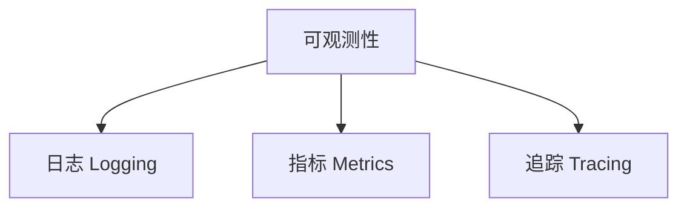
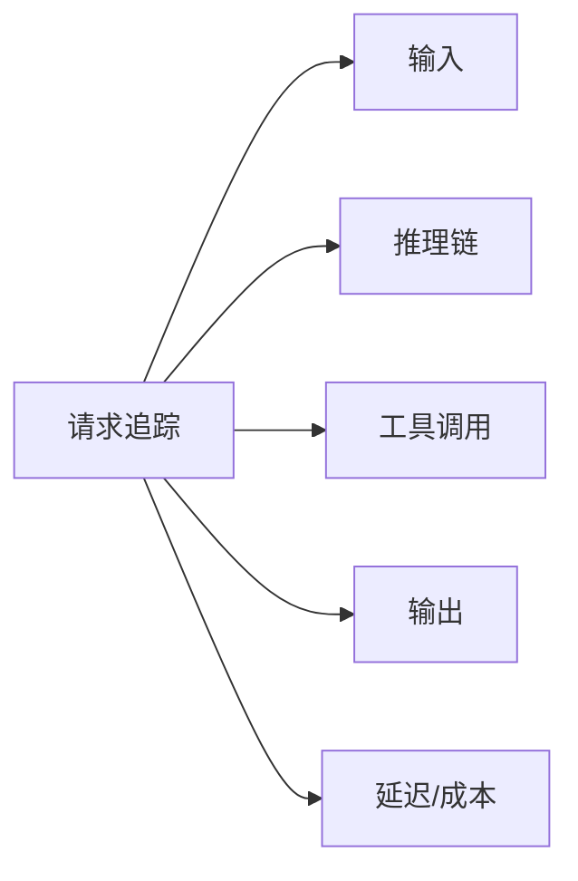

# 可观测性

## 可观测性三支柱



### 1. 日志（Logging）

```python
import structlog

logger = structlog.get_logger()

def agent_step(state: AgentState):
    logger.info(
        "agent_step",
        session_id=state.session_id,
        step=state.current_step,
        action=state.last_action,
        tokens_used=state.tokens_used,
    )
```

### 2. 指标（Metrics）

| 指标 | 类型 | 说明 |
|------|------|------|
| request_latency | Histogram | 请求延迟分布 |
| token_usage | Counter | Token 消耗总量 |
| tool_call_errors | Counter | 工具调用错误数 |
| active_sessions | Gauge | 当前活跃会话数 |

### 3. 追踪（Tracing）

```python
from opentelemetry import trace

tracer = trace.get_tracer(__name__)

@tracer.start_as_current_span("agent_execution")
def run_agent(query: str):
    with tracer.start_as_current_span("llm_call"):
        response = llm.invoke(query)
    
    with tracer.start_as_current_span("tool_execution"):
        result = tool.run(response)
    
    return result
```

## 关键追踪维度



## 最佳实践

1. **结构化日志**：使用 JSON 格式，便于查询分析
2. **关联 ID**：每个请求有唯一 trace_id
3. **敏感信息脱敏**：日志中不包含 PII
4. **采样策略**：高流量场景合理采样
5. **告警规则**：关键指标异常时及时通知

## 延伸阅读

- [[01-安全防护栏]] — 安全事件监控
- [[03-人类介入设计]] — 异常时的人工介入
