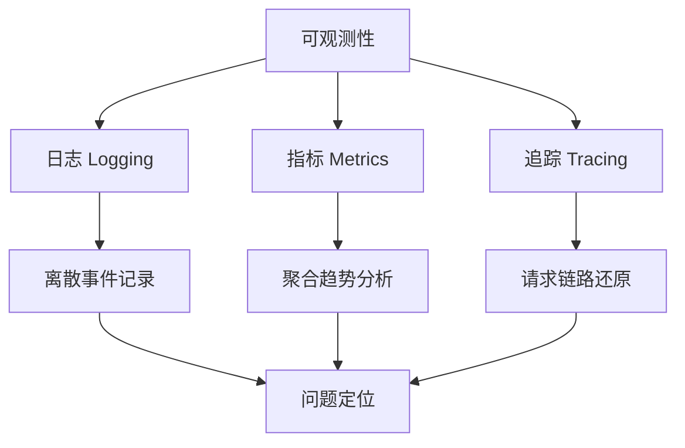
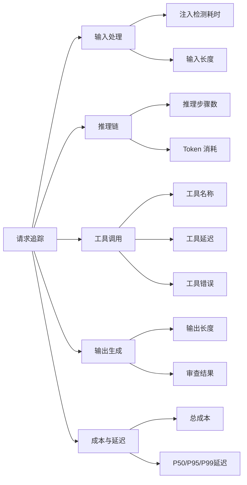

# 可观测性

## 可观测性三支柱

Agent 系统的可观测性建立在三个支柱之上，缺一不可：



| 支柱 | 回答的问题 | 数据特征 | 典型工具 |
|------|-----------|---------|---------|
| **日志** | "发生了什么？" | 离散事件，结构化文本 | structlog, Loki, ELK |
| **指标** | "系统健康吗？" | 数值聚合，时序数据 | Prometheus, Grafana |
| **追踪** | "请求经过了哪里？" | 有向无环图，Span 树 | OpenTelemetry, Jaeger |

### 1. 日志（Logging）

结构化日志是 Agent 调试的基础。每条日志应包含足够的上下文以便事后分析。

```python
import structlog
from dataclasses import dataclass, asdict

logger = structlog.get_logger()

@dataclass
class AgentStepContext:
    session_id: str
    step: int
    agent_id: str
    action: str
    tokens_used: int
    tool_name: str | None = None
    latency_ms: float = 0.0
    error: str | None = None

def log_agent_step(ctx: AgentStepContext):
    """记录 Agent 执行步骤的结构化日志。"""
    log_data = asdict(ctx)
    # 移除 None 值，保持日志简洁
    log_data = {k: v for k, v in log_data.items() if v is not None}

    if ctx.error:
        logger.error("agent_step_failed", **log_data)
    else:
        logger.info("agent_step", **log_data)

def log_llm_call(session_id: str, model: str, input_tokens: int,
                 output_tokens: int, latency_ms: float):
    """记录 LLM 调用的详细指标。"""
    logger.info(
        "llm_call",
        session_id=session_id,
        model=model,
        input_tokens=input_tokens,
        output_tokens=output_tokens,
        total_tokens=input_tokens + output_tokens,
        latency_ms=latency_ms,
        cost_estimate=_estimate_cost(model, input_tokens, output_tokens),
    )

def _estimate_cost(model: str, input_tokens: int, output_tokens: int) -> float:
    """估算 LLM 调用成本（美元）。"""
    pricing = {
        "claude-sonnet-4-6": (0.003, 0.015),
        "claude-haiku-4-5": (0.0008, 0.004),
        "gpt-4o": (0.005, 0.015),
    }
    input_price, output_price = pricing.get(model, (0.003, 0.015))
    return input_tokens * input_price / 1000 + output_tokens * output_price / 1000
```

### 2. 指标（Metrics）

Agent 系统需要关注的核心指标：

| 指标 | 类型 | 说明 | 告警阈值建议 |
|------|------|------|-------------|
| `agent_request_latency` | Histogram | 端到端请求延迟 | P99 > 30s |
| `llm_call_latency` | Histogram | 单次 LLM 调用延迟 | P95 > 10s |
| `token_usage_total` | Counter | Token 消耗总量 | 日用量 > 预算 80% |
| `tool_call_errors` | Counter | 工具调用错误数 | 错误率 > 5% |
| `active_sessions` | Gauge | 当前活跃会话数 | > 并发上限 90% |
| `agent_retry_count` | Counter | Agent 重试次数 | 重试率 > 10% |
| `human_intervention_rate` | Gauge | 人工介入率 | 突增 > 200% |

```python
from prometheus_client import Histogram, Counter, Gauge

# 定义指标
REQUEST_LATENCY = Histogram(
    "agent_request_latency_seconds",
    "Agent 请求端到端延迟",
    buckets=[0.5, 1, 2, 5, 10, 20, 30, 60],
)

TOKEN_USAGE = Counter(
    "agent_token_usage_total",
    "Token 消耗总量",
    ["model", "type"],  # type: input/output
)

TOOL_ERRORS = Counter(
    "agent_tool_call_errors_total",
    "工具调用错误数",
    ["tool_name", "error_type"],
)

ACTIVE_SESSIONS = Gauge(
    "agent_active_sessions",
    "当前活跃会话数",
)

class MetricsCollector:
    def record_request(self, latency_seconds: float):
        REQUEST_LATENCY.observe(latency_seconds)

    def record_tokens(self, model: str, input_tokens: int, output_tokens: int):
        TOKEN_USAGE.labels(model=model, type="input").inc(input_tokens)
        TOKEN_USAGE.labels(model=model, type="output").inc(output_tokens)

    def record_tool_error(self, tool_name: str, error_type: str):
        TOOL_ERRORS.labels(tool_name=tool_name, error_type=error_type).inc()
```

### 3. 追踪（Tracing）

分布式追踪可以还原一次请求在多个 Agent 和工具间的完整路径。

```python
from opentelemetry import trace
from opentelemetry.trace import Status, StatusCode

tracer = trace.get_tracer(__name__)

def run_agent_with_tracing(query: str, session_id: str) -> str:
    """带完整追踪的 Agent 执行。"""
    with tracer.start_as_current_span("agent_execution") as root_span:
        root_span.set_attribute("session_id", session_id)
        root_span.set_attribute("query_length", len(query))

        # 阶段 1: LLM 推理
        with tracer.start_as_current_span("llm_reasoning") as llm_span:
            try:
                response = llm.invoke(query)
                llm_span.set_attribute("model", response.model)
                llm_span.set_attribute("input_tokens", response.usage.input_tokens)
                llm_span.set_attribute("output_tokens", response.usage.output_tokens)
            except Exception as e:
                llm_span.set_status(Status(StatusCode.ERROR, str(e)))
                raise

        # 阶段 2: 工具调用（如果需要）
        if response.tool_calls:
            with tracer.start_as_current_span("tool_execution") as tool_span:
                tool_span.set_attribute("tool_count", len(response.tool_calls))
                for i, tool_call in enumerate(response.tool_calls):
                    with tracer.start_as_current_span(f"tool_{tool_call.name}") as tc_span:
                        tc_span.set_attribute("tool_name", tool_call.name)
                        try:
                            result = execute_tool(tool_call)
                            tc_span.set_attribute("result_length", len(str(result)))
                        except Exception as e:
                            tc_span.set_status(Status(StatusCode.ERROR, str(e)))
                            raise

        # 阶段 3: 输出生成
        with tracer.start_as_current_span("output_generation"):
            final_output = generate_output(response)

        root_span.set_attribute("output_length", len(final_output))
        return final_output
```

## 关键追踪维度



## 告警规则设计

```python
from dataclasses import dataclass
from enum import Enum

class AlertSeverity(Enum):
    INFO = "info"
    WARNING = "warning"
    CRITICAL = "critical"

@dataclass
class AlertRule:
    name: str
    condition: str
    severity: AlertSeverity
    cooldown_seconds: int = 300

# 推荐的 Agent 系统告警规则
ALERT_RULES = [
    AlertRule(
        name="high_error_rate",
        condition="tool_call_errors / tool_call_total > 0.05",
        severity=AlertSeverity.WARNING,
        cooldown_seconds=60,
    ),
    AlertRule(
        name="token_budget_exhausted",
        condition="token_usage_today > token_budget * 0.9",
        severity=AlertSeverity.CRITICAL,
        cooldown_seconds=3600,
    ),
    AlertRule(
        name="session_timeout_spike",
        condition="session_timeout_rate > 0.1",
        severity=AlertSeverity.WARNING,
        cooldown_seconds=300,
    ),
    AlertRule(
        name="infinite_loop_detected",
        condition="agent_step_count_in_session > 50",
        severity=AlertSeverity.CRITICAL,
        cooldown_seconds=60,
    ),
    AlertRule(
        name="human_intervention_spike",
        condition="human_intervention_rate > baseline * 2",
        severity=AlertSeverity.WARNING,
        cooldown_seconds=600,
    ),
]
```

## 生产监控看板

| 面板 | 内容 | 用途 |
|------|------|------|
| **实时概览** | 活跃会话数、QPS、错误率 | 日常巡检 |
| **延迟分布** | P50/P95/P99 延迟趋势 | 性能退化预警 |
| **Token 消耗** | 按模型/Agent 的 Token 用量 | 成本控制 |
| **工具健康** | 各工具的调用次数、错误率、延迟 | 工具故障定位 |
| **错误热力图** | 按时间 + 错误类型的分布 | 异常模式发现 |
| **人工介入** | 介入次数、原因分布 | 系统自愈能力评估 |

## 反模式与修复

| 反模式 | 问题 | 影响 | 修复方案 |
|--------|------|------|---------|
| **无结构化日志** | 使用 print/fprint 输出日志 | 无法查询、过滤、聚合 | structlog + JSON 格式 |
| **缺少 trace_id** | 请求经过多 Agent 后无法关联 | 调试时无法还原完整链路 | 全链路传递 correlation_id |
| **日志含 PII** | 日志中直接记录用户输入 | 隐私泄露，合规风险 | 脱敏处理 + 敏感字段标记 |
| **指标过少** | 只监控错误率，忽略延迟和成本 | 性能退化和成本超支无法发现 | 覆盖三支柱 + 关键业务指标 |
| **告警疲劳** | 低阈值 + 无冷却 = 海量告警 | 真正的问题被淹没 | 分级告警 + 冷却期 + 聚合 |
| **无采样策略** | 高流量场景记录所有追踪 | 存储成本飙升，查询变慢 | 按比例采样 + 错误全量保留 |
| **延迟指标缺失** | 只记录总延迟，不区分 LLM/工具/网络 | 无法定位延迟瓶颈 | 分段计时 + 各阶段独立指标 |
| **指标孤岛** | 日志、指标、追踪分散在不同系统 | 无法交叉关联分析问题 | 统一可观测性平台，通过 trace_id 串联三支柱 |

## 权衡分析

| 维度 | 全量采集 | 采样采集 | 建议 |
|------|---------|---------|------|
| **数据完整性** | 100% | 部分 | 错误和高延迟请求全量保留 |
| **存储成本** | 高 | 低 | 按日志量选择合适的存储方案 |
| **查询性能** | 慢（数据量大） | 快 | 热数据采样，冷数据全量 |
| **调试能力** | 完整 | 可能丢失关键信息 | 关键路径全量，常规路径采样 |
| **系统开销** | 高 | 低 | 高吞吐场景必须采样 |

**生产建议**：采用分层采样策略。错误请求和 P99+ 延迟请求全量保留；正常请求按 10% 采样；调试期间可临时提升至 100%。所有指标全量采集（指标数据量远小于日志和追踪）。

## 延伸阅读

- [[01-安全防护栏]] — 安全事件监控与审计
- [[03-人类介入设计]] — 异常时的人工介入触发
- [[00-协作总览]] — 多 Agent 系统的分布式追踪
- [[05-性能评估]] — 性能基准测试方法
