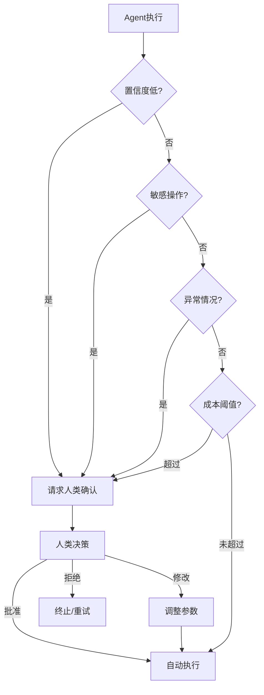

# 人类介入设计

## 介入时机

Agent 系统应在以下关键时刻请求人类介入：



| 触发条件 | 典型场景 | 紧急程度 |
|---------|---------|---------|
| **置信度低** | LLM 输出置信度 < 0.7 | 中 |
| **敏感操作** | 删除数据、修改配置、发送消息 | 高 |
| **异常情况** | 工具调用失败、超时、错误率突增 | 高 |
| **成本阈值** | Token 消耗超过预算 80% | 中 |
| **合规要求** | 涉及法律/医疗/金融决策 | 高 |

## 介入模式

### 1. 审批模式（Approval）

高风险操作执行前必须获得人类批准。

```python
import asyncio
from dataclasses import dataclass
from enum import Enum

class ApprovalDecision(Enum):
    APPROVED = "approved"
    REJECTED = "rejected"
    MODIFIED = "modified"

@dataclass
class ApprovalRequest:
    request_id: str
    action: dict
    risk_level: str
    context: str
    timeout_seconds: int = 300

@dataclass
class ApprovalResponse:
    decision: ApprovalDecision
    modified_action: dict | None = None
    reason: str = ""

class ApprovalGate:
    """审批门控——高风险操作必须经过人类批准。"""

    def __init__(self, rules: list[dict], notifier: Notifier):
        self.rules = rules
        self.notifier = notifier
        self.pending: dict[str, asyncio.Future] = {}

    async def check(self, action: dict) -> tuple[bool, ApprovalResponse]:
        """检查操作是否需要审批。"""
        risk_level = self._assess_risk(action)

        if risk_level == "low":
            return True, ApprovalResponse(
                decision=ApprovalDecision.APPROVED,
                reason="低风险操作，自动放行",
            )

        # 创建审批请求
        request = ApprovalRequest(
            request_id=generate_id(),
            action=action,
            risk_level=risk_level,
            context=self._build_context(action),
        )

        # 通知审批者
        await self.notifier.notify(request)

        # 等待审批结果
        try:
            response = await asyncio.wait_for(
                self._wait_for_approval(request.request_id),
                timeout=request.timeout_seconds,
            )
            return response.decision == ApprovalDecision.APPROVED, response
        except asyncio.TimeoutError:
            return False, ApprovalResponse(
                decision=ApprovalDecision.REJECTED,
                reason="审批超时，默认拒绝",
            )

    def _assess_risk(self, action: dict) -> str:
        """评估操作风险等级。"""
        for rule in self.rules:
            if rule["matches"](action):
                return rule["risk_level"]
        return "low"

    def _build_context(self, action: dict) -> str:
        """构建审批上下文信息。"""
        return f"操作类型: {action.get('type')}, 目标: {action.get('target')}"

    async def _wait_for_approval(self, request_id: str) -> ApprovalResponse:
        future = asyncio.get_event_loop().create_future()
        self.pending[request_id] = future
        return await future

    def submit_approval(self, request_id: str, response: ApprovalResponse):
        """提交审批结果（由审批界面调用）。"""
        if request_id in self.pending:
            self.pending[request_id].set_result(response)
            del self.pending[request_id]
```

### 2. 修正模式（Correction）

Agent 执行后，人类可以修正结果，Agent 从修正中学习。

```python
@dataclass
class Feedback:
    needs_correction: bool
    corrected_output: str | None = None
    correction_reason: str = ""

class CorrectableAgent:
    """支持人类修正的 Agent。"""

    def __init__(self, agent: Agent, memory: MemoryStore):
        self.agent = agent
        self.memory = memory

    async def execute(self, task: str) -> dict:
        # 检查是否有类似任务的修正历史
        similar_corrections = self.memory.search(task, type="correction", limit=3)

        # 如果有历史修正，将其作为上下文
        context = ""
        if similar_corrections:
            context = "历史修正参考：\n" + "\n".join(
                f"- 输入: {c['input']}, 原输出: {c['wrong_output']}, "
                f"修正: {c['correction']}"
                for c in similar_corrections
            )

        draft = await self.agent.run(task, additional_context=context)

        # 展示给用户并请求反馈
        feedback = await self.request_feedback(draft)

        if feedback.needs_correction:
            # 记录修正
            self.memory.store({
                "type": "correction",
                "input": task,
                "wrong_output": draft,
                "correction": feedback.corrected_output,
                "reason": feedback.correction_reason,
            })
            return {"output": feedback.corrected_output, "corrected": True}

        return {"output": draft, "corrected": False}

    async def request_feedback(self, draft: str) -> Feedback:
        """请求人类反馈。"""
        # 实际实现中通过 UI 或 API 请求反馈
        ...
```

### 3. 教学模式（Teaching）

人类纠正 Agent 的错误，Agent 从纠正中学习并改进未来行为。

```python
class TeachableAgent:
    """可教学的 Agent——从人类反馈中持续学习。"""

    def __init__(self, agent: Agent, memory: MemoryStore):
        self.agent = agent
        self.memory = memory

    async def learn_from_feedback(self, interaction: dict):
        """从人类反馈中学习。"""
        if interaction["feedback"] == "negative":
            # 记录失败案例
            self.memory.store({
                "type": "mistake",
                "input": interaction["input"],
                "wrong_output": interaction["output"],
                "correction": interaction["correction"],
                "reason": interaction.get("reason", ""),
                "timestamp": datetime.utcnow().isoformat(),
            })

            # 提取可泛化的规则
            rule = await self._extract_rule(interaction)
            if rule:
                self.memory.store({
                    "type": "learned_rule",
                    "rule": rule,
                    "source_interaction": interaction["id"],
                })

    async def _extract_rule(self, interaction: dict) -> str | None:
        """从修正中提取可泛化的规则。"""
        prompt = f"""分析以下修正案例，提取可泛化的规则：

输入：{interaction['input']}
错误输出：{interaction['output']}
正确输出：{interaction['correction']}

请用一句话描述应遵循的规则："""
        return await self.agent.llm.invoke(prompt)
```

## 介入效率优化

| 策略 | 说明 | 效果 |
|------|------|------|
| **批量审批** | 将多个低风险操作合并为一次审批 | 减少审批次数 60% |
| **预授权** | 常用操作预先授权，跳过审批 | 减少审批延迟 80% |
| **智能路由** | 根据操作类型自动选择审批者 | 提高审批效率 40% |
| **异步审批** | 审批请求异步发送，不阻塞 Agent | 提高系统吞吐量 |

```python
class PreAuthorization:
    """预授权机制——常用操作跳过审批。"""

    def __init__(self):
        self.authorized_patterns: list[dict] = []

    def add_pre_auth(self, pattern: dict, granted_by: str, expires_at: datetime):
        """添加预授权规则。"""
        self.authorized_patterns.append({
            "pattern": pattern,
            "granted_by": granted_by,
            "granted_at": datetime.utcnow(),
            "expires_at": expires_at,
        })

    def is_pre_authorized(self, action: dict) -> bool:
        """检查操作是否已预授权。"""
        now = datetime.utcnow()
        for auth in self.authorized_patterns:
            if auth["expires_at"] < now:
                continue
            if self._matches(action, auth["pattern"]):
                return True
        return False

    def _matches(self, action: dict, pattern: dict) -> bool:
        """检查操作是否匹配预授权模式。"""
        for key, value in pattern.items():
            if action.get(key) != value:
                return False
        return True
```

## 反模式与修复

| 反模式 | 问题 | 影响 | 修复方案 |
|--------|------|------|---------|
| **过度介入** | 每个操作都请求人类确认 | 用户体验极差，效率低下 | 分级介入策略 + 预授权机制 |
| **介入缺失** | 高风险操作无审批 | 不可逆操作出错无法挽回 | 风险评估 + 强制审批门控 |
| **超时不处理** | 审批请求超时后不处理 | Agent 挂起，资源泄漏 | 超时默认拒绝 + 通知机制 |
| **上下文不足** | 审批请求缺少决策上下文 | 审批者无法做出明智决策 | 完整上下文 + 风险评估 |
| **无学习机制** | 人类修正不被记录和学习 | 重复犯同样的错误 | 修正记忆 + 规则提取 |
| **审批瓶颈** | 所有操作都由同一人审批 | 审批者成为系统瓶颈 | 智能路由 + 分级授权 |

## 权衡分析

| 维度 | 严格介入 | 宽松介入 | 建议 |
|------|---------|---------|------|
| **安全性** | 高 | 低 | 涉及数据修改时必须严格 |
| **用户体验** | 差（频繁确认） | 好 | 使用预授权优化体验 |
| **系统效率** | 低（等待审批） | 高 | 异步审批减少阻塞 |
| **错误成本** | 低（人工把关） | 高 | 评估错误的可逆性 |
| **运维负担** | 高（需要审批流程） | 低 | 自动化审批流程 |

**生产建议**：采用分级介入策略。低风险操作（读取数据、查询信息）自动放行；中风险操作（写入文件、网络请求）记录日志并异步通知；高风险操作（删除数据、修改配置、金融交易）必须同步审批。使用预授权机制优化常用操作的体验。

## 延伸阅读

- [[04-ACI设计]] — 人机交互接口设计
- [[01-安全防护栏]] — 敏感操作的审批设计
- [[02-可观测性]] — 审批流程的监控
- [[00-协作总览]] — 多 Agent 系统的人类监督
