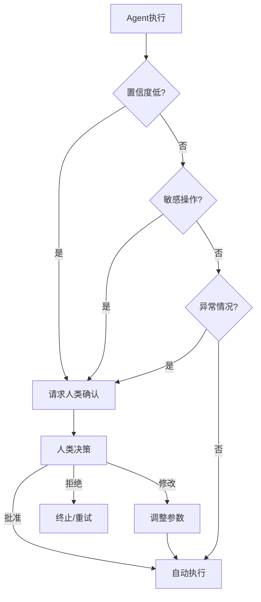

# 人类介入设计

## 介入时机



## 介入模式

### 1. 审批模式（Approval）

```python
class ApprovalGate:
    def __init__(self, rules):
        self.rules = rules
    
    def check(self, action: dict) -> bool:
        if any(rule.matches(action) for rule in self.rules):
            return self.request_approval(action)
        return True
    
    def request_approval(self, action: dict) -> bool:
        # 发送通知给审批者
        send_notification(action)
        # 等待审批结果
        return wait_for_approval(timeout=300)
```

### 2. 修正模式（Correction）

Agent 执行后，人类可以修正结果。

```python
class CorrectableAgent:
    def execute(self, task: str) -> dict:
        draft = self.agent.run(task)
        
        # 展示给用户并请求反馈
        feedback = self.request_feedback(draft)
        
        if feedback.needs_correction:
            draft = self.revise(draft, feedback)
        
        return draft
```

### 3. 教学模式（Teaching）

人类纠正 Agent 的错误，Agent 学习改进。

```python
class TeachableAgent:
    def learn_from_feedback(self, interaction: dict):
        if interaction["feedback"] == "negative":
            # 记录失败案例
            self.memory.store({
                "type": "mistake",
                "input": interaction["input"],
                "wrong_output": interaction["output"],
                "correction": interaction["correction"],
            })
```

## 最佳实践

1. **最小化介入**：只在关键时刻请求人类
2. **异步支持**：介入不阻塞其他任务
3. **上下文完整**：人类能看到足够的决策上下文
4. **快速路径**：常用操作可预授权
5. **学习改进**：从人类反馈中持续优化

## 延伸阅读

- [[04-ACI设计]] — 人机交互接口
- [[01-安全防护栏]] — 敏感操作的审批设计
