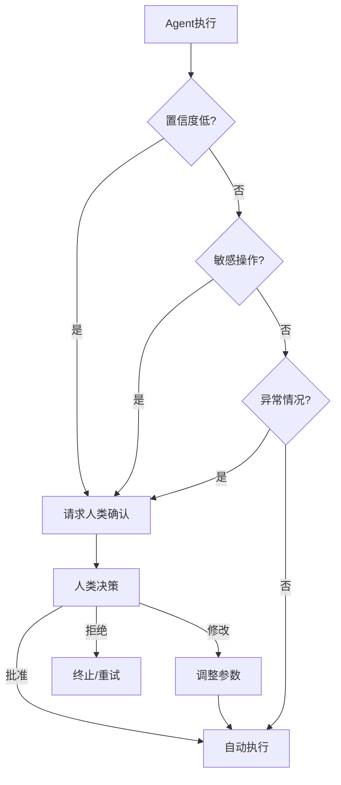

# 人类介入设计

## 介入时机



## 介入模式

### 1. 审批模式（Approval）

```python
class ApprovalGate:
    def __init__(self, rules):
        self.rules = rules
    
    def check(self, action: dict) -> bool:
        if any(rule.matches(action) for rule in self.rules):
            return self.request_approval(action)
        return True
    
    def request_approval(self, action: dict) -> bool:
        # 发送通知给审批者
        send_notification(action)
        # 等待审批结果
        return wait_for_approval(timeout=300)
```

### 2. 修正模式（Correction）

Agent 执行后，人类可以修正结果。

```python
class CorrectableAgent:
    def execute(self, task: str) -> dict:
        draft = self.agent.run(task)
        
        # 展示给用户并请求反馈
        feedback = self.request_feedback(draft)
        
        if feedback.needs_correction:
            draft = self.revise(draft, feedback)
        
        return draft
```

### 3. 教学模式（Teaching）

人类纠正 Agent 的错误，Agent 学习改进。

```python
class TeachableAgent:
    def learn_from_feedback(self, interaction: dict):
        if interaction["feedback"] == "negative":
            # 记录失败案例
            self.memory.store({
                "type": "mistake",
                "input": interaction["input"],
                "wrong_output": interaction["output"],
                "correction": interaction["correction"],
            })
```

## 反模式与修复

| 反模式 | 问题 | 影响 | 修复方案 |
|--------|------|------|---------|
| **审批疲劳** | 每个操作都要求人类审批 | 用户频繁被打断，最终无脑点击"批准"，失去介入意义 | 分级审批策略：低风险自动放行，仅高风险操作触发人工审批 |
| **无决策上下文** | 请求人类确认时只显示"是否批准？" | 人类缺乏足够信息做出判断，只能盲目同意 | 提供完整上下文：输入、Agent 推理过程、预期输出、风险评估 |
| **确认提示过多** | Agent 每一步都弹出确认对话框 | 工作流严重拖慢，用户体验极差 | 批量审批 + 预授权机制：同类操作一次性授权，定期复审 |
| **阻塞式等待** | 人类审批期间 Agent 线程完全阻塞 | 系统资源浪费，无法处理其他任务 | 异步审批模式：挂起当前任务，Agent 处理其他请求，审批通过后恢复 |
| **介入点设计不当** | 在低风险操作上要求审批，高风险操作反而自动执行 | 风险管控倒置，该拦的没拦住 | 基于风险矩阵定义介入点：影响范围大 + 不可逆 = 必须介入 |
| **无学习机制** | 人类反复纠正相同类型的错误 | 同一问题反复出现，人类介入无法减少 | 教学模式（TeachableAgent）：从纠正中提取规则，逐步自动化 |

## 最佳实践

1. **最小化介入**：只在关键时刻请求人类
2. **异步支持**：介入不阻塞其他任务
3. **上下文完整**：人类能看到足够的决策上下文
4. **快速路径**：常用操作可预授权
5. **学习改进**：从人类反馈中持续优化

## 权衡分析

| 维度 | 方案A | 方案B | 建议 |
|------|-------|-------|------|
| **审批范围** | 全量审批（所有操作需人类确认） | 风险分级审批（仅高风险操作需确认） | 全量审批适用于初始上线阶段收集数据；成熟后应切换为风险分级审批避免审批疲劳 |
| **审批方式** | 同步审批（阻塞等待人类响应） | 异步审批（挂起任务，审批通过后恢复） | 时间敏感的实时操作可用同步审批（设置合理超时）；长流程任务必须异步审批避免系统阻塞 |
| **上下文呈现** | 丰富上下文（输入、推理、备选方案、风险评估） | 最小上下文（仅操作描述和确认按钮） | 人类需要做出有意义的判断时必须提供丰富上下文；低风险批量操作的快速确认可用最小上下文 |
| **介入频率** | 每步介入（逐步确认） | 批量介入（同类操作一次性授权） | 首次执行或新场景时逐步确认建立信任；同类操作模式稳定后切换为批量授权提升效率 |
| **学习机制** | 教学模式（从纠正中提取规则，逐步自动化） | 静态规则（人工编写审批规则不自动更新） | 长期运行的系统应引入教学模式，让人类介入频率随系统成熟度递减；短期项目可用静态规则 |
| **响应策略** | 人类拒绝后终止流程 | 人类拒绝后 Agent 自主重试或提供替代方案 | 安全敏感操作被拒绝后应终止；探索性任务被拒绝后可让 Agent 基于拒绝原因自主调整 |

## 延伸阅读

- [[04-ACI设计]] — 人机交互接口
- [[01-安全防护栏]] — 敏感操作的审批设计
