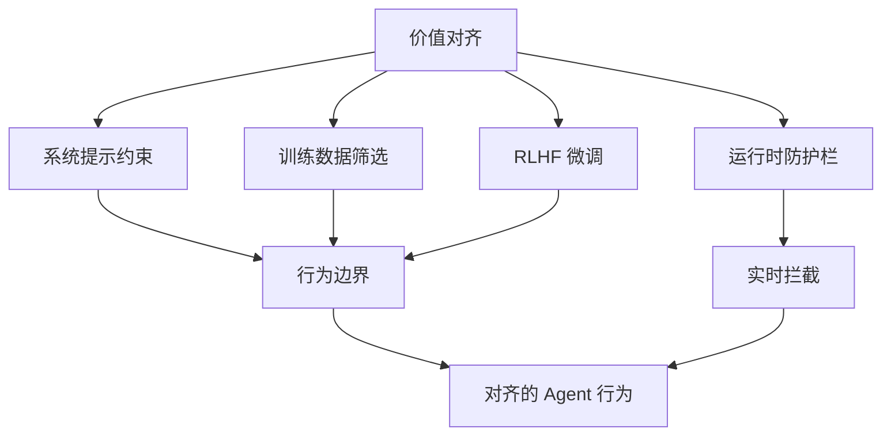

# 对齐与伦理

## 核心问题

Agent 系统需要在四个维度上与人类意图保持一致：

| 维度 | 定义 | 违反后果 |
|------|------|---------|
| **有用性（Helpful）** | 真正帮助用户达成目标 | Agent 变成摆设，用户弃用 |
| **诚实性（Honest）** | 不编造信息，不误导 | 幻觉导致错误决策 |
| **无害性（Harmless）** | 不对用户或社会造成伤害 | 法律风险、声誉损害 |
| **可控性（Controllable）** | 人类保持最终控制权 | Agent 失控，不可逆操作 |



## 伦理原则详解

### 1. 透明度

用户应知道他们在与 AI 交互，并理解 Agent 的能力边界。

```python
@dataclass
class TransparencyConfig:
    """Agent 透明度配置。"""
    disclose_ai_identity: bool = True       # 是否告知用户这是 AI
    show_confidence_scores: bool = True     # 是否展示置信度
    explain_reasoning: bool = True          # 是否解释决策过程
    list_limitations: bool = True           # 是否列出已知限制
    show_data_sources: bool = False         # 是否展示数据来源

class TransparencyLayer:
    def wrap_response(self, response: str, metadata: dict, config: TransparencyConfig) -> str:
        """在响应中注入透明度信息。"""
        parts = []

        if config.disclose_ai_identity:
            parts.append("🤖 AI 生成的回答，仅供参考。")

        if config.show_confidence_scores and metadata.get("confidence"):
            conf = metadata["confidence"]
            if conf < 0.7:
                parts.append(f"⚠️ 置信度较低（{conf:.0%}），建议人工验证。")

        if config.explain_reasoning and metadata.get("reasoning_steps"):
            steps = " → ".join(metadata["reasoning_steps"])
            parts.append(f"推理路径：{steps}")

        parts.append(response)
        return "\n\n".join(parts)
```

### 2. 问责制

明确 Agent 决策的责任归属，确保每条可追溯。

```python
import uuid
from datetime import datetime

@dataclass
class AuditEntry:
    """Agent 决策审计记录。"""
    entry_id: str
    timestamp: datetime
    agent_id: str
    action: str
    input_summary: str
    output_summary: str
    reasoning: str
    confidence: float
    human_approved: bool
    risk_level: str  # "low" | "medium" | "high" | "critical"

class AccountabilityTracker:
    def __init__(self):
        self.audit_log: list[AuditEntry] = []

    def record(self, agent_id: str, action: str, input_data: str,
               output_data: str, reasoning: str, confidence: float,
               risk_level: str, human_approved: bool = False) -> AuditEntry:
        entry = AuditEntry(
            entry_id=str(uuid.uuid4()),
            timestamp=datetime.utcnow(),
            agent_id=agent_id,
            action=action,
            input_summary=input_data[:200],
            output_summary=output_data[:200],
            reasoning=reasoning,
            confidence=confidence,
            human_approved=human_approved,
            risk_level=risk_level,
        )
        self.audit_log.append(entry)
        return entry

    def query_by_agent(self, agent_id: str) -> list[AuditEntry]:
        return [e for e in self.audit_log if e.agent_id == agent_id]

    def query_high_risk(self) -> list[AuditEntry]:
        return [e for e in self.audit_log if e.risk_level in ("high", "critical")]
```

### 3. 公平性

避免 Agent 输出中的偏见和歧视。

```python
class BiasDetector:
    """检测 Agent 输出中的潜在偏见。"""

    # 敏感属性关键词
    SENSITIVE_ATTRIBUTES = {
        "gender": ["男", "女", "男性", "女性", "他", "她"],
        "age": ["老人", "年轻人", "小孩", "老年", "青年"],
        "ethnicity": ["汉族", "少数民族", "外国人"],
        "disability": ["残疾人", "残障", "障碍"],
    }

    def check(self, output: str, context: dict) -> list[dict]:
        """检查输出中是否存在基于敏感属性的差异化处理。"""
        issues = []

        # 检查是否在非必要场景提及敏感属性
        if not context.get("requires_demographic"):
            for attr, keywords in self.SENSITIVE_ATTRIBUTES.items():
                for kw in keywords:
                    if kw in output:
                        issues.append({
                            "type": "unnecessary_demographic_reference",
                            "attribute": attr,
                            "keyword": kw,
                            "suggestion": f"移除非必要的{attr}相关信息",
                        })
        return issues
```

### 4. 隐私保护

最小化数据收集，保护用户隐私。

```python
class PrivacyGuard:
    """隐私保护守卫。"""

    def __init__(self, retention_days: int = 30):
        self.retention_days = retention_days

    def sanitize_for_storage(self, data: dict) -> dict:
        """存储前脱敏。"""
        sanitized = {}
        for key, value in data.items():
            if self._is_pii_field(key):
                sanitized[key] = self._mask(value)
            else:
                sanitized[key] = value
        return sanitized

    def _is_pii_field(self, field_name: str) -> bool:
        pii_fields = {"email", "phone", "name", "address", "id_card", "ssn"}
        return field_name.lower() in pii_fields

    def _mask(self, value: str) -> str:
        if len(value) <= 4:
            return "****"
        return value[:2] + "*" * (len(value) - 4) + value[-2:]

    def enforce_retention(self, stored_at: datetime) -> bool:
        """检查数据是否超过保留期限。"""
        age = (datetime.utcnow() - stored_at).days
        return age <= self.retention_days
```

## 伦理评估管线

```python
class EthicalEvaluationPipeline:
    """Agent 行为的伦理评估管线。"""

    def __init__(self, config: TransparencyConfig):
        self.bias_detector = BiasDetector()
        self.privacy_guard = PrivacyGuard()
        self.accountability = AccountabilityTracker()
        self.transparency = TransparencyLayer()
        self.config = config

    def evaluate(self, agent_id: str, action: dict, context: dict) -> dict:
        """综合伦理评估。"""
        issues = []

        # 1. 偏见检测
        bias_issues = self.bias_detector.check(action.get("output", ""), context)
        issues.extend(bias_issues)

        # 2. 隐私检查
        if context.get("contains_pii"):
            issues.append({
                "type": "pii_detected",
                "suggestion": "输出包含个人信息，需脱敏处理",
            })

        # 3. 风险评级
        risk_level = self._assess_risk(action, issues)

        # 4. 审计记录
        self.accountability.record(
            agent_id=agent_id,
            action=action.get("type", "unknown"),
            input_data=action.get("input", ""),
            output_data=action.get("output", ""),
            reasoning=action.get("reasoning", ""),
            confidence=action.get("confidence", 0.0),
            risk_level=risk_level,
        )

        return {
            "approved": len(issues) == 0 or risk_level == "low",
            "issues": issues,
            "risk_level": risk_level,
        }

    def _assess_risk(self, action: dict, issues: list) -> str:
        if any(i["type"] == "pii_detected" for i in issues):
            return "high"
        if len(issues) > 2:
            return "medium"
        if action.get("confidence", 1.0) < 0.5:
            return "medium"
        return "low"
```

## 反模式与修复

| 反模式 | 问题 | 影响 | 修复方案 |
|--------|------|------|---------|
| **无审计日志** | Agent 决策不可追溯 | 出了问题无法定位原因 | 全链路审计 + AccountabilityTracker |
| **硬编码伦理规则** | 伦理规则写死在代码中 | 无法适应不同地区法规 | 配置化伦理策略 + 动态加载 |
| **忽略偏见** | 不检测输出中的偏见 | 歧视性输出引发投诉 | BiasDetector + 定期审查 |
| **过度收集** | 收集超出必要的用户数据 | 违反 GDPR/个人信息保护法 | PrivacyGuard + 最小化原则 |
| **无透明度** | 用户不知道在与 AI 交互 | 信任危机，法规风险 | TransparencyLayer + 明确告知 |
| **信任 LLM 判断** | 让 LLM 自行判断伦理合规 | LLM 可能被绕过或产生幻觉 | 规则引擎兜底 + 人类审核 |

## 权衡分析

| 维度 | 严格伦理管控 | 宽松伦理管控 | 建议 |
|------|------------|------------|------|
| **合规性** | 高 | 低 | 涉及个人数据时必须严格 |
| **响应延迟** | 高（多层检查） | 低 | 对延迟敏感场景可异步审查 |
| **用户体验** | 差（频繁确认） | 好 | 分级管控，低风险自动放行 |
| **误拦截率** | 高 | 低 | 定期调优检测阈值 |
| **开发成本** | 高 | 低 | 从核心规则开始，逐步完善 |

**生产建议**：采用分级伦理策略。低风险操作（通用问答）自动放行；中风险操作（涉及个人信息）记录日志并脱敏；高风险操作（医疗/法律/金融建议）必须人工审核并添加免责声明。

## 延伸阅读

- [[01-安全防护栏]] — 技术层面的安全防护
- [[03-人类介入设计]] — 保持人类控制的机制
- [[02-可观测性]] — Agent 行为监控与审计
- [[00-协作总览]] — 多 Agent 系统的伦理治理
