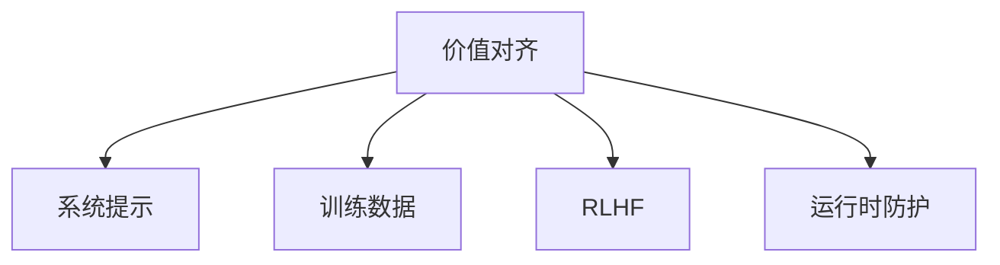

# 对齐与伦理

## 核心问题

Agent 系统需要确保：
- **有用性（Helpful）**：真正帮助用户达成目标
- **诚实性（Honest）**：不编造信息，不误导
- **无害性（Harmless）**：不对用户或社会造成伤害
- **可控性（Controllable）**：人类保持最终控制权



## 伦理原则

### 1. 透明度

用户应知道他们在与 AI 交互。

### 2. 问责制

明确 Agent 决策的责任归属。

### 3. 公平性

避免偏见和歧视。

### 4. 隐私保护

最小化数据收集，保护用户隐私。

## 实施策略

```python
class EthicalGuardrails:
    def evaluate_action(self, action: dict) -> tuple[bool, str]:
        # 检查是否符合伦理准则
        if violates_ethical_guidelines(action):
            return False, "Action violates ethical guidelines"
        
        # 检查是否可能造成 harm
        if potential_harm_score(action) > THRESHOLD:
            return False, "Action has high potential for harm"
        
        return True, "Action is ethically acceptable"
```

## 最佳实践

1. **明确边界**：定义 Agent 不能做的事情
2. **人类最终控制**：保留人类覆盖 Agent 决策的能力
3. **持续评估**：定期审查 Agent 行为的伦理影响
4. **多方参与**：伦理审查需要多元视角
5. **文档透明**：公开 Agent 的能力和限制

## 延伸阅读

- [[01-安全防护栏]] — 技术层面的安全防护
- [[03-人类介入设计]] — 保持人类控制
