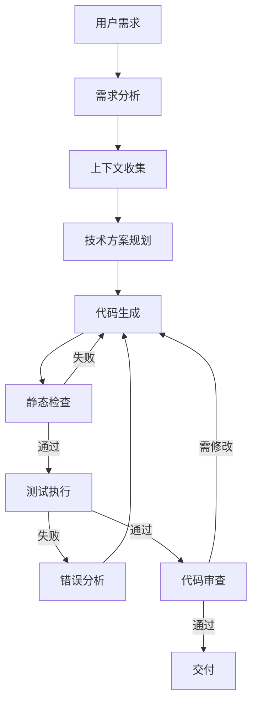
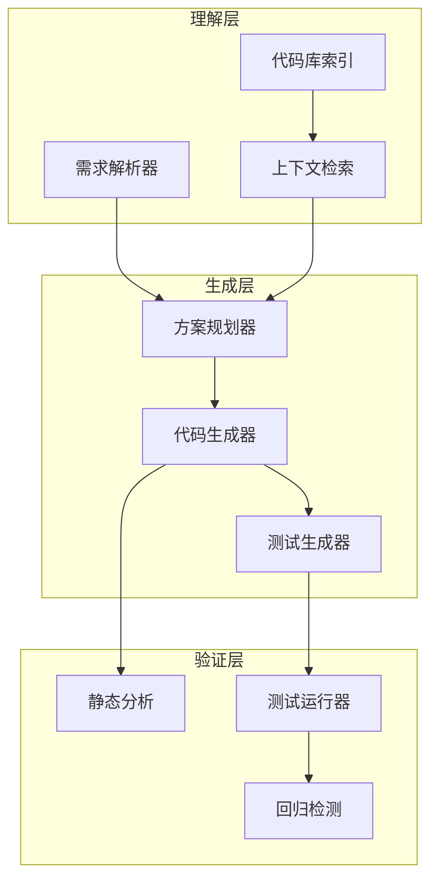

# 代码生成 Agent

## 场景描述

代码生成 Agent 是目前最具商业价值的 Agent 应用之一。与简单的代码补全不同，代码生成 Agent 需要**理解需求、规划架构、生成代码、运行测试、修复错误**——形成一个完整的闭环。典型产品包括 GitHub Copilot Workspace、Cursor Composer、Devin 等。

**核心挑战**：代码生成不是单步 LLM 调用，而是一个多轮推理-执行循环。Agent 必须能够读取现有代码库、理解项目上下文、生成符合项目风格的代码，并通过测试验证正确性。



## 架构设计

### 三层架构

生产级代码生成 Agent 通常采用三层架构：



### 工具集设计

| 工具 | 用途 | 实现要点 |
|------|------|---------|
| `file_read` | 读取现有代码 | 支持 glob 模式，返回带行号的内容 |
| `file_write` | 写入/修改文件 | 原子写入，支持 diff 预览 |
| `code_search` | 语义/正则搜索 | 结合 ripgrep 和向量检索 |
| `test_runner` | 执行测试 | 沙箱隔离，超时控制 |
| `linter` | 静态检查 | ESLint / Ruff / MyPy |
| `git_ops` | 版本控制 | 自动 commit，支持回滚 |
| `dependency` | 依赖管理 | 安全扫描，版本锁定 |

## 实现示例

### 核心 Agent 循环

```python
from dataclasses import dataclass, field
from typing import List, Optional, Dict, Any
from enum import Enum
import subprocess
import tempfile
import os

class TaskStatus(Enum):
    PLANNING = "planning"
    GENERATING = "generating"
    TESTING = "testing"
    FIXING = "fixing"
    DONE = "done"
    FAILED = "failed"

@dataclass
class TestResult:
    passed: bool
    output: str
    errors: List[str]
    duration_ms: int

@dataclass
class GenerationContext:
    requirement: str
    project_root: str
    relevant_files: List[str] = field(default_factory=list)
    existing_patterns: Dict[str, Any] = field(default_factory=dict)
    max_iterations: int = 5

class CodeGenerationAgent:
    """基于 ReAct + 评估器-优化器模式的代码生成 Agent。"""

    def __init__(self, llm, tools: Dict[str, Any]):
        self.llm = llm
        self.tools = tools
        self.iteration = 0

    async def generate(self, ctx: GenerationContext) -> str:
        """主循环：需求分析 → 代码生成 → 测试验证 → 错误修复。"""
        # 1. 收集上下文
        context = await self._gather_context(ctx)

        # 2. 规划技术方案
        plan = await self._plan_solution(ctx.requirement, context)

        # 3. 生成代码（带迭代修复）
        code = None
        for self.iteration in range(ctx.max_iterations):
            if code is None:
                code = await self._generate_code(plan, context)
            else:
                code = await self._fix_code(code, test_result, context)

            # 4. 静态检查
            lint_result = await self.tools["linter"].run(code)
            if not lint_result.passed:
                code = await self._fix_lint_issues(code, lint_result)
                continue

            # 5. 测试验证
            test_result = await self._run_tests(code, ctx)
            if test_result.passed:
                break

            # 6. 错误分析（评估器）
            analysis = await self._analyze_failure(test_result, code)
            if analysis["severity"] == "fatal":
                # 根本性错误，需要重新生成
                code = None
                plan = await self._replan(ctx.requirement, analysis, context)

        if not test_result.passed:
            raise GenerationError(
                f"Failed after {ctx.max_iterations} iterations. "
                f"Last error: {test_result.errors}"
            )

        return code

    async def _gather_context(self, ctx: GenerationContext) -> dict:
        """收集项目上下文：目录结构、代码风格、依赖、测试模式。"""
        project_files = await self.tools["file_read"].glob(
            f"{ctx.project_root}/**/*.py"
        )

        # 采样代表性文件以学习项目风格
        sample_files = project_files[:20]
        samples = []
        for f in sample_files:
            content = await self.tools["file_read"].read(f)
            samples.append({"path": f, "content": content})

        # 提取项目模式
        patterns = await self.llm.invoke(
            "分析以下代码样本，提取项目的编码风格、命名约定、"
            "错误处理模式和测试模式：\n\n"
            + "\n---\n".join(
                f"文件: {s['path']}\n{s['content'][:2000]}" for s in samples
            ),
            response_format="json"
        )

        return {
            "file_count": len(project_files),
            "patterns": patterns,
            "samples": samples,
        }

    async def _plan_solution(self, requirement: str, context: dict) -> dict:
        """规划技术方案：确定需要创建/修改的文件和函数。"""
        return await self.llm.invoke(
            f"根据以下需求和项目上下文，制定实现方案。\n\n"
            f"需求：{requirement}\n\n"
            f"项目风格：{context['patterns']}\n\n"
            f"输出 JSON 格式的实现计划，包含：\n"
            f"1. 需要创建/修改的文件列表\n"
            f"2. 每个文件的核心逻辑\n"
            f"3. 需要编写的测试用例\n"
            f"4. 潜在风险和注意事项",
            response_format="json"
        )

    async def _generate_code(self, plan: dict, context: dict) -> str:
        """根据计划生成代码。"""
        return await self.llm.invoke(
            f"根据以下实现计划生成完整代码。\n\n"
            f"计划：{plan}\n\n"
            f"项目风格约束：{context['patterns']}\n\n"
            f"要求：\n"
            f"- 代码必须可直接运行\n"
            f"- 包含完整的错误处理\n"
            f"- 遵循项目的命名约定\n"
            f"- 添加必要的类型注解"
        )

    async def _run_tests(
        self, code: str, ctx: GenerationContext
    ) -> TestResult:
        """在沙箱中运行测试。"""
        with tempfile.TemporaryDirectory() as tmpdir:
            # 写入生成的代码
            code_path = os.path.join(tmpdir, "generated.py")
            with open(code_path, "w") as f:
                f.write(code)

            # 生成并写入测试
            test_code = await self._generate_tests(code, ctx)
            test_path = os.path.join(tmpdir, "test_generated.py")
            with open(test_path, "w") as f:
                f.write(test_code)

            # 在沙箱中执行
            try:
                result = subprocess.run(
                    ["python", "-m", "pytest", test_path, "-v", "--tb=short"],
                    capture_output=True,
                    text=True,
                    timeout=30,
                    cwd=tmpdir,
                )
                return TestResult(
                    passed=result.returncode == 0,
                    output=result.stdout,
                    errors=self._extract_errors(result.stderr + result.stdout),
                    duration_ms=0,  # 简化
                )
            except subprocess.TimeoutExpired:
                return TestResult(
                    passed=False,
                    output="",
                    errors=["Test execution timed out after 30s"],
                    duration_ms=30000,
                )

    async def _analyze_failure(
        self, test_result: TestResult, code: str
    ) -> dict:
        """评估器：分析测试失败原因，判断是否需要重新生成还是修复。"""
        return await self.llm.invoke(
            f"分析以下测试失败结果，判断失败原因和严重程度。\n\n"
            f"生成的代码：\n```python\n{code}\n```\n\n"
            f"测试输出：\n{test_result.output}\n\n"
            f"错误信息：\n{test_result.errors}\n\n"
            f"返回 JSON，包含：\n"
            f"- severity: 'fixable' | 'fatal'\n"
            f"- root_cause: 根本原因\n"
            f"- fix_suggestions: 修复建议列表",
            response_format="json"
        )

    async def _fix_code(
        self, code: str, test_result: TestResult, context: dict
    ) -> str:
        """优化器：根据测试失败修复代码。"""
        return await self.llm.invoke(
            f"修复以下代码中的问题。\n\n"
            f"当前代码：\n```python\n{code}\n```\n\n"
            f"测试失败信息：\n{test_result.output}\n\n"
            f"项目风格：{context['patterns']}\n\n"
            f"只返回修复后的完整代码。"
        )

    async def _fix_lint_issues(self, code: str, lint_result) -> str:
        """修复静态检查问题。"""
        return await self.llm.invoke(
            f"修复以下代码的 lint 问题。\n\n"
            f"代码：\n```python\n{code}\n```\n\n"
            f"Lint 输出：\n{lint_result.output}\n\n"
            f"只返回修复后的完整代码。"
        )

    async def _replan(
        self, requirement: str, analysis: dict, context: dict
    ) -> dict:
        """根据失败分析重新规划方案。"""
        return await self.llm.invoke(
            f"之前的实现方案失败了，请重新规划。\n\n"
            f"原始需求：{requirement}\n"
            f"失败原因：{analysis}\n"
            f"项目上下文：{context['patterns']}\n\n"
            f"制定一个新的、更保守的实现方案。",
            response_format="json"
        )

    def _extract_errors(self, output: str) -> List[str]:
        """从测试输出中提取错误信息。"""
        errors = []
        for line in output.split("\n"):
            if "FAILED" in line or "ERROR" in line or "AssertionError" in line:
                errors.append(line.strip())
        return errors


class GenerationError(Exception):
    """代码生成失败。"""
    pass
```

### 上下文检索（RAG 增强）

大型代码库中，Agent 需要智能检索相关代码片段，而非读取整个项目：

```python
class CodebaseIndex:
    """代码库索引，支持语义搜索和结构化查询。"""

    def __init__(self, embedding_model):
        self.embedder = embedding_model
        self.chunks: List[dict] = []  # {path, content, start_line, end_line, symbols}

    async def index_project(self, root: str):
        """索引项目中的所有代码文件。"""
        import ast
        from pathlib import Path

        for py_file in Path(root).rglob("*.py"):
            content = py_file.read_text()
            # 按函数/类分块
            try:
                tree = ast.parse(content)
                for node in ast.iter_child_nodes(tree):
                    if isinstance(node, (ast.FunctionDef, ast.AsyncFunctionDef, ast.ClassDef)):
                        chunk_content = ast.get_source_segment(content, node)
                        if chunk_content:
                            self.chunks.append({
                                "path": str(py_file),
                                "content": chunk_content,
                                "start_line": node.lineno,
                                "end_line": node.end_lineno,
                                "symbols": [node.name],
                                "type": type(node).__name__,
                            })
            except SyntaxError:
                # 语法错误的文件按行分块
                lines = content.split("\n")
                for i in range(0, len(lines), 50):
                    chunk = "\n".join(lines[i:i+50])
                    self.chunks.append({
                        "path": str(py_file),
                        "content": chunk,
                        "start_line": i + 1,
                        "end_line": min(i + 50, len(lines)),
                        "symbols": [],
                        "type": "raw",
                    })

    async def search(self, query: str, top_k: int = 5) -> List[dict]:
        """语义搜索相关代码片段。"""
        query_embedding = await self.embedder.embed(query)
        scored = []
        for chunk in self.chunks:
            chunk_embedding = await self.embedder.embed(chunk["content"])
            score = self._cosine_similarity(query_embedding, chunk_embedding)
            scored.append({**chunk, "score": score})
        scored.sort(key=lambda x: x["score"], reverse=True)
        return scored[:top_k]

    def search_by_symbol(self, symbol: str) -> List[dict]:
        """按符号名精确搜索。"""
        return [c for c in self.chunks if symbol in c["symbols"]]

    def _cosine_similarity(self, a, b) -> float:
        import numpy as np
        return float(np.dot(a, b) / (np.linalg.norm(a) * np.linalg.norm(b)))
```

## 真实场景案例

### 场景 1：重构遗留代码

**需求**：将一个基于回调的 Node.js 模块重构为 async/await 风格。

**Agent 行为**：
1. 读取目标文件及其依赖，理解回调链
2. 识别 `callback(err, result)` 模式
3. 逐函数转换，保持对外 API 不变
4. 运行现有测试验证行为一致性
5. 发现测试中也有回调模式 → 自动更新测试

**关键挑战**：回调地狱的嵌套层级不同，Agent 需要理解每个回调的作用域和错误传播路径。

### 场景 2：跨文件功能添加

**需求**：为 Express.js API 添加 rate limiting 中间件。

**Agent 行为**：
1. 搜索项目中的中间件模式（`app.use(...)`）
2. 读取 `package.json` 检查是否已有 rate limiting 依赖
3. 创建 `middleware/rateLimiter.ts`，遵循项目现有的中间件结构
4. 在路由文件中注册中间件
5. 编写测试：正常请求、超限请求、不同 IP 隔离
6. 发现项目使用 Redis → 自动使用 Redis store 而非内存

### 场景 3：Bug 修复

**需求**：用户报告"登录后偶尔显示未登录状态"。

**Agent 行为**：
1. 搜索认证相关代码（`auth`, `session`, `token`）
2. 分析 token 刷新逻辑，发现竞态条件：两个并发请求同时刷新 token
3. 实现 mutex 锁确保单次刷新
4. 编写并发测试复现问题
5. 验证修复后测试通过

## 反模式与修复

| 反模式 | 问题 | 影响 | 修复方案 |
|--------|------|------|---------|
| **全库上下文** | 将整个代码库塞入 LLM 上下文 | 超出 token 限制，成本爆炸 | RAG 语义检索 + 结构化索引 |
| **无测试生成** | 只生成代码不生成测试 | 无法验证正确性，回归风险 | 每次生成都配套测试 |
| **盲目重试** | 测试失败后原封不动重试 | 浪费 token，永远无法通过 | 失败分析 → 定向修复 |
| **忽略项目风格** | 生成与项目风格不一致的代码 | 代码审查不通过 | 先学习项目模式再生成 |
| **单文件思维** | 只关注目标文件不看依赖 | 导入错误、接口不匹配 | 依赖图分析 + 关联文件读取 |
| **无回滚机制** | 生成失败后无法恢复 | 代码库损坏 | Git commit 每步，失败自动回滚 |
| **过度自信** | 不运行测试直接交付 | 生产事故 | 强制测试通过才能交付 |
| **忽略安全** | 生成包含硬编码密钥的代码 | 安全漏洞 | 生成后安全扫描 + PII 检测 |

### 盲目重试 vs 智能修复

```python
# ❌ 反模式：盲目重试
for i in range(max_retries):
    code = llm.generate(prompt)
    if run_tests(code).passed:
        break
    # 没有分析失败原因，下次生成可能犯同样的错

# ✅ 正确：评估器-优化器模式
for i in range(max_retries):
    code = llm.generate(prompt) if code is None else code
    result = run_tests(code)
    if result.passed:
        break
    # 分析失败原因，定向修复
    analysis = analyzer.analyze(result)
    code = fixer.fix(code, analysis)
```

## 权衡分析

| 维度 | ReAct 模式 | Plan-and-Execute 模式 | 评估器-优化器 |
|------|-----------|---------------------|-------------|
| **适用场景** | 简单到中等复杂度 | 复杂多文件变更 | 需要迭代修复 |
| **token 效率** | 中 | 高（一次规划） | 低（多次迭代） |
| **成功率** | 中 | 高 | 高 |
| **延迟** | 中 | 高（规划阶段） | 高（迭代阶段） |
| **可控性** | 低 | 高 | 中 |
| **推荐组合** | 简单补全 | 复杂重构 | 测试驱动修复 |

**生产建议**：根据任务复杂度动态选择策略。简单补全用 ReAct，跨文件重构用 Plan-and-Execute，测试失败修复用评估器-优化器。实际产品（如 Cursor）通常组合使用。

## 生产部署考量

1. **沙箱隔离**：代码执行必须在容器或 VM 中，防止恶意代码影响宿主
2. **成本控制**：设置单次生成的 token 上限和迭代次数上限
3. **用户确认**：高风险操作（删除文件、修改配置）需用户确认
4. **增量交付**：大改动拆分为多个小 PR，便于审查
5. **回滚能力**：每次自动 commit，支持一键回滚
6. **隐私保护**：代码中可能包含密钥或敏感数据，生成时需脱敏

## 延伸阅读

- [[06-ReAct]] — ReAct 推理-行动循环详解
- [[07-Plan-and-Execute]] — 规划-执行模式详解
- [[05-评估器-优化器]] — 评估器-优化器模式
- [[01-工具设计]] — Agent 工具层设计
- [[02-函数调用]] — LLM Function Calling
- [[03-防护栏与沙箱]] — 沙箱执行环境设计
- [[01-安全防护栏]] — 安全防护机制
