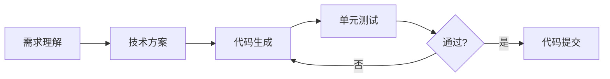

# 代码生成 Agent

## 场景

用户用自然语言描述需求，Agent 自动生成、测试并迭代代码。

## 架构



## 关键设计

| 组件 | 实现 |
|------|------|
| 需求解析 | 使用结构化输出提取功能点 |
| 代码生成 | ReAct 模式，调用代码搜索和文件操作工具 |
| 测试执行 | 沙箱容器运行 pytest |
| 迭代优化 | 评估器-优化器模式修复测试失败 |

## 代码示例

```python
from typing import List

class CodeGenerationAgent:
    def generate(self, requirement: str) -> str:
        # 1. 理解需求
        spec = self.llm_structured(
            f"分析需求并提取功能点: {requirement}",
            output_schema=Specification
        )
        
        # 2. 生成代码
        code = self.react_loop(
            goal=f"实现以下功能: {spec.features}",
            tools=[file_search, code_writer, linter]
        )
        
        # 3. 验证
        test_result = self.run_tests(code)
        if not test_result.passed:
            code = self.fix_code(code, test_result.errors)
        
        return code
```
