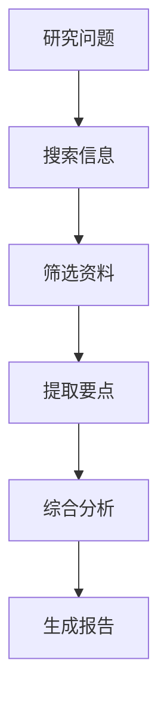
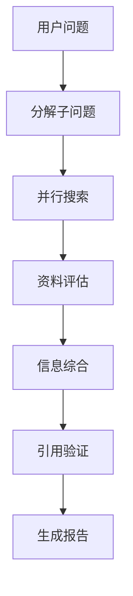

# 研究 Agent

## 场景描述

自动收集、分析和综合信息的研究助手 Agent。

## 架构设计

### 工作流

### 工具集

- 搜索引擎
- 论文数据库
- 网页内容提取
- 引用管理

## 关键挑战

| 挑战 | 解决方案 |
|------|---------|
| 信息过载 | 智能筛选和相关性排序 |
| 信息质量 | 来源可信度评估 |
| 偏见识别 | 多来源交叉验证 |
| 实时性 | 优先使用最新资料 |

## 最佳实践

1. **多源验证**：关键事实至少两个独立来源确认
2. **引用追踪**：所有结论标注来源
3. **更新机制**：定期更新知识库
4. **置信度标注**：区分确定事实和推测

## 延伸阅读

- [[03-并行化]] — 并行搜索策略
- [[05-评估器-优化器]] — 信息质量评估
