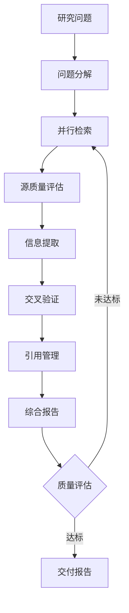
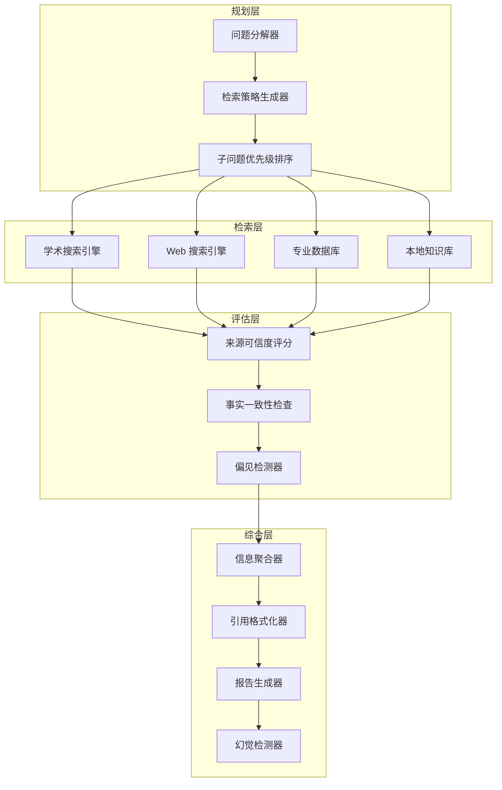

# 研究 Agent

## 场景描述

研究 Agent 是将 LLM 的语言理解能力与系统化信息检索相结合的 Agent 系统。与简单的"问答机器人"不同，研究 Agent 需要**分解复杂问题、并行检索多个信息源、评估来源可信度、交叉验证事实、管理引用链路**——形成一个完整的知识发现闭环。

典型应用场景包括：

- **学术研究助手**：为研究者检索论文、综述文献、发现研究空白
- **竞争情报分析**：追踪竞品动态、市场趋势、行业报告
- **尽职调查**：对目标公司/项目进行全面背景调查
- **政策研究**：梳理法规演变、比较不同司法管辖区的政策差异

**核心挑战**：研究不是简单的"搜索 + 摘要"。Agent 必须处理信息冲突、识别来源偏见、区分事实与观点、防止 LLM 幻觉污染检索结果，并为每条结论标注可追溯的引用。



## 架构设计

### 四层架构

生产级研究 Agent 采用四层架构，将检索、评估、综合、呈现分离：



### 工具集设计

| 工具 | 用途 | 实现要点 |
|------|------|---------|
| `web_search` | 通用 Web 搜索 | 支持多搜索引擎，返回结构化结果 |
| `scholar_search` | 学术论文检索 | Semantic Scholar / arXiv / PubMed API |
| `page_fetch` | 网页内容提取 | 去噪、正文提取、处理反爬 |
| `pdf_parse` | PDF 文档解析 | 学术论文结构化提取 |
| `citation_store` | 引用管理 | 去重、格式化、引用链追踪 |
| `credibility_check` | 来源评估 | 域名信誉、作者 h-index、引用数 |
| `fact_checker` | 事实验证 | 多源交叉验证、矛盾检测 |

## 实现示例

### 数据模型

```python
from dataclasses import dataclass, field
from typing import List, Optional, Dict, Any
from enum import Enum
from datetime import datetime
import hashlib


class SourceType(Enum):
    ACADEMIC = "academic"       # 学术论文
    NEWS = "news"               # 新闻报道
    GOVERNMENT = "government"   # 政府/官方文件
    INDUSTRY = "industry"       # 行业报告
    BLOG = "blog"               # 博客/个人观点
    SOCIAL = "social"           # 社交媒体


class CredibilityLevel(Enum):
    HIGH = "high"           # 同行评审论文、官方数据
    MEDIUM = "medium"       # 知名媒体、行业报告
    LOW = "low"             # 个人博客、未验证来源
    UNVERIFIED = "unverified"


@dataclass
class Source:
    """信息来源。"""
    url: str
    title: str
    source_type: SourceType
    author: Optional[str] = None
    published_date: Optional[datetime] = None
    credibility: CredibilityLevel = CredibilityLevel.UNVERIFIED
    credibility_score: float = 0.0        # 0.0 - 1.0
    snippet: str = ""
    full_text: Optional[str] = None
    cited_by_count: int = 0               # 学术引用数
    retrieval_rank: int = 0               # 检索排名


@dataclass
class Claim:
    """一条事实主张。"""
    statement: str
    confidence: float                       # 0.0 - 1.0
    supporting_sources: List[Source] = field(default_factory=list)
    contradicting_sources: List[Source] = field(default_factory=list)
    is_verified: bool = False


@dataclass
class Citation:
    """引用记录。"""
    citation_id: str
    source: Source
    claim: str
    page_number: Optional[int] = None
    quote: Optional[str] = None             # 直接引用原文


@dataclass
class ResearchReport:
    """研究报告。"""
    question: str
    executive_summary: str
    sections: List[Dict[str, Any]]          # [{title, content, claims}]
    citations: List[Citation]
    confidence_level: float
    limitations: List[str]
    generated_at: datetime = field(default_factory=datetime.now)
```

### 核心 Agent 循环

```python
import asyncio
import logging

logger = logging.getLogger(__name__)


class ResearchAgent:
    """基于并行检索 + 评估器-优化器模式的研究 Agent。"""

    def __init__(self, llm, tools: Dict[str, Any], config: Dict[str, Any]):
        self.llm = llm
        self.tools = tools
        self.config = config
        self.max_sub_questions = config.get("max_sub_questions", 8)
        self.max_sources_per_question = config.get("max_sources_per_question", 10)
        self.min_credibility = config.get("min_credibility", 0.3)
        self.max_iterations = config.get("max_iterations", 3)
        self.citation_store: List[Citation] = []

    async def research(self, question: str) -> ResearchReport:
        """主研究流程。"""
        # 1. 分解研究问题
        sub_questions = await self._decompose_question(question)
        logger.info(f"分解为 {len(sub_questions)} 个子问题")

        # 2. 并行检索
        all_sources = await self._parallel_search(sub_questions)
        logger.info(f"共检索到 {len(all_sources)} 个来源")

        # 3. 评估来源质量
        evaluated_sources = await self._evaluate_sources(all_sources)
        high_quality = [
            s for s in evaluated_sources
            if s.credibility_score >= self.min_credibility
        ]
        logger.info(f"高质量来源: {len(high_quality)}/{len(evaluated_sources)}")

        # 4. 提取事实主张
        claims = await self._extract_claims(question, high_quality)

        # 5. 交叉验证
        verified_claims = await self._cross_verify(claims)

        # 6. 生成报告（带质量评估循环）
        report = await self._generate_report_with_evaluation(
            question, verified_claims, high_quality
        )

        return report

    async def _decompose_question(self, question: str) -> List[str]:
        """将复杂研究问题分解为可并行检索的子问题。"""
        result = await self.llm.invoke(
            f"将以下研究问题分解为 3-{self.max_sub_questions} 个具体的子问题，"
            f"每个子问题应该可以独立检索。\n\n"
            f"研究问题：{question}\n\n"
            f"要求：\n"
            f"1. 子问题之间尽量独立\n"
            f"2. 覆盖问题的不同维度（背景、现状、争议、数据）\n"
            f"3. 每个子问题足够具体，适合搜索引擎查询\n\n"
            f"返回 JSON 数组格式。",
            response_format="json"
        )
        sub_questions = result if isinstance(result, list) else result.get("questions", [])
        return sub_questions[:self.max_sub_questions]

    async def _parallel_search(
        self, sub_questions: List[str]
    ) -> List[Source]:
        """并行搜索所有子问题，聚合去重。"""

        async def search_one(sq: str) -> List[Source]:
            """对单个子问题执行多源搜索。"""
            tasks = [
                self.tools["web_search"].run(sq, limit=self.max_sources_per_question),
                self.tools["scholar_search"].run(sq, limit=self.max_sources_per_question // 2),
            ]
            results = await asyncio.gather(*tasks, return_exceptions=True)

            sources = []
            for result in results:
                if isinstance(result, Exception):
                    logger.warning(f"搜索失败: {result}")
                    continue
                sources.extend(result)
            return sources

        # 并行执行所有子问题的搜索
        all_results = await asyncio.gather(
            *[search_one(sq) for sq in sub_questions],
            return_exceptions=True
        )

        # 聚合并去重（基于 URL）
        seen_urls: set = set()
        unique_sources: List[Source] = []
        for result in all_results:
            if isinstance(result, Exception):
                continue
            for source in result:
                url_hash = hashlib.md5(source.url.encode()).hexdigest()
                if url_hash not in seen_urls:
                    seen_urls.add(url_hash)
                    unique_sources.append(source)

        return unique_sources

    async def _evaluate_sources(self, sources: List[Source]) -> List[Source]:
        """评估每个来源的可信度。"""

        async def evaluate_one(source: Source) -> Source:
            try:
                # 获取页面内容（如果还没有）
                if source.full_text is None:
                    source.full_text = await self.tools["page_fetch"].run(source.url)

                # LLM 评估来源质量
                eval_result = await self.llm.invoke(
                    f"评估以下信息来源的可信度。\n\n"
                    f"标题：{source.title}\n"
                    f"URL：{source.url}\n"
                    f"类型：{source.source_type.value}\n"
                    f"作者：{source.author or '未知'}\n"
                    f"发布日期：{source.published_date or '未知'}\n"
                    f"内容摘要：{source.full_text[:1000]}\n\n"
                    f"评估维度：\n"
                    f"1. 来源权威性（0-10）\n"
                    f"2. 内容客观性（0-10）\n"
                    f"3. 信息时效性（0-10）\n"
                    f"4. 是否存在明显偏见\n\n"
                    f"返回 JSON：{{credibility_score: float, bias_detected: bool, reasoning: str}}",
                    response_format="json"
                )

                source.credibility_score = float(eval_result.get("credibility_score", 0.5))
                source.credibility = self._score_to_level(source.credibility_score)
                return source

            except Exception as e:
                logger.warning(f"评估来源失败 {source.url}: {e}")
                source.credibility_score = 0.0
                source.credibility = CredibilityLevel.UNVERIFIED
                return source

        # 并行评估，但限制并发数避免触发限流
        semaphore = asyncio.Semaphore(5)

        async def evaluate_with_limit(source: Source) -> Source:
            async with semaphore:
                return await evaluate_one(source)

        evaluated = await asyncio.gather(
            *[evaluate_with_limit(s) for s in sources]
        )
        return list(evaluated)

    def _score_to_level(self, score: float) -> CredibilityLevel:
        if score >= 0.8:
            return CredibilityLevel.HIGH
        elif score >= 0.5:
            return CredibilityLevel.MEDIUM
        elif score >= 0.3:
            return CredibilityLevel.LOW
        return CredibilityLevel.UNVERIFIED

    async def _extract_claims(
        self, question: str, sources: List[Source]
    ) -> List[Claim]:
        """从多个来源中提取与研究问题相关的事实主张。"""
        # 按可信度排序，取前 N 个
        sorted_sources = sorted(
            sources, key=lambda s: s.credibility_score, reverse=True
        )[:20]

        source_texts = "\n---\n".join(
            f"[来源 {i+1}] {s.title} ({s.source_type.value})\n"
            f"可信度: {s.credibility_score:.2f}\n"
            f"内容: {s.full_text[:2000] if s.full_text else s.snippet}"
            for i, s in enumerate(sorted_sources)
        )

        result = await self.llm.invoke(
            f"从以下来源中提取与研究问题相关的事实主张。\n\n"
            f"研究问题：{question}\n\n"
            f"来源信息：\n{source_texts}\n\n"
            f"要求：\n"
            f"1. 只提取有来源支持的事实性主张（非观点）\n"
            f"2. 标注每个主张的来源编号\n"
            f"3. 标注主张的置信度（0-1）\n\n"
            f"返回 JSON 数组：[{{statement, source_indices, confidence}}]",
            response_format="json"
        )

        claims_data = result if isinstance(result, list) else result.get("claims", [])

        claims = []
        for cd in claims_data:
            source_indices = cd.get("source_indices", [])
            supporting = [
                sorted_sources[i]
                for i in source_indices
                if i < len(sorted_sources)
            ]
            claims.append(Claim(
                statement=cd["statement"],
                confidence=cd.get("confidence", 0.5),
                supporting_sources=supporting,
            ))

        return claims

    async def _cross_verify(self, claims: List[Claim]) -> List[Claim]:
        """交叉验证：检查多源一致性，识别矛盾。"""
        for claim in claims:
            # 至少需要两个独立来源支持才算验证通过
            unique_domains = set()
            for s in claim.supporting_sources:
                from urllib.parse import urlparse
                domain = urlparse(s.url).netloc
                unique_domains.add(domain)

            if len(unique_domains) >= 2:
                claim.is_verified = True
                # 多源一致，提升置信度
                claim.confidence = min(1.0, claim.confidence + 0.1)
            elif len(unique_domains) == 1:
                # 单源，保持原置信度
                pass
            else:
                # 无来源支持，降低置信度
                claim.confidence = max(0.0, claim.confidence - 0.3)

        # 按置信度排序
        claims.sort(key=lambda c: c.confidence, reverse=True)
        return claims

    async def _generate_report_with_evaluation(
        self,
        question: str,
        claims: List[Claim],
        sources: List[Source],
    ) -> ResearchReport:
        """生成报告并通过评估器-优化器循环迭代改进。"""

        report = await self._generate_report(question, claims, sources)

        for iteration in range(self.max_iterations):
            # 评估报告质量
            evaluation = await self._evaluate_report(report, question)

            if evaluation["passed"]:
                break

            # 根据反馈改进报告
            report = await self._improve_report(report, evaluation["feedback"])

        return report

    async def _generate_report(
        self,
        question: str,
        claims: List[Claim],
        sources: List[Source],
    ) -> ResearchReport:
        """生成研究报告。"""
        verified = [c for c in claims if c.is_verified]
        unverified = [c for c in claims if not c.is_verified]

        claims_text = "\n".join(
            f"- [{c.confidence:.2f}] {c.statement} "
            f"(来源: {', '.join(s.title for s in c.supporting_sources[:3])})"
            for c in verified
        )

        result = await self.llm.invoke(
            f"基于以下已验证的事实主张，生成研究报告。\n\n"
            f"研究问题：{question}\n\n"
            f"已验证主张：\n{claims_text}\n\n"
            f"未验证主张（仅供参考）：\n"
            f"{chr(10).join(f'- {c.statement}' for c in unverified[:5])}\n\n"
            f"报告要求：\n"
            f"1. 执行摘要（200字）\n"
            f"2. 分节论述，每节引用具体来源\n"
            f"3. 标注每条结论的置信度\n"
            f"4. 列出研究局限性\n\n"
            f"返回 JSON：{{summary, sections: [{{title, content, claims}}], limitations}}",
            response_format="json"
        )

        # 构建引用列表
        citations = []
        citation_counter = 1
        for claim in verified:
            for source in claim.supporting_sources[:2]:
                citations.append(Citation(
                    citation_id=f"[{citation_counter}]",
                    source=source,
                    claim=claim.statement,
                ))
                citation_counter += 1

        # 计算整体置信度
        if verified:
            avg_confidence = sum(c.confidence for c in verified) / len(verified)
        else:
            avg_confidence = 0.0

        return ResearchReport(
            question=question,
            executive_summary=result.get("summary", ""),
            sections=result.get("sections", []),
            citations=citations,
            confidence_level=avg_confidence,
            limitations=result.get("limitations", []),
        )

    async def _evaluate_report(
        self, report: ResearchReport, question: str
    ) -> Dict[str, Any]:
        """评估器：评估报告质量。"""
        return await self.llm.invoke(
            f"评估以下研究报告的质量。\n\n"
            f"研究问题：{question}\n\n"
            f"报告摘要：{report.executive_summary}\n"
            f"引用数量：{len(report.citations)}\n"
            f"置信度：{report.confidence_level:.2f}\n"
            f"局限性数量：{len(report.limitations)}\n\n"
            f"评估标准：\n"
            f"1. 是否直接回答了研究问题\n"
            f"2. 论述是否有充分的来源支持\n"
            f"3. 是否考虑了不同观点\n"
            f"4. 引用是否规范\n"
            f"5. 局限性说明是否充分\n\n"
            f"返回 JSON：{{passed: bool, score: float, feedback: str}}",
            response_format="json"
        )

    async def _improve_report(
        self, report: ResearchReport, feedback: str
    ) -> ResearchReport:
        """优化器：根据评估反馈改进报告。"""
        result = await self.llm.invoke(
            f"根据以下反馈改进研究报告。\n\n"
            f"当前报告摘要：{report.executive_summary}\n"
            f"当前报告内容：{report.sections}\n\n"
            f"评估反馈：{feedback}\n\n"
            f"请改进报告，返回与原报告相同格式的 JSON。",
            response_format="json"
        )

        report.executive_summary = result.get("summary", report.executive_summary)
        report.sections = result.get("sections", report.sections)
        report.limitations = result.get("limitations", report.limitations)
        return report
```

### 并发控制与速率限制

```python
import asyncio
import time
from collections import deque


class RateLimiter:
    """令牌桶速率限制器，保护外部 API 不被过载。"""

    def __init__(self, max_requests: int, window_seconds: float):
        self.max_requests = max_requests
        self.window_seconds = window_seconds
        self.timestamps: deque = deque()
        self.lock = asyncio.Lock()

    async def acquire(self):
        """等待直到可以发送请求。"""
        async with self.lock:
            now = time.monotonic()

            # 清理过期的时间戳
            while self.timestamps and self.timestamps[0] < now - self.window_seconds:
                self.timestamps.popleft()

            if len(self.timestamps) >= self.max_requests:
                # 需要等待
                wait_time = self.timestamps[0] + self.window_seconds - now
                if wait_time > 0:
                    logger.debug(f"速率限制，等待 {wait_time:.2f}s")
                    await asyncio.sleep(wait_time)

            self.timestamps.append(time.monotonic())


class BoundedResearchAgent(ResearchAgent):
    """带速率限制和超时的研究 Agent。"""

    def __init__(self, llm, tools, config):
        super().__init__(llm, tools, config)
        self.search_limiter = RateLimiter(max_requests=10, window_seconds=60)
        self.llm_limiter = RateLimiter(max_requests=30, window_seconds=60)

    async def _parallel_search(self, sub_questions):
        """带速率限制的并行搜索。"""
        async def throttled_search(sq):
            await self.search_limiter.acquire()
            return await self.tools["web_search"].run(
                sq, limit=self.max_sources_per_question
            )

        tasks = [throttled_search(sq) for sq in sub_questions]
        results = await asyncio.gather(*tasks, return_exceptions=True)

        sources = []
        for r in results:
            if not isinstance(r, Exception):
                sources.extend(r)
        return sources
```

## 真实场景案例

### 场景 1：学术文献综述

**问题**："大语言模型在药物发现中的应用现状与挑战"

**Agent 行为**：

1. **分解**为 5 个子问题：LLM 在分子生成中的应用、蛋白质结构预测、药物重定位、临床试验设计辅助、当前局限性
2. **并行检索**：同时查询 Semantic Scholar（学术论文）和 Google Scholar（预印本）
3. **来源评估**：优先采用 Nature/Science 系列期刊论文，降低 MDPI 期刊权重
4. **事实提取**：识别关键数据点（如 "AlphaFold2 预测精度达到 X"）
5. **交叉验证**：同一条数据在至少两篇论文中出现才纳入报告
6. **生成报告**：综述结构（背景-方法-结果-讨论），每条结论标注 `[1][2]` 引用
7. **质量评估**：检查是否遗漏重要研究方向，补充缺失维度

**关键挑战**：学术论文中同一结论可能使用不同表述，Agent 需要语义级别的去重而非简单的字符串匹配。

### 场景 2：竞品情报分析

**问题**："分析 Notion 与 Obsidian 在知识管理市场的竞争格局"

**Agent 行为**：

1. **分解**为：产品功能对比、用户增长数据、融资/估值、社区活跃度、技术架构差异
2. **多源检索**：Web 搜索（新闻、评测） + 行业报告数据库 + Reddit/HN 社区讨论
3. **来源加权**：官方博客 > 科技媒体 > 个人评测 > 社交媒体评论
4. **数据提取**：识别具体数字（MAU、融资金额、估值倍数）
5. **时间线构建**：整理两家产品的关键里程碑事件
6. **偏见检测**：识别赞助内容或粉丝偏见，标注利益相关声明

**关键挑战**：竞品分析中信息高度碎片化，同一数据在不同来源中数值不同，Agent 需要判断哪个来源更权威。

### 场景 3：尽职调查

**问题**："对目标公司 Acme Corp 进行技术尽职调查"

**Agent 行为**：

1. **分解**为：技术栈评估、安全事件历史、专利组合、核心团队背景、开源贡献
2. **多维检索**：技术博客 + 专利数据库 + GitHub 组织 + LinkedIn + 安全漏洞数据库
3. **风险标注**：将发现分为"已确认风险"、"潜在风险"、"待验证"
4. **引用溯源**：每条发现必须可追溯到原始来源（法院文件、SEC 文件等）
5. **局限声明**：明确标注"仅基于公开信息，不构成法律意见"

**关键挑战**：尽职调查要求极高的准确性，Agent 必须严格区分"事实"和"推测"，任何不确定的结论都需要明确标注。

## 反模式与修复

| 反模式 | 问题 | 影响 | 修复方案 |
|--------|------|------|---------|
| **单源依赖** | 只用一个搜索引擎或数据库 | 信息盲区大，偏见无法识别 | 并行查询多个独立来源，见 [[03-并行化]] |
| **无来源评估** | 所有来源同等对待 | 错误信息、谣言被纳入报告 | 实现可信度评分，按来源类型加权 |
| **幻觉注入** | LLM 在综合阶段"发明"不存在的来源 | 报告引用虚构论文/数据 | 每条引用必须映射到实际检索到的 Source 对象 |
| **无交叉验证** | 单源信息直接采信 | 事实错误传播 | 至少 2 个独立域名来源验证通过 |
| **上下文溢出** | 将所有检索内容塞入 LLM 上下文 | 超出 token 限制，信息噪声大 | 按相关性和可信度筛选，分批处理 |
| **忽略时效性** | 使用过时数据回答时效性问题 | 结论已失效 | 按发布日期排序，优先使用近期来源 |
| **引用格式混乱** | 引用信息不完整或格式不一致 | 读者无法溯源 | 结构化 Citation 对象，自动格式化 |
| **无限检索循环** | 质量评估不达标时反复检索相同内容 | 成本爆炸，延迟不可控 | 设置最大迭代次数，记录已查询集合 |

### 幻觉注入 vs 严格引用

```python
# ❌ 反模式：让 LLM 自由生成引用（幻觉风险极高）
prompt = f"基于以下信息生成报告，标注引用：\n{sources_text}"
# LLM 可能生成 [Smith et al., 2024] 但该论文根本不存在

# ✅ 正确：引用必须来自真实检索结果
prompt = (
    f"基于以下已检索来源生成报告。\n\n"
    f"可用来源列表：\n"
    + "\n".join(f"[{c.citation_id}] {c.source.title} - {c.source.url}" for c in citations)
    + "\n\n"
    f"严格要求：只能引用上述列表中的来源，不得创建新的引用编号。"
)
```

## 权衡分析

### 搜索深度 vs 延迟

| 策略 | 搜索深度 | 典型延迟 | 适用场景 |
|------|---------|---------|---------|
| **快速概览** | 3 个子问题 × 5 个来源 | 10-20s | 快速了解、初步探索 |
| **标准研究** | 5 个子问题 × 10 个来源 | 30-60s | 一般研究需求 |
| **深度研究** | 8 个子问题 × 15 个来源 | 90-180s | 学术综述、尽职调查 |
| **全面调查** | 12+ 子问题 × 20 个来源 | 300s+ | 重大决策支持 |

**建议**：实现自适应策略——先快速概览，如果置信度不足再加深搜索。避免一开始就执行深度搜索，浪费不必要的成本和时间。

### 搜索广度 vs 质量

| 维度 | 广度优先 | 质量优先 |
|------|---------|---------|
| **来源数量** | 多（50+） | 少（10-20） |
| **评估开销** | 低（快速筛选） | 高（逐个深度评估） |
| **覆盖面** | 高，但噪声大 | 低，但信噪比高 |
| **适合场景** | 探索性研究、发现新维度 | 验证性研究、结论可靠性 |
| **风险** | 可能遗漏边缘但重要的来源 | 可能错过非主流但正确的观点 |

**建议**：两阶段策略——第一阶段广度优先快速扫描，第二阶段对高相关性来源做深度评估。

### 成本控制矩阵

```python
# 不同研究深度的成本估算（基于典型 API 定价）
RESEARCH_TIERS = {
    "quick": {
        "sub_questions": 3,
        "sources_per_sq": 5,
        "eval_sources": 10,
        "llm_calls": 15,        # 分解 + 提取 + 综合
        "estimated_cost_usd": 0.10,
        "estimated_latency_s": 15,
    },
    "standard": {
        "sub_questions": 5,
        "sources_per_sq": 10,
        "eval_sources": 25,
        "llm_calls": 40,
        "estimated_cost_usd": 0.50,
        "estimated_latency_s": 45,
    },
    "deep": {
        "sub_questions": 8,
        "sources_per_sq": 15,
        "eval_sources": 50,
        "llm_calls": 80,
        "estimated_cost_usd": 2.00,
        "estimated_latency_s": 120,
    },
}
```

## 生产部署考量

### 1. 速率限制与容错

外部搜索 API（Google、Semantic Scholar 等）都有速率限制。生产环境必须：

- 实现令牌桶或滑动窗口限流器
- 对 API 调用使用指数退避重试
- 区分瞬时错误（429/503）和永久错误（404/400）
- 记录失败的搜索查询，支持后续补查

### 2. 幻觉预防机制

研究 Agent 的幻觉风险比普通对话更高，因为用户期望引用是真实的：

- **引用验证**：生成报告后，程序化验证每个引用 ID 是否对应真实的 Source 对象
- **内容匹配**：检查引用的 claim 是否确实出现在该来源的内容中
- **隔离生成**：LLM 只能引用传入的来源列表，不允许自创来源
- **人工审核**：对高风险场景（法律、医学），标注"AI 生成，需人工验证"

### 3. 来源可靠性策略

```python
# 来源类型的基础可信度权重
SOURCE_TYPE_WEIGHTS = {
    SourceType.ACADEMIC: 0.9,
    SourceType.GOVERNMENT: 0.85,
    SourceType.INDUSTRY: 0.7,
    SourceType.NEWS: 0.6,
    SourceType.BLOG: 0.4,
    SourceType.SOCIAL: 0.2,
}

# 域名黑名单（已知的虚假信息来源）
BLOCKED_DOMAINS = {"fake-news-site.com", "clickbait-central.net"}

# 学术来源的额外评估维度
ACADEMIC_BOOST_FACTORS = {
    "peer_reviewed": 0.1,       # 同行评审加分
    "high_citation": 0.1,       # 高引用数加分
    "reputable_journal": 0.15,  # 顶级期刊加分
    "recent_publication": 0.05, # 近 2 年发表加分
}
```

### 4. 缓存与成本优化

- **搜索结果缓存**：相同查询 24 小时内复用缓存
- **页面内容缓存**：已抓取的页面本地存储，避免重复请求
- **增量研究**：在已有报告基础上补充新问题，而非从头开始
- **分层模型**：来源评估用小模型（低成本），报告生成用大模型（高质量）

### 5. 隐私与合规

- 用户的研究问题可能涉及敏感商业信息，日志中需要脱敏
- 抓取网页内容需遵守 robots.txt 和 ToS
- 学术论文的全文提取需注意版权
- 欧盟用户的数据处理需符合 GDPR

### 6. 可观测性

- 记录每个子问题的检索结果数量和来源分布
- 追踪来源评估的平均可信度分布
- 监控幻觉检测拦截率
- 统计平均研究延迟和成本

## 与其他模式的关系

研究 Agent 是多种架构模式的复合体：

- **[[03-并行化]]**：多子问题并行检索是核心性能优化手段
- **[[05-评估器-优化器]]**：报告质量通过生成-评估-迭代循环保证
- **[[06-ReAct]]**：在需要动态调整搜索策略时（如搜索结果不理想），使用推理-行动循环
- **[[07-Plan-and-Execute]]**：复杂研究任务先规划整体结构，再按计划执行各阶段

## 延伸阅读

- [[03-并行化]] — 并行检索策略详解
- [[05-评估器-优化器]] — 报告质量评估与迭代优化
- [[06-ReAct]] — 动态搜索策略调整
- [[07-Plan-and-Execute]] — 复杂研究任务规划
- [[01-工具设计]] — 搜索与抓取工具设计
- [[03-记忆管理]] — 研究会话的状态与历史管理
- [[01-安全防护栏]] — 防止幻觉和错误信息传播
- [[02-可观测性]] — 研究过程的追踪与监控
- [[01-代码生成Agent]] — 另一个复合模式案例
