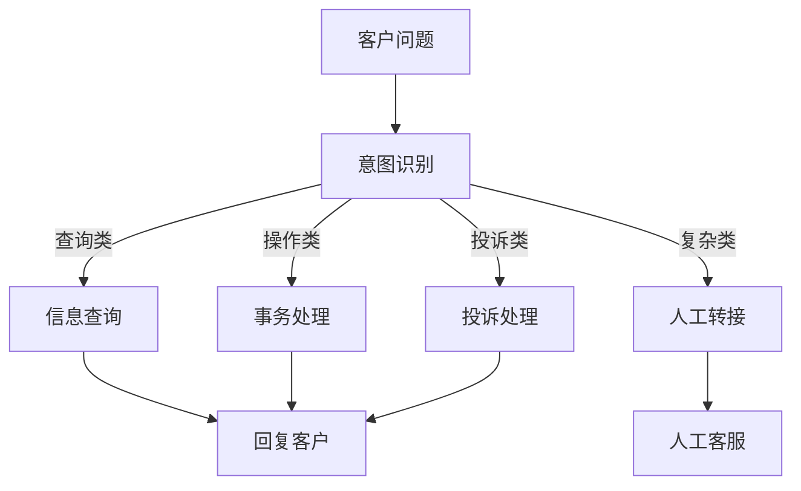
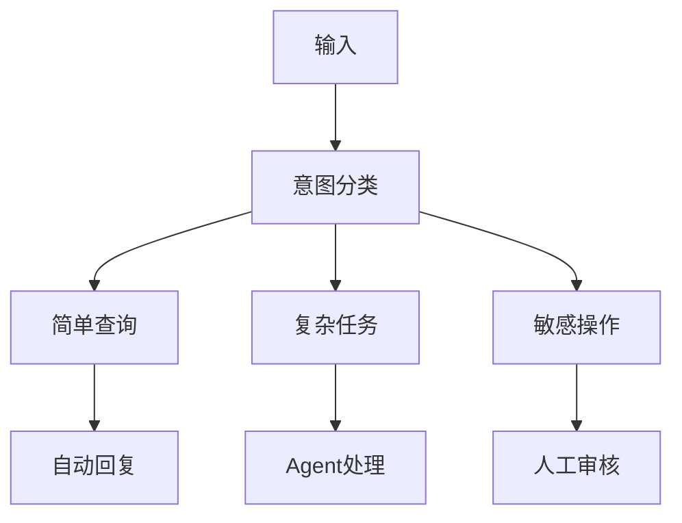

# 客户服务 Agent

## 场景描述

处理客户咨询、投诉和请求的 Agent 系统。

## 架构设计

### 分层处理

### 关键组件

- **意图识别**：分类客户问题类型
- **知识库**：产品/政策信息检索
- **订单系统**：查询和修改订单
- **情绪检测**：识别客户情绪状态
- **转接机制**：复杂问题转人工

## 最佳实践

1. **快速响应**：简单问题秒级响应
2. **清晰边界**：明确告知 Agent 能做什么
3. **平滑转接**：转人工时传递完整上下文
4. **情绪感知**：愤怒客户优先转人工
5. **满意度追踪**：每次服务后收集反馈

## 延伸阅读

- [[02-路由]] — 意图分类与路由
- [[03-人类介入设计]] — 转人工设计
