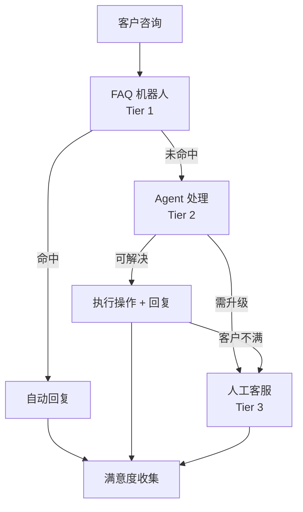
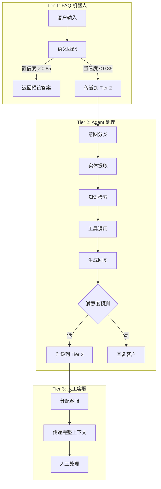
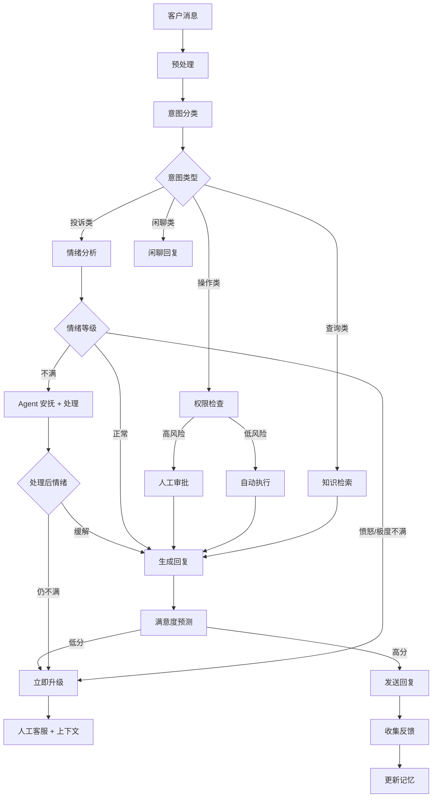

# 客户服务 Agent

## 场景描述

客户服务是 Agent 最成熟的落地场景之一。与简单的 FAQ 检索机器人不同，生产级客服 Agent 需要**理解意图、检索知识、执行操作、感知情绪、判断何时升级**——在自动化效率与客户体验之间找到平衡点。

**真实场景**：一家日均处理 5 万次咨询的跨境电商平台（ShopGlobal），客服团队成本占运营支出的 18%。引入 Agent 系统的目标：将 60% 的常见咨询自动化处理，同时将客户满意度（CSAT）维持在 4.2/5.0 以上。



**核心挑战**：
- 客户表述模糊（"我的东西还没到" → 需要识别订单、物流状态、预期时间）
- 情绪波动大（投诉场景下 Agent 的任何失误都会放大不满）
- 操作风险高（退款、修改地址等操作涉及资金安全）
- 上下文依赖强（同一个客户可能跨多天、多渠道反复咨询）

## 架构设计

### 三层处理架构

生产级客服系统采用分层递进架构：Tier 1 处理高频简单问题，Tier 2 处理需要推理和操作的复杂问题，Tier 3 处理需要人类判断的敏感问题。



### 关键组件

| 组件 | 职责 | 技术选型 | 延迟要求 |
|------|------|---------|---------|
| **FAQ 匹配器** | 高频问题的快速应答 | 向量检索 + BM25 混合 | < 200ms |
| **意图分类器** | 识别客户问题类型 | 微调分类模型 / LLM | < 500ms |
| **实体提取器** | 提取订单号、产品名等 | NER 模型 + 正则 | < 300ms |
| **知识检索** | 从知识库获取相关信息 | RAG（向量 + 关键词） | < 500ms |
| **操作执行器** | 查询订单、发起退款等 | API 调用 + 审批流 | < 2s |
| **情绪分析器** | 检测客户情绪状态 | 情感分类模型 | < 200ms |
| **升级决策器** | 判断是否需要人工介入 | 规则引擎 + LLM | < 100ms |
| **对话记忆** | 维护跨轮次上下文 | Redis + 向量数据库 | < 10ms |

### 整体流程



## 实现示例

### 意图分类

意图分类是 Agent 的"第一反应"，决定后续所有处理路径。分类错误会导致整个请求走向错误方向。

```python
from enum import Enum
from dataclasses import dataclass
from typing import List, Optional
import json


class Intent(Enum):
    """客服场景的意图分类体系。"""
    ORDER_TRACK = "order_track"          # 订单查询/物流追踪
    ORDER_MODIFY = "order_modify"        # 修改订单（地址、数量等）
    REFUND_REQUEST = "refund_request"    # 退款/退货申请
    PRODUCT_INQUIRY = "product_inquiry"  # 产品咨询
    COMPLAINT = "complaint"              # 投诉
    ACCOUNT_ISSUE = "account_issue"      # 账户问题
    SHIPPING_INQUIRY = "shipping_inquiry" # 物流问题
    CHITCHAT = "chitchat"                # 闲聊/打招呼
    UNKNOWN = "unknown"                  # 无法识别


@dataclass
class ClassificationResult:
    intent: Intent
    confidence: float
    entities: dict         # 提取的实体（订单号、产品名等）
    needs_clarification: bool  # 是否需要追问
    clarification_question: Optional[str] = None


INTENT_CLASSIFICATION_PROMPT = """你是一个电商客服意图分类器。根据客户的输入，返回 JSON 格式的分类结果。

意图类型：
- order_track: 查询订单状态、物流信息
- order_modify: 修改订单地址、数量、取消订单
- refund_request: 退款、退货、换货
- product_inquiry: 产品功能、规格、库存咨询
- complaint: 投诉、不满、差评
- account_issue: 登录问题、密码重置、账户安全
- shipping_inquiry: 运费、配送时间、快递公司
- chitchat: 打招呼、闲聊、感谢
- unknown: 无法识别

需要提取的实体：
- order_id: 订单号（如 "ORD-12345"）
- product_name: 产品名称
- issue_type: 问题子类型

返回格式：
{{
    "intent": "意图类型",
    "confidence": 0.0-1.0,
    "entities": {{"order_id": "...", "product_name": "...", "issue_type": "..."}},
    "needs_clarification": true/false,
    "clarification_question": "需要追问时的问题，否则为 null"
}}

客户输入：{user_input}
对话历史：{conversation_history}"""


class IntentClassifier:
    """意图分类器：使用 LLM 进行意图识别和实体提取。"""

    def __init__(self, llm_client, fallback_intent: Intent = Intent.UNKNOWN):
        self.llm = llm_client
        self.fallback = fallback_intent

    async def classify(
        self,
        user_input: str,
        conversation_history: str = ""
    ) -> ClassificationResult:
        try:
            response = await self.llm.complete(
                messages=[{
                    "role": "user",
                    "content": INTENT_CLASSIFICATION_PROMPT.format(
                        user_input=user_input,
                        conversation_history=conversation_history or "无"
                    )
                }],
                max_tokens=300,
                temperature=0.0,  # 分类任务需要确定性
            )

            result = json.loads(response)

            return ClassificationResult(
                intent=Intent(result["intent"]),
                confidence=float(result["confidence"]),
                entities=result.get("entities", {}),
                needs_clarification=result.get("needs_clarification", False),
                clarification_question=result.get("clarification_question"),
            )

        except (json.JSONDecodeError, KeyError, ValueError) as e:
            # LLM 输出格式异常时降级到规则匹配
            return self._rule_based_fallback(user_input)

        except Exception as e:
            # LLM 调用失败时降级
            return ClassificationResult(
                intent=self.fallback,
                confidence=0.0,
                entities={},
                needs_clarification=True,
                clarification_question="抱歉，我没能理解您的问题。能否请您换个方式描述一下？",
            )

    def _rule_based_fallback(self, text: str) -> ClassificationResult:
        """基于关键词的兜底分类。"""
        rules = [
            (r"(订单|快递|物流|发货|到货)", Intent.ORDER_TRACK),
            (r"(退款|退货|退钱|换货)", Intent.REFUND_REQUEST),
            (r"(投诉|差评|不满意|太差)", Intent.COMPLAINT),
            (r"(密码|登录|账户|注册)", Intent.ACCOUNT_ISSUE),
            (r"(修改|取消|换地址)", Intent.ORDER_MODIFY),
        ]
        import re
        for pattern, intent in rules:
            if re.search(pattern, text):
                return ClassificationResult(
                    intent=intent,
                    confidence=0.6,  # 规则匹配的置信度较低
                    entities={},
                    needs_clarification=False,
                )

        return ClassificationResult(
            intent=self.fallback,
            confidence=0.0,
            entities={},
            needs_clarification=True,
            clarification_question="请问您是想查询订单、申请退款，还是有其他问题？",
        )
```

**设计要点**：
- 温度设为 0.0 保证分类一致性
- JSON schema 强约束防止 LLM 输出自由文本
- 双层降级：JSON 解析失败 → 规则匹配 → 返回 UNKNOWN 并追问

### 情绪分析与升级决策

情绪分析不是可选功能，而是升级决策的核心依据。一个愤怒的客户被 Agent 反复给出标准回复，比没有 Agent 更糟糕。

```python
from dataclasses import dataclass
from enum import Enum
import time


class EmotionLevel(Enum):
    """情绪等级，从平静到极度愤怒。"""
    CALM = "calm"                # 平静/中性
    SLIGHTLY_UPSET = "slightly"  # 轻微不满
    UPSET = "upset"              # 明显不满
    ANGRY = "angry"              # 愤怒
    FURIOUS = "furious"          # 极度愤怒


@dataclass
class EmotionAnalysis:
    level: EmotionLevel
    score: float           # -1.0 (极度负面) 到 1.0 (非常正面)
    triggers: list         # 触发情绪的关键词/因素
    escalation_recommended: bool
    reason: str


SENTIMENT_PROMPT = """分析以下客户消息的情绪状态。

客户消息：{message}
对话历史：{history}

返回 JSON：
{{
    "score": -1.0 到 1.0 的浮点数（-1=极度愤怒, 0=中性, 1=非常满意），
    "triggers": ["触发情绪的关键词或因素"],
    "reason": "情绪判断的简要理由"
}}"""


class EmotionAnalyzer:
    """情绪分析器：结合关键词规则和 LLM 分析。"""

    # 高强度情绪关键词（规则层，不依赖 LLM）
    ANGER_KEYWORDS = [
        "垃圾", "骗子", "投诉", "315", "工商", "律师",
        "曝光", "再也不买", "差评", "举报", "法院",
        "太差了", "什么玩意", "垃圾公司", "欺诈",
    ]

    ESCALATION_KEYWORDS = [
        "投诉", "315", "工商", "律师", "法院", "举报",
        "曝光", "媒体", "12315",
    ]

    def __init__(self, llm_client):
        self.llm = llm_client

    async def analyze(
        self,
        message: str,
        history: str = ""
    ) -> EmotionAnalysis:
        # 第一层：关键词快速检测（< 5ms）
        keyword_result = self._keyword_check(message)
        if keyword_result and keyword_result.level in (
            EmotionLevel.ANGRY, EmotionLevel.FURIOUS
        ):
            return keyword_result

        # 第二层：LLM 精细分析（200-500ms）
        try:
            response = await self.llm.complete(
                messages=[{
                    "role": "user",
                    "content": SENTIMENT_PROMPT.format(
                        message=message,
                        history=history or "无"
                    )
                }],
                max_tokens=200,
                temperature=0.0,
            )
            result = json.loads(response)
            score = float(result["score"])
            level = self._score_to_level(score)

            return EmotionAnalysis(
                level=level,
                score=score,
                triggers=result.get("triggers", []),
                escalation_recommended=level in (
                    EmotionLevel.ANGRY, EmotionLevel.FURIOUS
                ),
                reason=result.get("reason", ""),
            )
        except Exception:
            # LLM 失败时回退到关键词结果
            return keyword_result or EmotionAnalysis(
                level=EmotionLevel.CALM,
                score=0.0,
                triggers=[],
                escalation_recommended=False,
                reason="分析失败，默认中性",
            )

    def _keyword_check(self, text: str) -> Optional[EmotionAnalysis]:
        """关键词快速情绪检测。"""
        found_anger = [kw for kw in self.ANGER_KEYWORDS if kw in text]
        found_escalation = [kw for kw in self.ESCALATION_KEYWORDS if kw in text]

        if found_escalation:
            return EmotionAnalysis(
                level=EmotionLevel.FURIOUS,
                score=-0.9,
                triggers=found_escalation,
                escalation_recommended=True,
                reason=f"检测到升级关键词: {found_escalation}",
            )
        elif found_anger:
            return EmotionAnalysis(
                level=EmotionLevel.ANGRY,
                score=-0.7,
                triggers=found_anger,
                escalation_recommended=True,
                reason=f"检测到愤怒关键词: {found_anger}",
            )
        return None

    @staticmethod
    def _score_to_level(score: float) -> EmotionLevel:
        if score <= -0.6:
            return EmotionLevel.FURIOUS
        elif score <= -0.3:
            return EmotionLevel.ANGRY
        elif score <= -0.1:
            return EmotionLevel.UPSET
        elif score <= 0.1:
            return EmotionLevel.SLIGHTLY_UPSET
        else:
            return EmotionLevel.CALM


class EscalationDecision:
    """升级决策器：综合多维信号决定是否转人工。"""

    def __init__(self):
        self.rules = [
            # (条件函数, 优先级, 原因)
            (
                lambda ctx: ctx.emotion.level == EmotionLevel.FURIOUS,
                100,
                "客户极度愤怒"
            ),
            (
                lambda ctx: ctx.failed_attempts >= 2,
                90,
                "Agent 连续失败 2 次以上"
            ),
            (
                lambda ctx: ctx.intent == Intent.REFUND_REQUEST
                and ctx.order_amount and ctx.order_amount > 1000,
                80,
                "大额退款请求"
            ),
            (
                lambda ctx: ctx.customer_tier == "vip",
                70,
                "VIP 客户主动要求"
            ),
            (
                lambda ctx: ctx.intent == Intent.COMPLAINT
                and ctx.emotion.level in (EmotionLevel.ANGRY, EmotionLevel.UPSET),
                60,
                "投诉 + 负面情绪"
            ),
        ]

    def should_escalate(self, context: "ConversationContext") -> dict:
        """返回是否升级及原因。"""
        triggered = []
        for rule_fn, priority, reason in self.rules:
            try:
                if rule_fn(context):
                    triggered.append({"priority": priority, "reason": reason})
            except (AttributeError, TypeError):
                continue  # 上下文缺少字段时跳过该规则

        if not triggered:
            return {"escalate": False, "reason": None}

        # 取最高优先级的触发规则
        top = max(triggered, key=lambda x: x["priority"])
        return {"escalate": True, "reason": top["reason"]}


@dataclass
class ConversationContext:
    """对话上下文，供升级决策使用。"""
    intent: Intent
    emotion: EmotionAnalysis
    failed_attempts: int = 0
    order_amount: Optional[float] = None
    customer_tier: str = "normal"
    turn_count: int = 0
```

**设计要点**：
- 双层检测：关键词规则（< 5ms）先拦截高危情绪，LLM 分析精细判断
- 升级决策基于多维信号而非单一阈值
- VIP 客户的升级阈值更低——客户价值影响服务策略
- 规则优先级系统允许运营团队灵活调整

### 知识检索与 RAG

客服 Agent 的回复质量取决于知识检索的准确性。检索不到正确信息时，Agent 会"编造"答案——这在客服场景中是致命的。

```python
from dataclasses import dataclass
from typing import List, Optional
import hashlib


@dataclass
class KnowledgeChunk:
    """知识库中的一个片段。"""
    id: str
    content: str
    source: str          # 来源：FAQ、产品手册、政策文档等
    category: str        # 分类：退货政策、配送说明等
    last_updated: float  # 最后更新时间
    relevance_score: float = 0.0


class KnowledgeRetriever:
    """知识检索器：混合检索（向量 + 关键词 + 分类过滤）。"""

    def __init__(self, vector_store, embedding_fn, keyword_index=None):
        self.vector_store = vector_store
        self.embed = embedding_fn
        self.keyword_index = keyword_index

    async def retrieve(
        self,
        query: str,
        intent: Intent,
        entities: dict,
        top_k: int = 5,
        min_score: float = 0.5,
    ) -> List[KnowledgeChunk]:
        """多路召回 + 重排序。"""

        # 路径 1：向量语义检索
        query_embedding = self.embed(query)
        vector_results = await self.vector_store.search(
            query_embedding, k=top_k * 2  # 多召回，后续过滤
        )

        # 路径 2：关键词检索（如果有的话）
        keyword_results = []
        if self.keyword_index:
            keyword_results = await self.keyword_index.search(query, k=top_k)

        # 路径 3：基于意图的分类过滤
        intent_filter = self._get_intent_filter(intent)
        filtered_results = [
            r for r in vector_results + keyword_results
            if self._matches_filter(r, intent_filter)
        ]

        # 去重 + 重排序
        unique = self._deduplicate(filtered_results)
        ranked = self._rerank(query, unique)

        # 过滤低分结果
        return [r for r in ranked if r.relevance_score >= min_score][:top_k]

    def _get_intent_filter(self, intent: Intent) -> Optional[str]:
        """意图到知识分类的映射。"""
        mapping = {
            Intent.REFUND_REQUEST: "退货退款政策",
            Intent.ORDER_TRACK: "物流配送说明",
            Intent.PRODUCT_INQUIRY: "产品信息",
            Intent.SHIPPING_INQUIRY: "配送说明",
            Intent.ACCOUNT_ISSUE: "账户安全",
        }
        return mapping.get(intent)

    def _matches_filter(self, result: dict, category: Optional[str]) -> bool:
        if not category:
            return True
        return result.get("metadata", {}).get("category") == category

    def _deduplicate(self, results: list) -> List[KnowledgeChunk]:
        seen_ids = set()
        unique = []
        for r in results:
            rid = r.get("id") or hashlib.md5(
                r.get("text", "").encode()
            ).hexdigest()
            if rid not in seen_ids:
                seen_ids.add(rid)
                unique.append(KnowledgeChunk(
                    id=rid,
                    content=r.get("text", ""),
                    source=r.get("metadata", {}).get("source", "unknown"),
                    category=r.get("metadata", {}).get("category", ""),
                    last_updated=r.get("metadata", {}).get("last_updated", 0),
                    relevance_score=r.get("similarity", r.get("score", 0)),
                ))
        return unique

    def _rerank(
        self, query: str, chunks: List[KnowledgeChunk]
    ) -> List[KnowledgeChunk]:
        """重排序：综合语义分数、时效性、来源可信度。"""
        import time
        now = time.time()

        for chunk in chunks:
            # 时效性衰减：超过 90 天的知识降权
            age_days = (now - chunk.last_updated) / 86400
            recency_boost = max(0, 1.0 - age_days / 90) * 0.1

            # 来源可信度：官方政策 > FAQ > 用户评论
            source_trust = {
                "official_policy": 0.15,
                "faq": 0.10,
                "product_manual": 0.12,
                "user_review": 0.0,
            }.get(chunk.source, 0.05)

            chunk.relevance_score += recency_boost + source_trust

        chunks.sort(key=lambda c: c.relevance_score, reverse=True)
        return chunks
```

**设计要点**：
- 多路召回（向量 + 关键词 + 分类过滤）减少遗漏
- 重排序考虑时效性——过期的退货政策比没有检索到更危险
- 来源可信度影响排序——官方文档优先于用户评论
- 最低分数阈值过滤不相关结果，防止 LLM 被低质量检索内容误导

### 完整对话处理管线

将上述组件组合成完整的客服 Agent 处理管线：

```python
from dataclasses import dataclass, field
from typing import List, Optional, Dict, Any
import time
import logging

logger = logging.getLogger(__name__)


@dataclass
class ConversationTurn:
    role: str           # "customer" | "agent" | "human_agent"
    content: str
    timestamp: float
    metadata: Dict[str, Any] = field(default_factory=dict)


@dataclass
class AgentResponse:
    content: str                # 回复内容
    source: str                 # "faq" | "agent" | "human"
    intent: Optional[Intent] = None
    confidence: float = 0.0
    escalated: bool = False
    escalation_reason: Optional[str] = None
    knowledge_used: List[str] = field(default_factory=list)
    latency_ms: int = 0


class CustomerServiceAgent:
    """客服 Agent 主管线：协调意图分类、知识检索、情绪分析、升级决策。"""

    def __init__(
        self,
        llm_client,
        classifier: IntentClassifier,
        emotion_analyzer: EmotionAnalyzer,
        knowledge_retriever: KnowledgeRetriever,
        escalation: EscalationDecision,
        tool_executor: "ToolExecutor",
        max_auto_turns: int = 5,
    ):
        self.llm = llm_client
        self.classifier = classifier
        self.emotion_analyzer = emotion_analyzer
        self.knowledge = knowledge_retriever
        self.escalation = escalation
        self.tools = tool_executor
        self.max_auto_turns = max_auto_turns

        # 对话历史（生产中应使用 Redis）
        self.sessions: Dict[str, List[ConversationTurn]] = {}

    async def handle_message(
        self,
        session_id: str,
        user_message: str,
        customer_tier: str = "normal",
    ) -> AgentResponse:
        start_time = time.time()

        # 1. 加载对话历史
        history = self.sessions.get(session_id, [])
        history.append(ConversationTurn(
            role="customer",
            content=user_message,
            timestamp=time.time(),
        ))

        # 2. 并行执行意图分类和情绪分析
        history_text = self._format_history(history[-6:])  # 最近 3 轮
        intent_result, emotion = await asyncio.gather(
            self.classifier.classify(user_message, history_text),
            self.emotion_analyzer.analyze(user_message, history_text),
        )

        # 3. 检查是否需要追问
        if intent_result.needs_clarification:
            response = AgentResponse(
                content=intent_result.clarification_question
                or "请问您想咨询什么问题？",
                source="agent",
                intent=intent_result.intent,
                confidence=intent_result.confidence,
                latency_ms=int((time.time() - start_time) * 1000),
            )
            history.append(ConversationTurn(
                role="agent", content=response.content, timestamp=time.time()
            ))
            self.sessions[session_id] = history
            return response

        # 4. 检查升级条件
        failed_attempts = sum(
            1 for t in history
            if t.metadata.get("agent_failed")
        )
        ctx = ConversationContext(
            intent=intent_result.intent,
            emotion=emotion,
            failed_attempts=failed_attempts,
            customer_tier=customer_tier,
            turn_count=len(history),
        )
        escalation = self.escalation.should_escalate(ctx)

        if escalation["escalate"]:
            return await self._escalate_to_human(
                session_id, history, escalation["reason"],
                intent_result, emotion, start_time
            )

        # 5. 检索知识
        knowledge_chunks = await self.knowledge.retrieve(
            query=user_message,
            intent=intent_result.intent,
            entities=intent_result.entities,
            top_k=3,
        )

        # 6. 执行操作类意图（如查订单）
        tool_result = None
        if intent_result.intent in (
            Intent.ORDER_TRACK, Intent.ORDER_MODIFY, Intent.REFUND_REQUEST
        ):
            tool_result = await self._execute_tool(
                intent_result, history_text
            )

        # 7. 生成回复
        reply_text = await self._generate_reply(
            user_message=user_message,
            intent=intent_result,
            knowledge=knowledge_chunks,
            tool_result=tool_result,
            emotion=emotion,
            history=history_text,
        )

        # 8. 预测回复质量
        quality = await self._predict_quality(reply_text, user_message, emotion)
        if quality < 0.4 and len(history) > 2:
            # 多轮低质量回复后升级
            return await self._escalate_to_human(
                session_id, history, "Agent 回复质量持续偏低",
                intent_result, emotion, start_time
            )

        # 构造响应
        latency_ms = int((time.time() - start_time) * 1000)
        response = AgentResponse(
            content=reply_text,
            source="agent",
            intent=intent_result.intent,
            confidence=intent_result.confidence,
            knowledge_used=[c.content[:50] for c in knowledge_chunks],
            latency_ms=latency_ms,
        )

        # 记录对话历史
        history.append(ConversationTurn(
            role="agent",
            content=reply_text,
            timestamp=time.time(),
            metadata={
                "intent": intent_result.intent.value,
                "emotion_score": emotion.score,
                "latency_ms": latency_ms,
            },
        ))
        self.sessions[session_id] = history

        # 记录监控指标
        logger.info(
            f"session={session_id} intent={intent_result.intent.value} "
            f"emotion={emotion.level.value} latency={latency_ms}ms "
            f"confidence={intent_result.confidence:.2f}"
        )

        return response

    def _format_history(self, turns: List[ConversationTurn]) -> str:
        return "\n".join(
            f"{'客户' if t.role == 'customer' else '客服'}: {t.content}"
            for t in turns
        )

    async def _generate_reply(
        self,
        user_message: str,
        intent: ClassificationResult,
        knowledge: List[KnowledgeChunk],
        tool_result: Optional[dict],
        emotion: EmotionAnalysis,
        history: str,
    ) -> str:
        """基于检索结果和工具输出生成回复。"""

        knowledge_text = "\n\n".join(
            f"[来源: {k.source}] {k.content}" for k in knowledge
        ) if knowledge else "（知识库中未找到相关信息）"

        tool_text = ""
        if tool_result:
            tool_text = f"\n\n操作执行结果：{json.dumps(tool_result, ensure_ascii=False)}"

        # 根据情绪调整语气
        tone_instruction = {
            EmotionLevel.CALM: "用友好、专业的语气回复。",
            EmotionLevel.SLIGHTLY_UPSET: "表示理解客户的不便，语气温和耐心。",
            EmotionLevel.UPSET: "先真诚道歉，再提供解决方案。避免辩解。",
            EmotionLevel.ANGRY: "立即道歉，表达重视。优先提供最快速的解决方案。",
            EmotionLevel.FURIOUS: "深度道歉，表达理解。明确告知将升级到专人处理。",
        }.get(emotion.level, "用专业、友好的语气回复。")

        prompt = f"""你是 ShopGlobal 的客服助手。根据以下信息回复客户。

客户问题：{user_message}
意图分类：{intent.intent.value}（置信度 {intent.confidence:.2f}）

参考知识：
{knowledge_text}
{tool_text}

情绪状态：{emotion.level.value}（{emotion.reason}）
语气要求：{tone_instruction}

回复要求：
1. 直接回答客户问题，不要重复客户的话
2. 如果知识库没有相关信息，坦诚告知并建议联系人工客服
3. 不要编造不存在的政策、价格或承诺
4. 回复控制在 200 字以内
5. 如果是操作类问题，明确告知操作结果"""

        try:
            return await self.llm.complete(
                messages=[{"role": "user", "content": prompt}],
                max_tokens=500,
                temperature=0.3,
            )
        except Exception as e:
            logger.error(f"Reply generation failed: {e}")
            return "抱歉，系统暂时出现问题。我已为您转接人工客服，请稍候。"

    async def _execute_tool(
        self,
        intent_result: ClassificationResult,
        history: str,
    ) -> Optional[dict]:
        """执行操作类工具调用。"""
        order_id = intent_result.entities.get("order_id")

        if intent_result.intent == Intent.ORDER_TRACK and order_id:
            return await self.tools.query_order(order_id)

        elif intent_result.intent == Intent.REFUND_REQUEST and order_id:
            # 退款需要额外确认，不自动执行
            return await self.tools.check_refund_eligibility(order_id)

        return None

    async def _escalate_to_human(
        self,
        session_id: str,
        history: List[ConversationTurn],
        reason: str,
        intent: ClassificationResult,
        emotion: EmotionAnalysis,
        start_time: float,
    ) -> AgentResponse:
        """升级到人工客服，传递完整上下文。"""
        summary = self._format_history(history)

        # 写入升级队列（生产中使用消息队列）
        escalation_context = {
            "session_id": session_id,
            "reason": reason,
            "intent": intent.intent.value,
            "emotion_level": emotion.level.value,
            "conversation_summary": summary,
            "customer_message_count": sum(
                1 for t in history if t.role == "customer"
            ),
        }

        logger.warning(
            f"ESCALATION session={session_id} reason={reason} "
            f"emotion={emotion.level.value}"
        )

        # 通知调度系统（此处简化为日志）
        await self._notify_dispatch(escalation_context)

        return AgentResponse(
            content=(
                "非常抱歉给您带来了不好的体验。"
                "我已为您转接专属客服，TA 将尽快为您处理。"
                "请您稍候片刻。"
            ),
            source="agent",
            intent=intent.intent,
            confidence=intent.confidence,
            escalated=True,
            escalation_reason=reason,
            latency_ms=int((time.time() - start_time) * 1000),
        )

    async def _predict_quality(
        self, reply: str, user_message: str, emotion: EmotionAnalysis
    ) -> float:
        """预测回复质量（0-1）。"""
        # 简化实现：检查回复是否包含关键要素
        checks = [
            len(reply) > 10,                         # 不是空回复
            "抱歉" not in reply or emotion.score > -0.3,  # 未在愤怒时只道歉
            "不知道" not in reply,                    # 没有说"不知道"
            len(reply) < 500,                         # 不是过长
        ]
        return sum(checks) / len(checks)

    async def _notify_dispatch(self, context: dict):
        """通知人工客服调度系统。"""
        # 生产环境：发送到 Redis/Kafka/客服系统 API
        logger.info(f"Dispatch notification: {context['session_id']}")
```

### 工具执行器

Agent 需要调用外部系统执行实际操作（查询订单、检查退款资格等）：

```python
class ToolExecutor:
    """客服场景的工具执行器。"""

    def __init__(self, order_api, refund_api, customer_api):
        self.order_api = order_api
        self.refund_api = refund_api
        self.customer_api = customer_api

    async def query_order(self, order_id: str) -> dict:
        """查询订单状态。"""
        try:
            order = await self.order_api.get_order(order_id)
            return {
                "success": True,
                "order_id": order_id,
                "status": order["status"],
                "tracking_number": order.get("tracking_number"),
                "estimated_delivery": order.get("estimated_delivery"),
                "items": order.get("items", []),
            }
        except OrderNotFoundError:
            return {
                "success": False,
                "error": "未找到该订单，请确认订单号是否正确。",
            }
        except Exception as e:
            logger.error(f"Order query failed: {e}")
            return {
                "success": False,
                "error": "系统暂时无法查询，请稍后重试。",
            }

    async def check_refund_eligibility(self, order_id: str) -> dict:
        """检查退款资格（不直接执行退款）。"""
        try:
            order = await self.order_api.get_order(order_id)
            eligibility = await self.refund_api.check_eligibility(order_id)

            return {
                "success": True,
                "eligible": eligibility["eligible"],
                "reason": eligibility.get("reason", ""),
                "refund_amount": eligibility.get("refund_amount"),
                "deadline": eligibility.get("deadline"),
                "policy_note": (
                    "签收后 7 天内可申请无理由退货，"
                    "15 天内可申请质量问题退换。"
                ),
            }
        except Exception as e:
            logger.error(f"Refund eligibility check failed: {e}")
            return {
                "success": False,
                "error": "暂时无法检查退款资格，请联系人工客服。",
            }
```

## 反模式与修复

| 反模式 | 问题 | 影响 | 修复方案 |
|--------|------|------|---------|
| **无情绪感知的机械回复** | 对愤怒客户回复"感谢您的反馈，我们会持续改进" | 客户更加愤怒，投诉升级率翻倍 | 情绪分析驱动语气调整，高危情绪立即升级 |
| **编造政策信息** | 知识库检索失败时 LLM 自行编造退货政策 | 客户按错误政策操作后二次投诉，信任崩塌 | 设置"检索不到即坦诚"的兜底策略，禁用幻觉 |
| **无限循环追问** | Agent 反复要求客户"请提供更多细节" | 客户体验极差，流失率上升 | 最多追问 2 次，超出后自动升级人工 |
| **全量日志上下文** | 将完整对话日志（含操作记录）塞入 LLM 上下文 | Token 爆炸，响应延迟 > 5s | 摘要 + 关键轮次，工具结果只传结论 |
| **一刀切升级阈值** | 所有客户的升级规则相同 | VIP 客户等待时间过长，高价值客户流失 | 分层升级策略：VIP 阈值更低、队列优先 |
| **忽略多轮上下文** | 每轮独立处理，不关联之前的对话 | 客户反复说"我刚才说了…"，体验割裂 | 对话记忆 + 实体状态跟踪 |
| **无操作确认** | 退款、修改地址等操作自动执行无确认 | 误操作导致资金损失 | 敏感操作需客户二次确认（"确认退款 ¥299？"） |
| **单一检索策略** | 只用向量检索或只用关键词 | 向量检索漏掉精确术语，关键词漏掉同义表达 | 混合检索 + 重排序 |

### 无限循环追问 vs 智能升级

```python
# ❌ 反模式：无限追问
async def bad_handle(session_id, message):
    result = classify(message)
    if result.confidence < 0.5:
        return "我不太理解，请您再说详细一些。"  # 可能无限循环

# ✅ 正确：追问计数 + 自动升级
async def good_handle(session_id, message):
    turn_count = get_turn_count(session_id)
    result = classify(message)

    if result.confidence < 0.5:
        if turn_count >= 2:
            return await escalate_to_human(
                session_id, "多次意图识别失败"
            )
        return f"为了更好地帮助您，能否请您具体说明：{result.clarification_question}"
```

## 权衡分析

### 自动化率 vs 客户满意度

| 自动化率目标 | 预期 CSAT | 升级率 | 适用场景 |
|-------------|----------|--------|---------|
| 40% | 4.5/5.0 | 60% | 高客单价、低容错（奢侈品、金融） |
| 60% | 4.2/5.0 | 40% | 通用电商、SaaS 客服 |
| 80% | 3.8/5.0 | 20% | 低价高频、FAQ 主导（外卖、打车） |
| 90% | 3.5/5.0 | 10% | 纯信息查询（航班状态、快递追踪） |

**核心洞察**：自动化率和 CSAT 不是线性关系。从 40% 提升到 60%，CSAT 下降有限；但从 80% 提升到 90%，CSAT 可能急剧下降——因为最后 10% 的"自动化"往往是强行处理本该人工介入的复杂问题。

### 速度 vs 准确性

| 策略 | 平均延迟 | 准确率 | 适用场景 |
|------|---------|--------|---------|
| 纯 LLM 生成 | 2-5s | 高（但有幻觉风险） | 复杂咨询、需要推理 |
| RAG + LLM | 3-7s | 高（有知识锚定） | 政策咨询、产品信息 |
| 规则引擎 + 模板 | < 500ms | 高（确定性强） | 订单查询、物流追踪 |
| 混合：规则优先 + LLM 兜底 | 500ms-3s | 高 | 生产推荐方案 |

**生产建议**：按意图路由到不同策略。订单查询用规则引擎（快且准），政策咨询用 RAG（有据可依），投诉安抚用 LLM（需要语言灵活性）。详见 [[02-路由]]。

### 成本 vs 覆盖率

| 方案 | 单次对话成本 | 覆盖率 | 维护成本 |
|------|-------------|--------|---------|
| 纯规则引擎 | ~¥0.001 | 30-40% | 高（规则维护） |
| 纯 LLM | ¥0.05-0.20 | 80-90% | 低（提示维护） |
| FAQ + Agent + 人工 | ¥0.01-0.05 | 95%+ | 中 |

## 生产部署考量

### 延迟 SLA

```python
class LatencySLA:
    """客服系统的延迟 SLA 定义。"""

    TARGETS = {
        # 场景: (P50 目标, P99 目标, 超时阈值)
        "faq_match":      (200, 500, 1000),    # FAQ 匹配
        "intent_classify": (300, 800, 2000),   # 意图分类
        "knowledge_search": (500, 1500, 3000), # 知识检索
        "reply_generate":  (1000, 3000, 8000), # 回复生成
        "tool_execution":  (500, 2000, 5000),  # 工具调用
        "total":           (2000, 5000, 10000), # 端到端
    }

    @classmethod
    def check(cls, operation: str, latency_ms: int) -> str:
        p50, p99, timeout = cls.TARGETS.get(operation, (2000, 5000, 10000))
        if latency_ms <= p50:
            return "green"
        elif latency_ms <= p99:
            return "yellow"
        elif latency_ms <= timeout:
            return "orange"
        else:
            return "red"  # 超时，需要降级处理
```

**关键指标监控**：
- **首字节延迟（TTFT）**：客户发送消息到收到第一个字的时间，目标 < 2s
- **端到端延迟**：完整回复的总时间，P99 < 5s
- **超时率**：超过 10s 的请求占比，目标 < 0.1%
- **降级率**：因延迟过高而降级到简单回复的占比

### 情绪监控仪表盘

```python
class SentimentMonitor:
    """情绪监控：实时追踪客户情绪分布和升级趋势。"""

    def __init__(self, metrics_client):
        self.metrics = metrics_client

    def record_interaction(
        self,
        session_id: str,
        emotion_level: EmotionLevel,
        escalated: bool,
        resolved: bool,
        resolution_time_s: float,
    ):
        """记录一次交互的情绪指标。"""
        # 情绪分布
        self.metrics.increment(
            "cs.emotion.distribution",
            tags={"level": emotion_level.value}
        )

        # 升级率
        if escalated:
            self.metrics.increment("cs.escalation.total")
            self.metrics.increment(
                "cs.escalation.by_emotion",
                tags={"level": emotion_level.value}
            )

        # 解决率
        if resolved:
            self.metrics.increment("cs.resolution.success")
            self.metrics.histogram(
                "cs.resolution.time",
                value=resolution_time_s
            )
        else:
            self.metrics.increment("cs.resolution.failure")

    def check_alerts(self) -> list:
        """检查是否需要触发告警。"""
        alerts = []

        # 愤怒比例过高
        angry_ratio = self.metrics.get_ratio(
            "cs.emotion.distribution",
            filter_tags={"level": ["angry", "furious"]},
        )
        if angry_ratio > 0.15:
            alerts.append({
                "severity": "high",
                "message": f"愤怒客户比例 {angry_ratio:.1%}，超过 15% 阈值",
                "action": "检查是否系统故障或政策变更导致客诉增加",
            })

        # 升级率突增
        escalation_rate = self.metrics.get_rate("cs.escalation.total", window="5m")
        if escalation_rate > 0.5:
            alerts.append({
                "severity": "medium",
                "message": f"近 5 分钟升级率 {escalation_rate:.1%}",
                "action": "检查 Agent 服务质量，可能需要扩容人工客服",
            })

        return alerts
```

### 对话记忆管理

客服场景的记忆管理与通用 Agent 不同——需要跨会话记住客户历史：

```python
class CustomerMemory:
    """客户记忆：跨会话存储客户偏好和历史交互摘要。"""

    def __init__(self, redis_client, vector_store):
        self.redis = redis_client  # 热数据：最近交互
        self.vector_store = vector_store  # 冷数据：历史交互

    async def get_customer_context(self, customer_id: str) -> dict:
        """获取客户上下文，用于个性化服务。"""

        # 1. 热数据：最近订单和偏好
        hot_data = await self.redis.hgetall(f"customer:{customer_id}")

        # 2. 冷数据：历史交互摘要
        recent_interactions = await self.vector_store.search(
            query=f"客户 {customer_id} 的历史咨询",
            filters={"customer_id": customer_id},
            k=3,
        )

        return {
            "customer_id": customer_id,
            "tier": hot_data.get("tier", "normal"),
            "recent_orders": json.loads(
                hot_data.get("recent_orders", "[]")
            ),
            "preferences": json.loads(
                hot_data.get("preferences", "{}")
            ),
            "interaction_history": [
                r["text"] for r in recent_interactions
            ],
            "previous_issues": hot_data.get("previous_issues", ""),
        }

    async def update_after_conversation(
        self,
        customer_id: str,
        summary: str,
        issues: list,
        satisfaction: float,
    ):
        """对话结束后更新客户记忆。"""
        # 更新热数据
        await self.redis.hset(f"customer:{customer_id}", mapping={
            "previous_issues": summary,
            "last_contact": str(time.time()),
            "last_satisfaction": str(satisfaction),
        })

        # 存入冷数据（向量数据库）
        await self.vector_store.add(
            texts=[summary],
            embeddings=[self.embed(summary)],
            metadatas=[{
                "customer_id": customer_id,
                "type": "conversation_summary",
                "timestamp": time.time(),
                "satisfaction": satisfaction,
                "issues": issues,
            }]
        )
```

**记忆策略**：
- 热数据（Redis）：最近 30 天的订单、偏好、上次问题摘要
- 冷数据（向量数据库）：所有历史交互的摘要，支持语义检索
- 敏感数据：PII 脱敏后存储，详见 [[03-记忆管理]]

## 延伸阅读

- [[02-路由]] — 意图分类与请求路由的设计模式
- [[03-人类介入设计]] — 人工升级的设计模式与实施策略
- [[03-记忆管理]] — 对话记忆的分层架构与衰减策略
- [[01-工具设计]] — Agent 工具层设计（订单查询、退款等操作）
- [[02-函数调用]] — LLM Function Calling 的实现细节
- [[06-ReAct]] — 推理-行动循环在客服场景的应用
- [[01-安全防护栏]] — 敏感操作的审批与安全防护
- [[02-可观测性]] — 监控指标与告警设计
