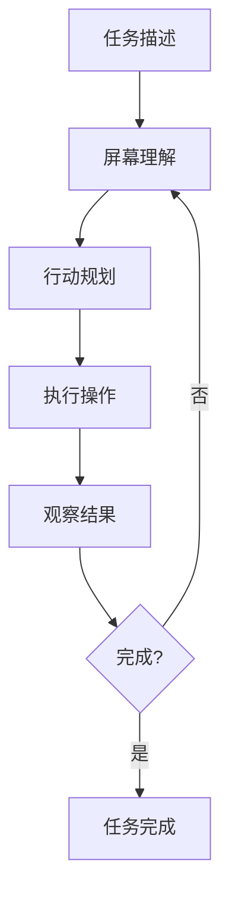
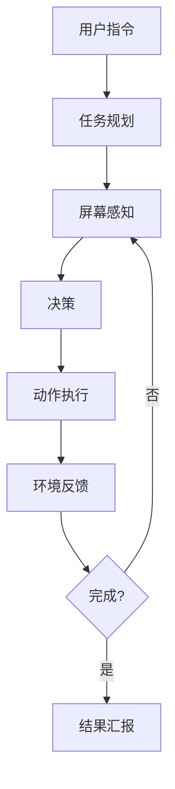

# 计算机使用 Agent

## 场景描述

通过操作 GUI（图形用户界面）完成任务的 Agent，如填写表单、浏览网页、操作软件等。



## 核心能力

### 1. 屏幕理解

通过视觉模型理解当前界面状态。

```python
def perceive_screen() -> dict:
    screenshot = capture_screen()
    
    # 使用多模态模型分析
    analysis = vision_llm.invoke(
        f"分析以下截图，识别：\n"
        f"1. 当前界面是什么\n"
        f"2. 可用的交互元素\n"
        f"3. 当前状态"
    )
    
    return analysis
```

### 2. 行动执行

```python
class GUIAction:
    def click(self, x: int, y: int):
        pyautogui.click(x, y)
    
    def type_text(self, text: str):
        pyautogui.typewrite(text)
    
    def scroll(self, direction: str, amount: int):
        pyautogui.scroll(amount if direction == "up" else -amount)
```

## 架构设计



## 安全考量

| 风险 | 防护措施 |
|------|---------|
| 误操作 | 沙箱环境、操作确认 |
| 敏感数据 | 屏幕内容过滤 |
| 无限循环 | 最大步数限制 |
| 权限越界 | 最小权限原则 |

## 最佳实践

1. **确定性操作**：优先使用 API，其次使用 GUI
2. **状态验证**：每次操作后验证结果
3. **撤销机制**：支持操作回滚
4. **人工监控**：高风险任务实时监督

## 延伸阅读

- [[08-自主Agent]] — 自主操作模式
- [[03-防护栏与沙箱]] — 安全执行环境
