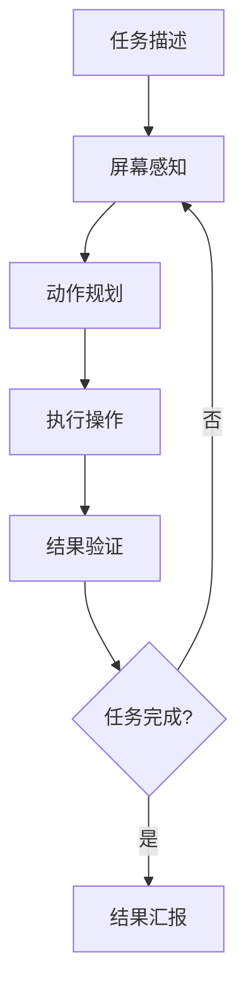
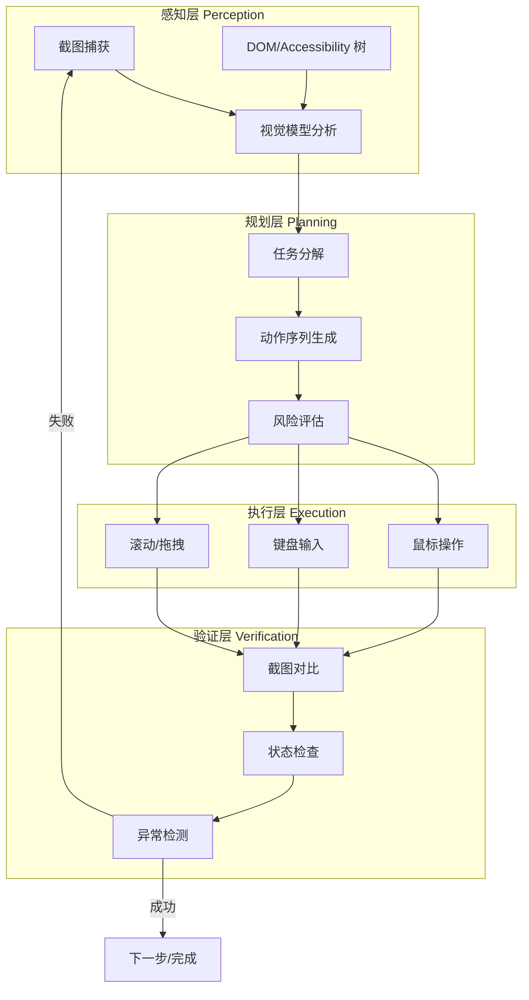

# 计算机使用 Agent

## 场景描述

计算机使用 Agent（Computer Use Agent）是一类通过操作图形用户界面（GUI）来完成任务的 Agent。与传统的脚本自动化不同，计算机使用 Agent 需要**理解屏幕内容、规划操作序列、执行交互动作、验证执行结果**——形成一个完整的感知-行动闭环。

**核心挑战**：GUI 环境是动态且不可预测的。界面布局可能变化，加载时间不确定，弹窗可能随时出现，而且操作通常是不可撤销的（如发送邮件、提交订单）。Agent 必须具备鲁棒的感知能力、灵活的规划能力和可靠的安全机制。

**典型产品**：Anthropic Computer Use（Claude 的桌面操控能力）、OpenAI Operator（浏览器自动化 Agent）、UI-Tars（字节跳动的 GUI Agent 模型）、Microsoft UFO（Windows GUI 自动化框架）。



## 真实场景

### 场景 1：RPA 流程自动化

企业内部存在大量重复性 GUI 操作：每天从 ERP 系统导出数据、在 Excel 中整理、再导入到 BI 工具。传统 RPA 需要精确定位每个按钮和输入框，维护成本极高。计算机使用 Agent 可以理解界面语义，自动适应 UI 变更。

**关键需求**：可靠识别动态元素、处理弹窗干扰、支持跨应用工作流。

### 场景 2：Web 数据采集

从结构化程度低的网站采集数据。传统的 CSS 选择器方案在网站改版后立即失效，而 Agent 可以通过视觉理解页面内容，定位所需数据并提取。

**关键需求**：滚动加载处理、分页导航、数据格式标准化。

### 场景 3：表单批量填写

在政府或企业系统中批量填写标准化表单（如税务申报、员工入职信息）。每个表单字段的位置和类型不同，Agent 需要理解表单语义并正确映射数据。

**关键需求**：字段类型识别、数据校验、错误回退。

### 场景 4：软件自动化测试

对缺乏 API 的遗留系统进行端到端测试。Agent 根据测试用例描述自动操作界面，截图验证结果，生成测试报告。

**关键需求**：截图对比、异常检测、测试步骤可复现。

## 架构设计

### 四阶段管道

生产级计算机使用 Agent 采用四阶段管道架构：



### 多模态感知系统

单一感知通道不足以应对复杂 GUI 环境。生产系统通常融合三种感知源：

| 感知源 | 优势 | 劣势 | 适用场景 |
|--------|------|------|---------|
| **屏幕截图** | 通用，不依赖实现细节 | 分辨率敏感，无法获取隐藏元素 | 任何 GUI 应用 |
| **DOM 树** | 精确元素定位，可获取属性 | 仅限 Web 应用 | 浏览器自动化 |
| **Accessibility 树** | 语义丰富，跨平台 | 覆盖不完整 | 辅助功能支持良好的应用 |

```python
from dataclasses import dataclass, field
from typing import List, Optional, Dict, Any
from enum import Enum
import base64
import json
import time


@dataclass
class ScreenElement:
    """屏幕上的可交互元素。"""
    id: str
    element_type: str           # button, input, link, text, image, ...
    text: str                   # 可见文本
    bounds: tuple[int, int, int, int]  # (x, y, width, height)
    center: tuple[int, int]     # (cx, cy)
    confidence: float           # 感知置信度 0-1
    source: str                 # "vision" | "dom" | "a11y"
    metadata: Dict[str, Any] = field(default_factory=dict)


class PerceptionMode(Enum):
    VISION_ONLY = "vision"         # 仅截图 + 视觉模型
    DOM_ONLY = "dom"               # 仅 DOM 解析
    HYBRID = "hybrid"              # 截图 + DOM + Accessibility


class MultiModalPerceiver:
    """多模态屏幕感知器，融合截图、DOM 和 Accessibility 树。"""

    def __init__(self, vision_model, mode: PerceptionMode = PerceptionMode.HYBRID):
        self.vision_model = vision_model
        self.mode = mode

    async def perceive(self, browser=None) -> List[ScreenElement]:
        """执行一次完整的屏幕感知，返回所有可交互元素。"""
        elements: List[ScreenElement] = []

        if self.mode in (PerceptionMode.VISION_ONLY, PerceptionMode.HYBRID):
            screenshot = await self._capture_screenshot(browser)
            vision_elements = await self._analyze_screenshot(screenshot)
            elements.extend(vision_elements)

        if self.mode in (PerceptionMode.DOM_ONLY, PerceptionMode.HYBRID) and browser:
            dom_elements = await self._parse_dom(browser)
            elements.extend(dom_elements)

            a11y_elements = await self._parse_accessibility(browser)
            elements.extend(a11y_elements)

        if self.mode == PerceptionMode.HYBRID:
            elements = self._deduplicate_and_merge(elements)

        return elements

    async def _capture_screenshot(self, browser=None) -> str:
        """捕获屏幕截图，返回 base64 编码的图像。"""
        if browser:
            screenshot_bytes = await browser.screenshot()
        else:
            # 桌面截图（需要 pyautogui 或类似工具）
            import pyautogui
            import io
            img = pyautogui.screenshot()
            buf = io.BytesIO()
            img.save(buf, format="PNG")
            screenshot_bytes = buf.getvalue()
        return base64.b64encode(screenshot_bytes).decode("utf-8")

    async def _analyze_screenshot(self, screenshot_b64: str) -> List[ScreenElement]:
        """使用视觉模型分析截图，识别可交互元素。"""
        prompt = """分析以下截图，识别所有可交互的 UI 元素。
对每个元素，返回 JSON 数组，每个元素包含：
- type: button/input/link/text/image/dropdown/checkbox
- text: 可见文本内容
- bounds: [x, y, width, height]（像素坐标）
- description: 元素功能描述

只返回 JSON，不要其他文字。"""

        result = await self.vision_model.invoke(
            prompt,
            images=[screenshot_b64],
            response_format="json"
        )

        elements = []
        for i, item in enumerate(result):
            bounds = tuple(item["bounds"])
            cx = bounds[0] + bounds[2] // 2
            cy = bounds[1] + bounds[3] // 2
            elements.append(ScreenElement(
                id=f"vision_{i}",
                element_type=item["type"],
                text=item.get("text", ""),
                bounds=bounds,
                center=(cx, cy),
                confidence=0.8,
                source="vision",
                metadata={"description": item.get("description", "")}
            ))
        return elements

    async def _parse_dom(self, browser) -> List[ScreenElement]:
        """从 DOM 树解析可交互元素（仅 Web 应用）。"""
        js_code = """
        (() => {
            const interactable = document.querySelectorAll(
                'button, a, input, select, textarea, [role="button"], [role="link"], [onclick]'
            );
            return Array.from(interactable).map((el, i) => {
                const rect = el.getBoundingClientRect();
                return {
                    id: `dom_${i}`,
                    type: el.tagName.toLowerCase(),
                    text: (el.textContent || el.value || '').trim().slice(0, 100),
                    bounds: [rect.x, rect.y, rect.width, rect.height],
                    center: [rect.x + rect.width/2, rect.y + rect.height/2],
                    attributes: {
                        id: el.id,
                        class: el.className,
                        href: el.href || '',
                        type: el.type || '',
                        ariaLabel: el.getAttribute('aria-label') || '',
                        placeholder: el.placeholder || '',
                    }
                };
            });
        })()
        """
        raw = await browser.evaluate(js_code)
        elements = []
        for item in raw:
            elements.append(ScreenElement(
                id=item["id"],
                element_type=item["type"],
                text=item["text"],
                bounds=tuple(item["bounds"]),
                center=tuple(item["center"]),
                confidence=1.0,
                source="dom",
                metadata=item.get("attributes", {})
            ))
        return elements

    async def _parse_accessibility(self, browser) -> List[ScreenElement]:
        """从 Accessibility 树解析语义元素。"""
        # Playwright 示例
        snapshot = await browser.accessibility.snapshot()
        elements = self._flatten_a11y_tree(snapshot, prefix="a11y")
        return elements

    def _flatten_a11y_tree(self, node, prefix: str, depth: int = 0) -> List[ScreenElement]:
        """递归展平 Accessibility 树。"""
        elements = []
        if node is None:
            return elements

        role = node.get("role", "")
        interactive_roles = {
            "button", "link", "textbox", "checkbox", "radio",
            "combobox", "menuitem", "tab", "switch", "slider"
        }

        if role in interactive_roles:
            name = node.get("name", "")
            elements.append(ScreenElement(
                id=f"{prefix}_{depth}",
                element_type=role,
                text=name,
                bounds=(0, 0, 0, 0),  # a11y 树不总包含坐标
                center=(0, 0),
                confidence=0.9,
                source="a11y",
                metadata={"role": role, "description": node.get("description", "")}
            ))

        for i, child in enumerate(node.get("children", [])):
            elements.extend(
                self._flatten_a11y_tree(child, f"{prefix}_{i}", depth + 1)
            )
        return elements

    def _deduplicate_and_merge(self, elements: List[ScreenElement]) -> List[ScreenElement]:
        """去重并融合多源元素，提高感知准确性。"""
        # 按空间位置聚类，合并同一元素的多个来源
        merged = []
        used = set()

        for i, elem in enumerate(elements):
            if i in used:
                continue

            cluster = [elem]
            for j, other in enumerate(elements):
                if j <= i or j in used:
                    continue
                if self._spatially_close(elem, other):
                    cluster.append(other)
                    used.add(j)

            # 选择置信度最高的作为主元素，合并元数据
            best = max(cluster, key=lambda e: e.confidence)
            for e in cluster:
                if e.source != best.source:
                    best.metadata[f"{e.source}_text"] = e.text
                    best.metadata[f"{e.source}_type"] = e.element_type
                    # 补充坐标（如果主元素缺少）
                    if best.center == (0, 0) and e.center != (0, 0):
                        best.center = e.center
                        best.bounds = e.bounds

            merged.append(best)
            used.add(i)

        return merged

    def _spatially_close(self, a: ScreenElement, b: ScreenElement, threshold: int = 30) -> bool:
        """判断两个元素是否指向同一 UI 对象。"""
        if a.center == (0, 0) or b.center == (0, 0):
            # 无坐标时退化为文本匹配
            return a.text == b.text and a.text != ""
        dx = abs(a.center[0] - b.center[0])
        dy = abs(a.center[1] - b.center[1])
        return dx < threshold and dy < threshold
```

## 实现示例

### 核心 Agent 循环

```python
import asyncio
import logging
from dataclasses import dataclass, field
from typing import List, Optional, Callable, Awaitable

logger = logging.getLogger(__name__)


@dataclass
class AgentConfig:
    max_steps: int = 30
    step_timeout_s: float = 10.0
    verification_delay_s: float = 1.0
    screenshot_on_every_step: bool = True
    human_approval_required: bool = False
    rollback_enabled: bool = True


@dataclass
class StepResult:
    step_number: int
    action: str
    success: bool
    screenshot_before: str      # base64
    screenshot_after: str       # base64
    error: Optional[str] = None
    duration_ms: int = 0


class ComputerUseAgent:
    """计算机使用 Agent 主循环。"""

    def __init__(
        self,
        llm,
        perceiver: MultiModalPerceiver,
        executor: "ActionExecutor",
        config: AgentConfig = AgentConfig(),
    ):
        self.llm = llm
        self.perceiver = perceiver
        self.executor = executor
        self.config = config
        self.step_history: List[StepResult] = []
        self.rollback_stack: List[Callable] = []

    async def run(self, task: str, browser=None) -> str:
        """主循环：感知 → 规划 → 执行 → 验证。"""
        logger.info(f"开始执行任务: {task}")

        for step in range(self.config.max_steps):
            # 1. 感知当前屏幕状态
            elements = await self.perceiver.perceive(browser)
            screenshot = await self.perceiver._capture_screenshot(browser)

            # 2. 规划下一步动作
            action = await self._plan_next_action(task, elements, screenshot)

            if action["type"] == "complete":
                logger.info(f"任务完成，共 {step} 步")
                return action.get("result", "任务已完成")

            # 3. 人工审批（可选）
            if self.config.human_approval_required:
                approved = await self._request_approval(action)
                if not approved:
                    return "任务被人工终止"

            # 4. 保存回滚快照
            if self.config.rollback_enabled:
                rollback_fn = await self.executor.save_snapshot()
                self.rollback_stack.append(rollback_fn)

            # 5. 执行动作
            t0 = time.time()
            exec_result = await asyncio.wait_for(
                self.executor.execute(action),
                timeout=self.config.step_timeout_s,
            )
            duration = int((time.time() - t0) * 1000)

            # 6. 等待界面稳定
            await asyncio.sleep(self.config.verification_delay_s)

            # 7. 验证执行结果
            new_screenshot = await self.perceiver._capture_screenshot(browser)
            verification = await self._verify_action(
                action, screenshot, new_screenshot
            )

            step_result = StepResult(
                step_number=step,
                action=json.dumps(action, ensure_ascii=False),
                success=verification["success"],
                screenshot_before=screenshot,
                screenshot_after=new_screenshot,
                error=verification.get("error"),
                duration_ms=duration,
            )
            self.step_history.append(step_result)

            if not verification["success"]:
                logger.warning(f"步骤 {step} 验证失败: {verification.get('error')}")
                # 尝试回滚
                if self.config.rollback_enabled and self.rollback_stack:
                    await self._rollback()
                # 让 LLM 根据失败信息调整策略
                continue

        return f"达到最大步数 {self.config.max_steps}，任务未完成"

    async def _plan_next_action(
        self, task: str, elements: List[ScreenElement], screenshot: str
    ) -> dict:
        """使用 LLM 规划下一步动作。"""
        element_descriptions = "\n".join(
            f"  [{e.id}] {e.element_type}: \"{e.text}\" at {e.center}"
            for e in elements
        )

        history_summary = "\n".join(
            f"  步骤 {s.step_number}: {s.action} -> {'成功' if s.success else '失败: ' + (s.error or '')}"
            for s in self.step_history[-5:]  # 只保留最近 5 步
        )

        prompt = f"""你是一个计算机使用 Agent。你的任务是：{task}

当前屏幕上的可交互元素：
{element_descriptions}

最近操作历史：
{history_summary}

根据当前屏幕状态和任务目标，决定下一步操作。
返回 JSON 格式：
- type: "click" | "type" | "scroll" | "press_key" | "wait" | "complete"
- target: 目标元素 ID 或坐标 [x, y]
- value: 要输入的文本（仅 type 动作）
- direction: "up" | "down"（仅 scroll 动作）
- key: 按键名称（仅 press_key 动作）
- result: 任务完成时的输出（仅 complete 动作）

只返回 JSON。"""

        result = await self.llm.invoke(
            prompt,
            images=[screenshot],
            response_format="json"
        )
        return result

    async def _verify_action(
        self, action: dict, before_screenshot: str, after_screenshot: str
    ) -> dict:
        """验证动作执行结果。"""
        prompt = f"""验证以下 GUI 操作是否成功执行。

操作：{json.dumps(action, ensure_ascii=False)}

我会提供操作前后的截图。请分析：
1. 屏幕是否发生了预期的变化
2. 是否出现了错误信息或弹窗
3. 操作是否被正确执行

返回 JSON：
- success: true/false
- error: 失败原因（success 为 false 时）
- observation: 观察到的变化描述"""

        result = await self.llm.invoke(
            prompt,
            images=[before_screenshot, after_screenshot],
            response_format="json"
        )
        return result

    async def _request_approval(self, action: dict) -> bool:
        """请求人工审批。"""
        print(f"\n[审批请求] Agent 想要执行: {json.dumps(action, ensure_ascii=False, indent=2)}")
        response = input("批准? (y/n): ").strip().lower()
        return response == "y"

    async def _rollback(self):
        """回滚上一步操作。"""
        if self.rollback_stack:
            rollback_fn = self.rollback_stack.pop()
            try:
                await rollback_fn()
                logger.info("回滚成功")
            except Exception as e:
                logger.error(f"回滚失败: {e}")


class ActionExecutor:
    """执行 GUI 操作。"""

    def __init__(self, backend: str = "pyautogui"):
        self.backend = backend

    async def execute(self, action: dict) -> dict:
        """根据动作类型分发执行。"""
        action_type = action.get("type")

        try:
            if action_type == "click":
                return await self._click(action["target"])
            elif action_type == "type":
                return await self._type_text(action["target"], action["value"])
            elif action_type == "scroll":
                return await self._scroll(action.get("direction", "down"))
            elif action_type == "press_key":
                return await self._press_key(action["key"])
            elif action_type == "wait":
                await asyncio.sleep(action.get("duration", 1.0))
                return {"success": True}
            else:
                return {"success": False, "error": f"未知动作类型: {action_type}"}
        except Exception as e:
            return {"success": False, "error": str(e)}

    async def _click(self, target) -> dict:
        """点击目标位置或元素。"""
        import pyautogui
        if isinstance(target, list) and len(target) == 2:
            x, y = target
        elif isinstance(target, str):
            # 假设 target 是元素 ID，需要解析坐标
            return {"success": False, "error": "需要坐标而非元素 ID"}
        else:
            return {"success": False, "error": f"无效目标: {target}"}

        # 移动鼠标并点击，模拟人类行为
        pyautogui.moveTo(x, y, duration=0.2)
        pyautogui.click(x, y)
        return {"success": True, "clicked_at": [x, y]}

    async def _type_text(self, target, text: str) -> dict:
        """在目标位置输入文本。"""
        import pyautogui
        if isinstance(target, list):
            pyautogui.click(target[0], target[1])
            await asyncio.sleep(0.1)
        pyautogui.typewrite(text, interval=0.03)
        return {"success": True, "typed": text}

    async def _scroll(self, direction: str, amount: int = 3) -> dict:
        """滚动页面。"""
        import pyautogui
        clicks = amount if direction == "up" else -amount
        pyautogui.scroll(clicks)
        return {"success": True, "direction": direction}

    async def _press_key(self, key: str) -> dict:
        """按下指定按键。"""
        import pyautogui
        pyautogui.press(key)
        return {"success": True, "key": key}

    async def save_snapshot(self) -> Callable:
        """保存当前状态快照，返回回滚函数。"""
        # 实际实现中可能需要保存截图、URL、DOM 状态等
        import pyautogui
        snapshot = pyautogui.screenshot()

        async def rollback():
            # 仅做记录，GUI 操作通常无法真正回滚
            logger.info("回滚：已记录快照，需要人工恢复")

        return rollback
```

## 反模式与修复

| 反模式 | 问题 | 影响 | 修复方案 |
|--------|------|------|---------|
| **纯像素坐标定位** | 硬编码 (x, y) 坐标点击 | 分辨率变化或窗口移动后全部失效 | 使用元素语义定位 + 视觉模型自适应 |
| **无验证盲目执行** | 操作后不检查结果 | 错误累积，最终偏离目标 | 每步截图对比验证，失败时暂停重试 |
| **无限重试无退避** | 失败后立即重试相同操作 | 触发反爬机制、浪费资源 | 指数退避 + 策略切换（如换坐标、换方法） |
| **忽略加载状态** | 不等待页面加载完成 | 操作被吞掉或作用在错误元素上 | 检测加载指示器，等待网络空闲 |
| **全屏截图逐帧分析** | 每步都发送全分辨率截图给视觉模型 | token 成本爆炸、延迟高 | 裁剪感兴趣区域（ROI）+ 缓存不变区域 |
| **缺乏权限边界** | Agent 可以执行任何 GUI 操作 | 误操作发送邮件、删除数据 | 白名单允许的操作类型，高风险需人工确认 |
| **单模态感知** | 只用截图或只用 DOM | 截图精度不够，DOM 覆盖不全 | 多模态融合，互相补充 |

### 纯坐标 vs 语义定位

```python
# ❌ 反模式：硬编码坐标
def fill_form_broken():
    pyautogui.click(450, 320)    # "姓名" 输入框——换个分辨率就废了
    pyautogui.typewrite("张三")
    pyautogui.click(450, 380)    # "邮箱" 输入框
    pyautogui.typewrite("zhang@example.com")

# ✅ 正确：语义定位
async def fill_form_robust(agent, data: dict):
    elements = await agent.perceiver.perceive()

    for field_name, value in data.items():
        # 通过语义找到对应输入框
        target = find_element_by_label(elements, field_name)
        if target is None:
            raise ValueError(f"找不到字段: {field_name}")

        await agent.executor.execute({
            "type": "type",
            "target": list(target.center),
            "value": value
        })

def find_element_by_label(elements: List[ScreenElement], label: str) -> Optional[ScreenElement]:
    """通过标签文本找到对应的输入框。"""
    # 先找 label 元素
    label_el = None
    for e in elements:
        if label.lower() in e.text.lower():
            label_el = e
            break

    if label_el is None:
        return None

    # 找最近的输入框
    inputs = [e for e in elements if e.element_type in ("input", "textbox", "textarea")]
    if not inputs:
        return None

    return min(inputs, key=lambda e: _distance(e.center, label_el.center))

def _distance(a: tuple, b: tuple) -> float:
    return ((a[0] - b[0])**2 + (a[1] - b[1])**2) ** 0.5
```

## 权衡分析

### 视觉模型 vs DOM 解析

| 维度 | 视觉模型（截图驱动） | DOM 解析 | 混合方案 |
|------|---------------------|---------|---------|
| **通用性** | 高，任何 GUI 应用 | 低，仅限 Web | 中高 |
| **定位精度** | 中（受分辨率和模型能力影响） | 高（精确到像素） | 高 |
| **延迟** | 高（需调用视觉 LLM） | 低（本地解析） | 中 |
| **成本** | 高（视觉 token 贵） | 低（无 LLM 调用） | 中 |
| **维护性** | 高（不依赖 DOM 结构） | 低（UI 改版需更新选择器） | 高 |
| **隐藏元素** | 无法感知 | 可以获取 | 可以获取 |
| **推荐场景** | 桌面应用、混合环境 | 纯 Web 自动化 | 生产环境首选 |

### 像素坐标 vs 元素选择器

| 维度 | 像素坐标 | 元素选择器 | 语义描述 |
|------|---------|-----------|---------|
| **实现复杂度** | 低 | 中 | 高 |
| **跨分辨率鲁棒性** | 差 | 好 | 好 |
| **跨平台鲁棒性** | 差 | 中 | 好 |
| **可调试性** | 差（只知道坐标） | 好（知道元素） | 好（知道意图） |
| **适用环境** | 固定分辨率嵌入式 | Web 应用 | 通用 |

**生产建议**：优先使用元素选择器（Web 场景）或 Accessibility 树（桌面场景），仅在这些方案不可用时退化到视觉模型 + 坐标定位。

## 安全考虑

GUI 自动化 Agent 拥有与人类相同的界面操作能力，安全风险极高。必须建立多层防护体系。

### 沙箱隔离

```python
class SandboxedEnvironment:
    """沙箱化的 GUI 执行环境。"""

    def __init__(self):
        self.allowed_apps: set[str] = set()
        self.blocked_urls: list[str] = []
        self.max_actions_per_minute: int = 30

    def create_virtual_display(self):
        """在虚拟显示中运行，不干扰宿主桌面。"""
        # Linux: 使用 Xvfb 创建虚拟显示器
        import subprocess
        self.xvfb = subprocess.Popen(
            ["Xvfb", ":99", "-screen", "0", "1920x1080x24"],
            stdout=subprocess.DEVNULL,
            stderr=subprocess.DEVNULL
        )
        import os
        os.environ["DISPLAY"] = ":99"

    def check_app_allowed(self, app_name: str) -> bool:
        """检查应用是否在白名单中。"""
        return app_name.lower() in self.allowed_apps

    def check_url_allowed(self, url: str) -> bool:
        """检查 URL 是否被阻止。"""
        return not any(blocked in url for blocked in self.blocked_urls)
```

### 速率限制与人类监督

```python
class SafetyController:
    """安全控制器：速率限制、风险评估、人工介入。"""

    def __init__(self, config: AgentConfig):
        self.action_timestamps: list[float] = []
        self.config = config
        self.risk_actions = {"send_email", "submit_form", "delete", "purchase", "transfer"}

    def check_rate_limit(self) -> bool:
        """检查是否超过速率限制。"""
        now = time.time()
        # 清理一分钟前的记录
        self.action_timestamps = [
            t for t in self.action_timestamps if now - t < 60
        ]
        if len(self.action_timestamps) >= self.config.max_actions_per_minute:
            return False
        self.action_timestamps.append(now)
        return True

    def assess_risk(self, action: dict) -> str:
        """评估动作风险等级。返回 'low' / 'medium' / 'high'。"""
        action_type = action.get("type", "")

        # 涉及提交/发送的动作为高风险
        if action_type in self.risk_actions:
            return "high"

        # 输入敏感信息为中风险
        value = action.get("value", "")
        if any(keyword in value.lower() for keyword in ["password", "密码", "token"]):
            return "medium"

        return "low"

    async def guard(self, action: dict) -> bool:
        """综合安全检查，返回是否允许执行。"""
        # 速率限制
        if not self.check_rate_limit():
            logger.warning("速率限制：操作过于频繁")
            return False

        # 风险评估
        risk = self.assess_risk(action)
        if risk == "high":
            logger.warning(f"高风险操作，需要人工确认: {action}")
            return await self._request_human_approval(action)

        return True

    async def _request_human_approval(self, action: dict) -> bool:
        """请求人工审批。实际实现中应通过通知系统发送。"""
        print(f"\n[安全] 高风险操作需要审批: {json.dumps(action, ensure_ascii=False)}")
        response = input("允许执行? (y/n): ").strip().lower()
        return response == "y"
```

### 安全检查清单

| 安全措施 | 必要性 | 说明 |
|---------|--------|------|
| 虚拟显示器/容器 | 必须 | 隔离 Agent 操作，不干扰宿主桌面 |
| 操作白名单 | 必须 | 限制可执行的操作类型和目标应用 |
| 速率限制 | 必须 | 防止失控循环和触发反爬机制 |
| 高风险操作人工确认 | 必须 | 发送、提交、删除等不可逆操作 |
| 截图审计日志 | 强烈推荐 | 每步截图留存，支持事后审查 |
| 超时强制终止 | 强烈推荐 | 防止 Agent 挂起或无限等待 |
| 敏感信息脱敏 | 推荐 | 截图中可能包含密码等敏感信息 |
| 操作回滚机制 | 推荐 | 关键操作前保存快照 |

## 真实产品参考

| 产品 | 厂商 | 方案 | 特点 |
|------|------|------|------|
| **Computer Use** | Anthropic | Claude 视觉 + 工具调用 | 截图理解 + 坐标点击 + 键盘输入，API 原生支持 |
| **Operator** | OpenAI | GPT-4o + 浏览器环境 | 专注 Web 自动化，内置浏览器环境 |
| **UI-Tars** | 字节跳动 | 专用 GUI Agent 模型 | 端到端视觉理解，不依赖额外工具 |
| **UFO** | Microsoft | Windows UI Automation + LLM | 深度集成 Windows Accessibility API |
| **WebVoyager** | 学术研究 | 多模态 Web Agent | 视觉 + HTML 融合，开放域 Web 任务 |

**技术趋势**：从早期的 DOM 解析 + 规则引擎，到视觉语言模型（VLM）驱动的端到端方案，计算机使用 Agent 正在向更强的通用性和更低的维护成本演进。专用 GUI Agent 模型（如 UI-Tars）通过大规模 GUI 交互数据训练，在元素定位和动作规划上超越通用视觉模型。

## 延伸阅读

- [[08-自主Agent]] — 自主操作模式，计算机使用 Agent 的高阶形态
- [[03-防护栏与沙箱]] — 沙箱执行环境设计
- [[03-人类介入设计]] — Human-in-the-Loop 审批模式
- [[06-ReAct]] — 感知-行动循环的推理框架
- [[01-工具设计]] — Agent 工具层设计原则
- [[04-ACI设计]] — Agent-Computer Interface 设计
- [[01-安全防护栏]] — 安全防护机制总览
